## Overview

This document defines 7 distinct agent-relevant question types in this sample Chinese exam paper 2. These types are intended for question detection, marking, and diagnosis. They do not necessarily correspond 1:1 with the paper's official section hierarchy.

### Canonical type vs printed section title

School worksheets often print section names that are **finer-grained** than these seven canonical types (for example **词语搭配**, **辨字测验**, **词语选择**). For detector JSON (`paper2_question_sections.json`), validate against **`ai_study_buddy/schemas/chinese_paper2_questions_section.v1.1.schema.json`** when using **`schema_version`**: **`v1.1`** (optional field below); legacy files may still use **`v1.0`** with **`chinese_paper2_questions_section.v1.0.schema.json`**.

- **`question_type`** is always one of the **seven canonical values** below. It is the value downstream tools should route on (marking behavior, stems, answer-booklet rules).
- **`printed_section_title`** (optional string in the v1.1 schema) holds the **verbatim printed heading** when it helps humans or analytics—for example `question_type`: **`语文应用`** with **`printed_section_title`**: **`词语搭配`** when the layout is still independent MCQ-style language work but the paper labels a collocation block separately.

Omit **`printed_section_title`** or set it to **`""`** when the printed title does not add information beyond **`debug.matched_header_text`** or when it matches the canonical type name.
1. "语文应用": Multiple-Choice Question (MCQ) format. The student is asked to select 1 correct answer from 4 options. Each question is independent from the other questions in the same section.
2. "短文填空": A variant of MCQ. The student is asked to select 1 suitable word from 4 options according to the overall paragraph content and the surrounding context of the word-in-question. The official instruction of this type of question is usually "根据短文的内容和上下文的意思，从括号中选出适当的词语。". Each question is independent from other questions in the sense that they don't directly rely on other questions to be answered. But the questions do share the same overall paragraph context.
3. "阅读理解一 MCQ“: Each question is a MCQ but all questions share the same comprehension paragraph stem. The official instruction of this type of question is usually "根据短文的内容和上下文的意思,选出适当的答案。".
4. "完成对话": The student is given X number of phrases and a conversation paragraph with Y number of blanks. Usually X > Y, and the student is required to choose the right phrase for each blank (i.e. question) without repeating. The official instruction of this type of question is "根据上下文的意思,从表中选出适当的短语或短句,然后把代表它们的数字填写在作答簿上。".
5. "阅读理解二A MCQ": Each question is a MCQ but all questions share the same comprehension passage stem. The official instruction of this type of question is usually "根据短文和上下文的意思,回答问题,然后把答案填写在作答簿上。". This type is very similar to "阅读理解一 MCQ" on the page (both are shared stem + MCQs). For agent purposes, it is separated from "阅读理解二A 写作" because the two have different answer formats and marking behavior, even though they share the same parent section/group and stem in the source exam. **Detector hint:** if the same printed group continues with **阅读理解二A 写作** right after the MCQs, classify this MCQ block as **阅读理解二A MCQ**—not **阅读理解一 MCQ**—unless the paper already established a separate **阅读理解一** section earlier.
6. "阅读理解二A 写作": This is usually just 1 question with 4 marks. For agent purposes, it is treated as a distinct type from "阅读理解二A MCQ" because it requires open-ended written production rather than answer selection. It shares the same parent section/group and stem as the questions in the "阅读理解二A MCQ" section, so it does not have its own section header in the source exam. **Detector hint:** seeing **阅读理解二A 写作** (same stem as the MCQs above it) **strongly implies** the preceding MCQ reading block is **阅读理解二A MCQ**, not **阅读理解一 MCQ**; PSLE-style papers almost always pair 写作 with **二 A组** MCQs, not with **阅读理解一**.
7. "阅读理解二B 问答": This is the open-ended question section of the comprehension. The official instruction of this type of question is usually "根据短文和上下文的意思,回答问题,然后把答案填写在作答簿上。". The questions share the same article stem.

### 阅读理解一 MCQ vs 阅读理解二A MCQ (layout looks the same)

Both types are **shared reading stem + multiple-choice questions**. Worksheets may print only **「阅读理解」** without **一** vs **二 A组** labels, so the layout alone is ambiguous.

**Use this ordering signal:** **阅读理解二A 写作** is defined to share the **A组** stem with **阅读理解二A MCQ**. If you detect a **写作** block immediately after MCQs and both use the **same** `stem_page_range`, treat those MCQs as **阅读理解二A MCQ** with high confidence. **阅读理解一 MCQ** is not normally bundled in the same contiguous stimulus group with **阅读理解二A 写作**; defaulting MCQs to **一** and 写作 to **二A** in one merged section is usually wrong.

## 语文应用

### Screenshots

#### Section header

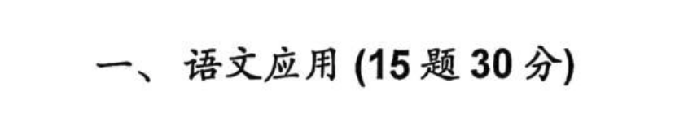

The section header index is usually 一 (i.e. one) because 语文应用 is usually the first section in the exam.

#### Sample questions

##### Pinyin recall

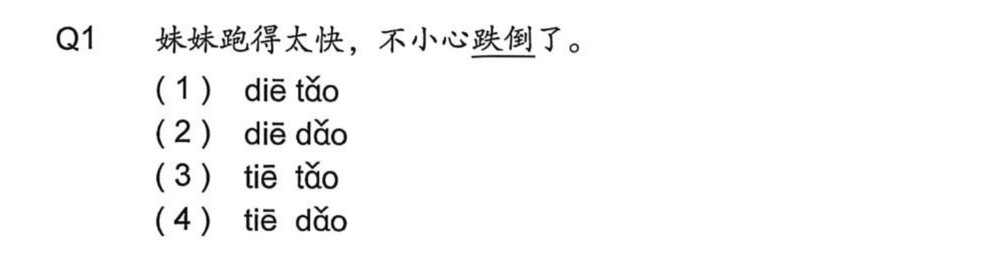

##### Language use

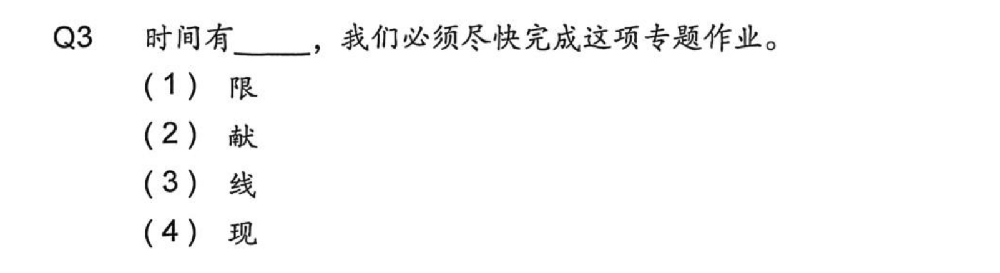

## 短文填空

### Screenshots

#### Section header

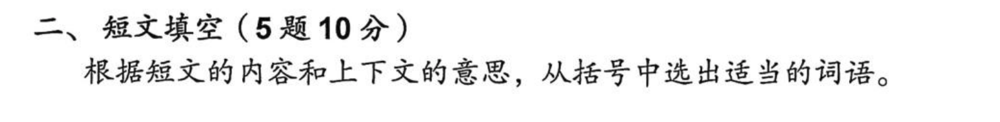

The section header index is usually 二 (i.e. two) because 短文填空 is usually the second section in the exam.

#### Sample questions

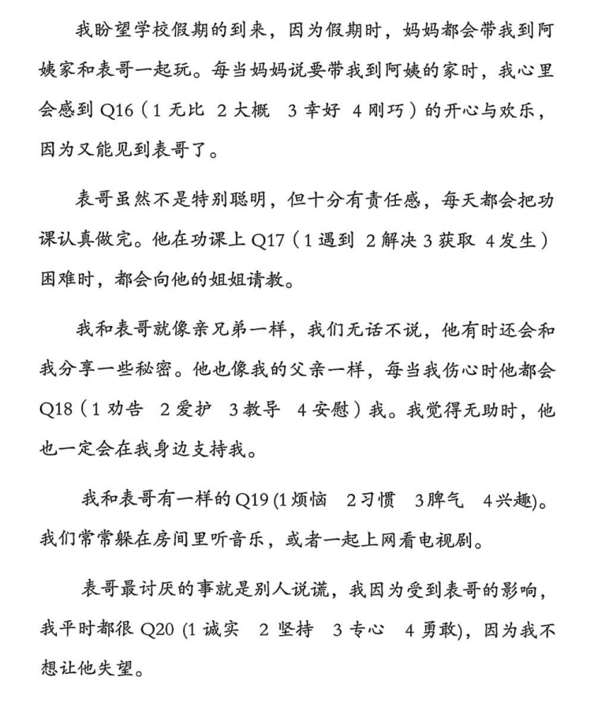

## 阅读理解一 MCQ

### Screenshots

#### Section header

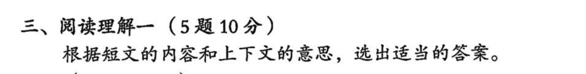

The section header index is usually 三 (i.e. three) because 阅读理解一 is usually the third section in the exam.

#### Sample questions

##### Stem

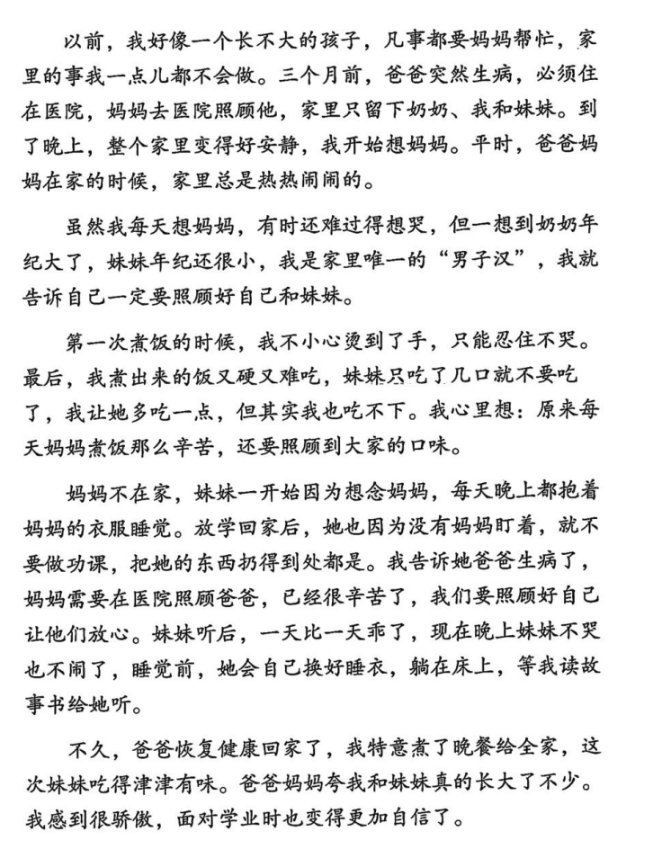

##### Questions

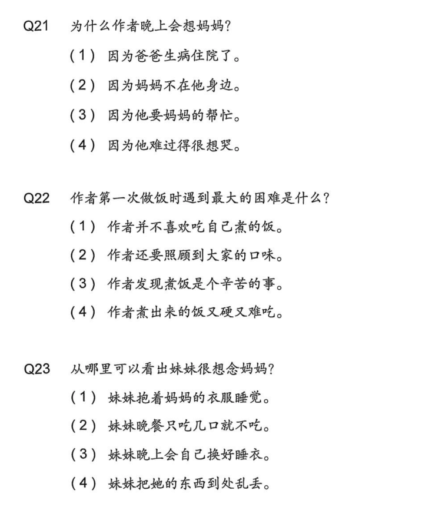

**Note:** If a later block in the **same** reading bundle is **阅读理解二A 写作**, re-check whether these MCQs should be **阅读理解二A MCQ** instead—see *阅读理解一 MCQ vs 阅读理解二A MCQ* in Overview.

## 完成对话

### Screenshots

#### Section header

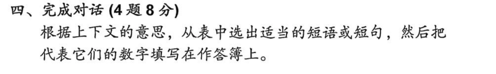

The section header index is usually 四 (i.e. four) because 完成对话 is usually the fourth section in the exam.

#### Sample questions

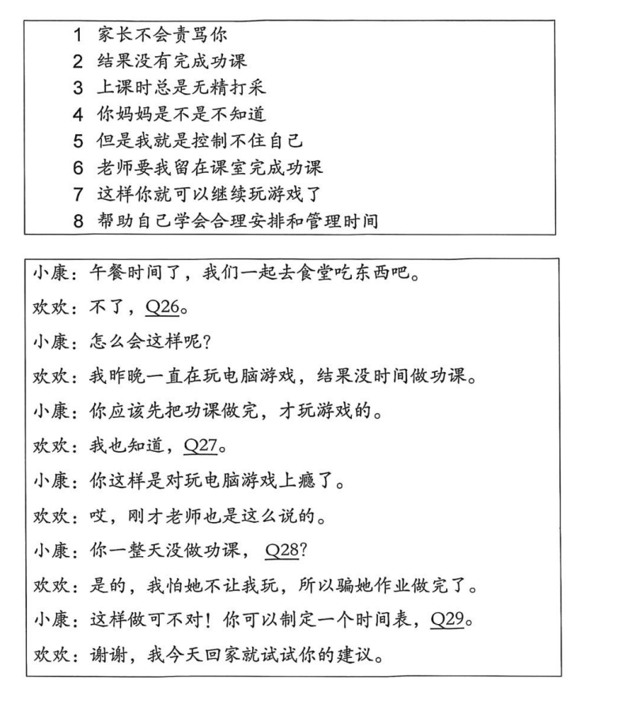

## 阅读理解二A MCQ

### Screenshots

#### Section header

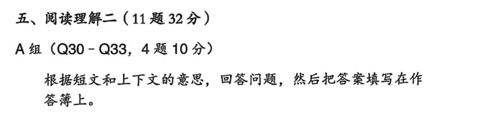

The section header index is usually 五 (i.e. five) because 阅读理解二 is usually the fifth top-level section in the exam. In the source exam, this header is shared between "阅读理解二A MCQ“ and "阅读理解二A 写作" because both belong to 阅读理解二 A组 and share the same stem.

#### Sample questions

##### Stem

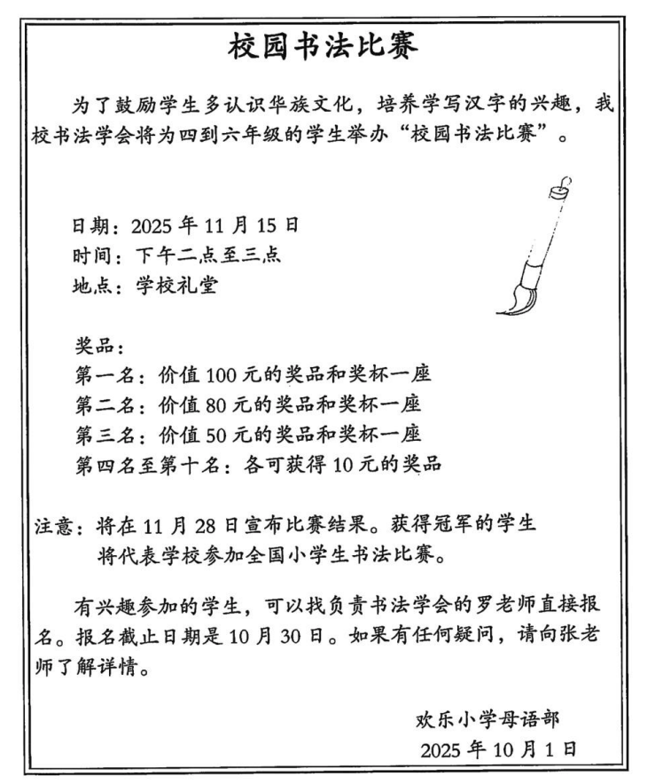

##### Questions

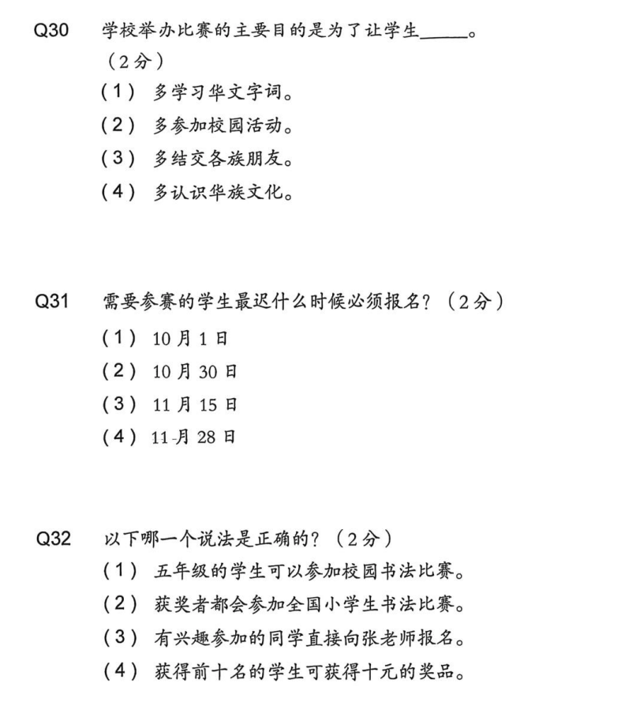

**Note:** This type is almost always **immediately followed** (same printed group, same stem) by **阅读理解二A 写作** in full exams. Use that pairing when disambiguating from **阅读理解一 MCQ** on worksheets.

## 阅读理解二A 写作

### Screenshots

This is a distinct agent-relevant question type even though it shares the same parent section/group header and passage stem as "阅读理解二A MCQ".

#### Sample questions

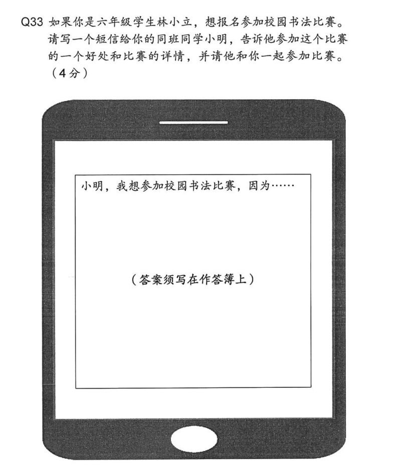

## 阅读理解二B 问答

### Screenshots

#### Section header

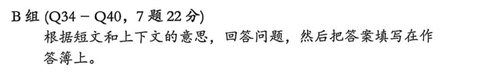

This type does not usually have its own numbered top-level section header. Instead, it typically appears under the subgroup header "B组" within the broader "阅读理解二" section, which keeps the same top-level section index (i.e. 五).

#### Sample questions

##### Stem

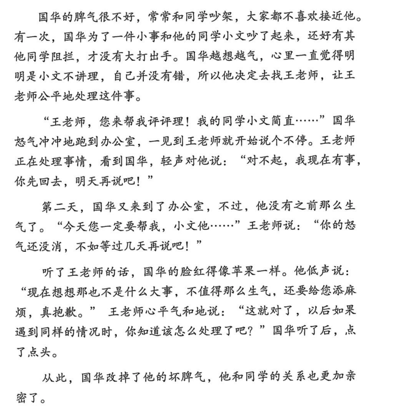

##### Questions

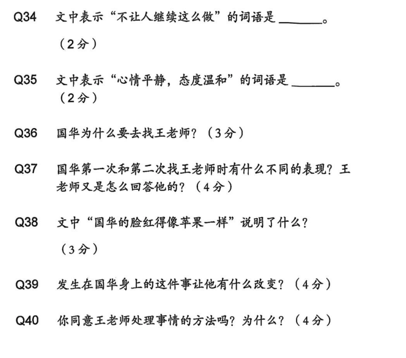