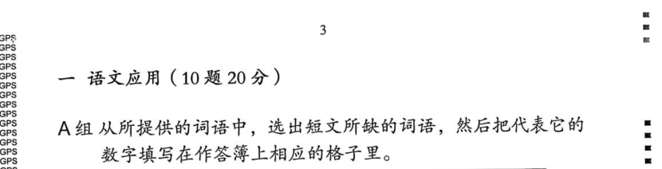
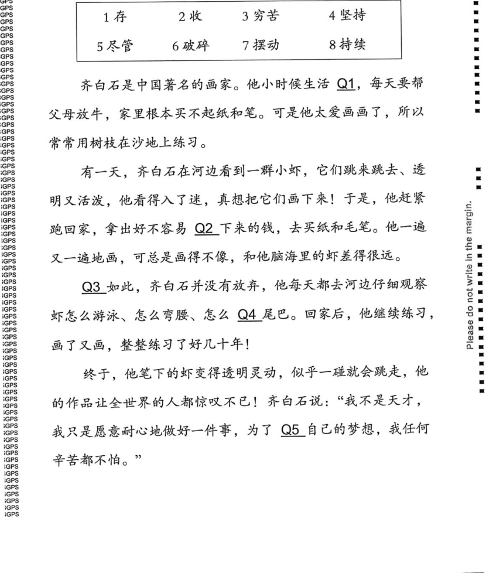
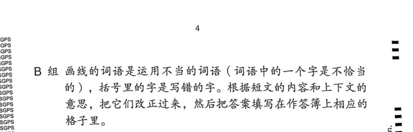
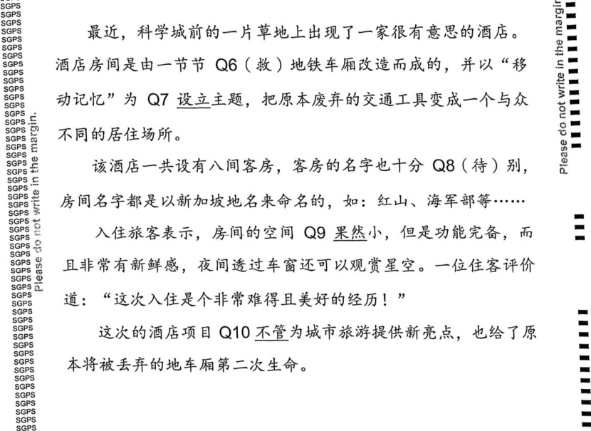
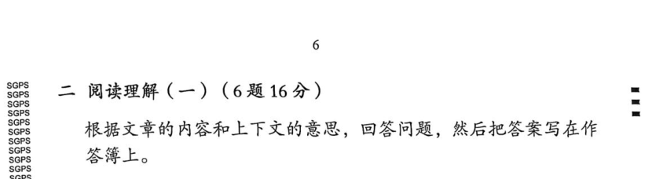
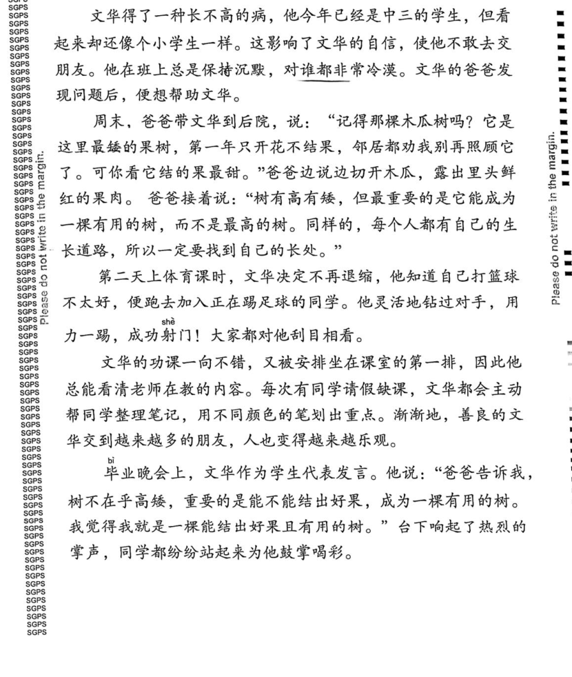
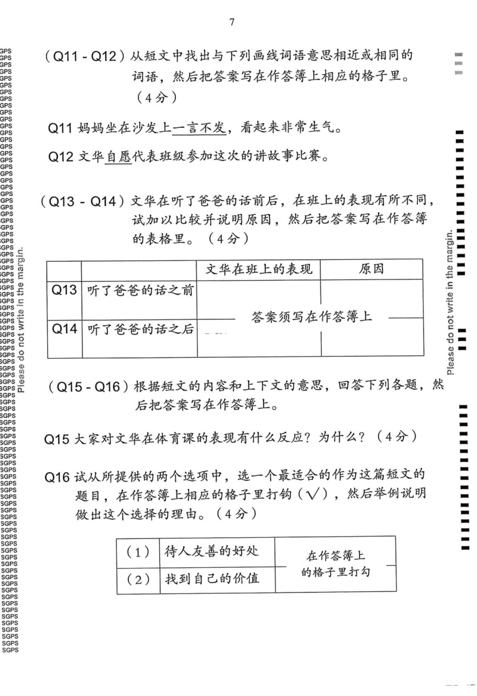
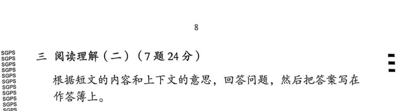
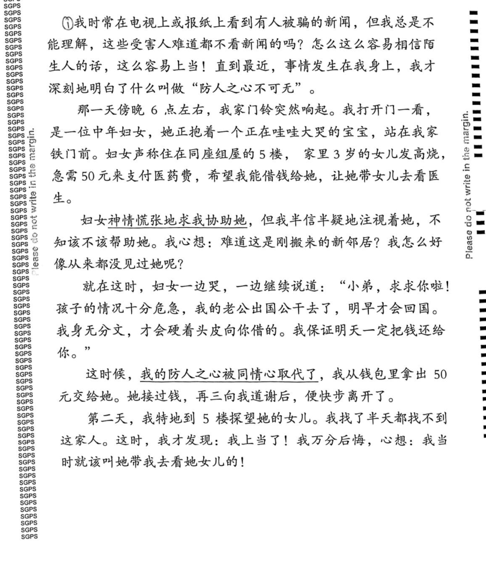
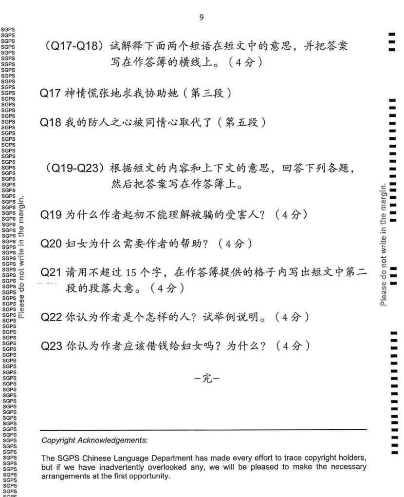

## Overview

This document defines 4 distinct agent-relevant question types in Singapore Primary Higher Chinese (高华) Paper 2 (试卷二). These types are intended for question detection, marking, and diagnosis. They correspond to the SEAB blueprint for Higher Chinese Language (0015) and are grounded in sample papers such as `_c_五年级高华 期末考试 (试卷二).pdf`.

See [higher_chinese_exam_format.md](./higher_chinese_exam_format.md) for the full exam structure. The equivalent document for Standard Chinese is [chinese_exam_paper2_question_types.md](./chinese_exam_paper2_question_types.md).

### Key differences from Standard Chinese Paper 2

- **No MCQ bubble sheet (OAS)** — Higher Chinese Paper 2 has no multiple-choice option-answer sheet. All responses are written by hand in the answer booklet.
- **Section 一** combines **two** sub-types (A组 综合填空 + B组 字词改正) under one printed section header; both are written/short-form rather than MCQ.
- **Both comprehension sections (二 and 三) are fully open-ended** (问答) — there is no 阅读理解 MCQ block and no 完成对话 block.
- A组 answer boxes are **small printed squares** (one character width); B组 answer boxes are **wide rectangles** (one word/correction per line).

### Canonical type vs printed section title

School worksheets sometimes print section labels that differ slightly from SEAB wording (for example 综合填空 vs 短文填空, or 字次改正 vs 字词改正). Structured outputs (for example a **`paper2_question_sections.json`** artifact from automation) should still use the **four canonical values** below as **`question_type`**; auxiliary columns can carry the paper's own wording, marks, and page ranges.

- **`question_type`** is always one of the **four canonical values** below.
- **`printed_section_title`** (optional) holds the **verbatim printed heading** when it adds useful information — for example when the paper prints 字次改正 instead of 字词改正.
- **`section_total_marks`** (optional) is the section's **total marks** only when the value is trustworthy and clearly assigned to that canonical type alone.

1. `"综合填空"`: Word-bank cloze passage. The student is given a word bank (typically 8 words in a printed table) and a short passage with 5 numbered blanks (Q1–Q5). The student selects the word from the bank that fits each blank according to the overall meaning and context of the passage, then writes the **number** representing that word in the answer box in the answer booklet. Each blank/question is independent (only one word from the bank is correct), but all questions share the same passage context. The official instruction is usually "从所提供的词语中，选出短文所缺的词语，然后把代表它们的数字填写在作答簿上相应的格子里。" This is A组 within the printed section 一 语文应用.

2. `"字词改正"`: Character/word correction passage. The student is given a short passage where certain words are underlined; each underlined word contains **one incorrect character** (the correct character is given in brackets after the underlined word). The student must identify the correctly written word (replacing the bracketed wrong character with the right one) based on the context of the passage, then write the corrected word in the answer box in the answer booklet. The official instruction is usually "画线的词语是运用不当的词语（词语中的一个字是不恰当的），括号里的字是写错的字。根据短文的内容和上下文的意思，把它们改正过来，然后把答案填写在作答簿上相应的格子里。" This is B组 within the same printed section 一 语文应用.

3. `"阅读理解一 问答"`: Open-ended comprehension questions on the first reading passage (printed section 二 阅读理解（一）). The student reads a passage and answers all questions in open-ended written form in the answer booklet. Typical question sub-types include: vocabulary-in-context (find a synonym/antonym from the passage), compare-and-contrast with a table grid, multi-part Q&A, summarise-in-X-words, and choose-a-title-and-justify. There are no MCQ options — all answers are written. The official instruction is usually "根据文章的内容和上下文的意思，回答问题，然后把答案写在作答簿上。" In the SEAB blueprint this block carries 6 questions and 16 marks.

4. `"阅读理解二 问答"`: Open-ended comprehension questions on the second reading passage (printed section 三 阅读理解（二）). Structurally identical to 阅读理解一 问答 — same open-ended written format, same range of question sub-types — but with a different passage and a higher mark allocation. The official instruction is usually the same as 阅读理解一 问答. In the SEAB blueprint this block carries 7 questions and 24 marks.

---

## 综合填空

### Screenshots

#### Section header

The section index is 一 (A组) because 综合填空 is the first sub-section in the exam. The printed section header covers both 综合填空 (A组) and 字词改正 (B组) under the umbrella title 语文应用.

#### Sample questions

The word bank is presented as a printed table at the top of the passage (typically 8 words/phrases numbered 1–8). Blanks in the running text are labelled Q1–Q5. Students write the **number** (not the word itself) in small boxes in the answer booklet.

---

## 字词改正

### Screenshots

#### Section header

This is B组 within the same printed section 一 语文应用. There is no separate top-level section number — the B组 label immediately follows the A组 passage within the same printed section.

#### Sample questions

Underlined words in the passage mark the questions (Q6–Q10). Each underlined word has a bracketed incorrect character immediately after it in the source text. Students write the correctly formed word in wide answer boxes in the answer booklet.

---

## 阅读理解一 问答

### Screenshots

#### Section header

The section index is 二 because 阅读理解（一）is the second top-level section in the exam.

#### Stem (reading passage)

#### Sample questions

All questions are open-ended. Common formats seen in school samples:
- **(Q11–Q12 vocabulary)** "从短文中找出与下列画线词语意思相近或相同的词语" — find a synonym from the passage for an underlined word.
- **(Q13–Q14 compare/contrast table)** A printed table in the answer booklet asks students to fill in before/after or cause/effect comparisons.
- **(Q15–Q16 Q&A + justify)** "回答下列各题" followed by a why/what question, and a choose-the-best-title question with a justify-your-choice component.

---

## 阅读理解二 问答

### Screenshots

#### Section header

The section index is 三 because 阅读理解（二）is the third top-level section in the exam.

#### Stem (reading passage)

#### Sample questions

All questions are open-ended and structurally identical in format to 阅读理解一 问答. Common formats seen in school samples:
- **(Q17–Q18 phrase-in-context)** "试解释下面两个短语在短文中的意思" — explain the meaning of a phrase from the passage.
- **(Q19–Q23 Q&A)** "根据短文的内容和上下文的意思，回答下列各题" — multi-mark open questions requiring textual evidence, inference, summarisation (in ≤ N characters), character assessment with examples, and opinion-with-justification.
