## Overview

This document defines 9 canonical question types for English Paper 2. They support marking, reporting, and section-level routing. They follow the Paper 2 Booklet A / Booklet B structure described in [english_exam_format.md](./english_exam_format.md), but are expressed as stable type names—not only as printed section letters.

### Canonical type vs printed section title

School papers usually print English Paper 2 sections as lettered sections from **Section A** to **Section I**. Use the canonical type names below as the stable routing labels downstream tools consume. The printed letter is useful context, but classification hinges on answer format (MCQ versus open-ended), whether a stimulus is shared, and how marks are communicated on the paper.

1. **"Grammar MCQ"**: Booklet A multiple-choice grammar questions. The student selects 1 correct answer from 4 options for each independent sentence-level question. Answers are usually shaded on the Optical Answer Sheet (OAS).
2. **"Vocabulary MCQ"**: Booklet A multiple-choice vocabulary questions. The student selects 1 correct answer from 4 options for each independent sentence-level vocabulary question. Answers are usually shaded on the OAS.
3. **"Vocabulary Cloze"**: Booklet A multiple-choice cloze-style vocabulary questions. The student reads a shared passage and chooses the word closest in meaning to each underlined word or phrase. Each item has 4 options, but the questions share the same passage context.
4. **"Visual Text Comprehension"**: Booklet A multiple-choice comprehension questions based on visual and informational stimuli. In this sample, the student studies **Text 1** (a poster) and **Text 2** (an article extract), then answers MCQs that may ask about either text or compare them.
5. **"Grammar Cloze"**: Booklet B open-ended grammar cloze. The student fills numbered blanks in a shared passage using words from a provided word bank. In this sample, each word can be used only once.
6. **"Editing"**: Booklet B editing for spelling and grammar. The student corrects underlined words that contain spelling or grammatical errors and writes the corrected forms in answer boxes.
7. **"Comprehension Cloze"**: Booklet B open-ended comprehension cloze. The student fills each blank in a shared passage with a suitable word without a multiple-choice option list.
8. **"Synthesis and Transformation"**: Booklet B open-ended sentence transformation. The student rewrites each sentence or sentence pair using the provided word or structure while preserving meaning.
9. **"Comprehension Open-ended"**: Booklet B open-ended comprehension questions. The student refers to a shared passage and writes short answers, table entries, reasons, comparisons, or explanations. In this sample, the passage is printed at the end of Booklet A and the answer questions are printed in Booklet B.

### Booklet split and cross-reference

Booklet A contains the MCQ sections **A-D** and uses the OAS. Booklet B contains the written-response sections **E-I** and provides answer spaces in the booklet. A full scan may also include blank pages, booklet covers, and the OAS page; those are not separate question types.

**Detector hint:** **Comprehension Open-ended** may require a cross-booklet link. In this sample, the Section I passage is printed on page 11 of Booklet A, while the questions begin in Booklet B. Treat the passage as the stem for the Booklet B **Comprehension Open-ended** questions rather than as an extra Booklet A section.

## Grammar MCQ

### Screenshots

#### Section header

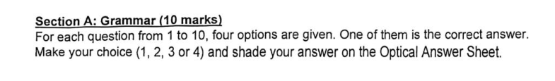

The printed section title is usually **Section A: Grammar**. In PSLE-style Paper 2, this is usually the first Booklet A section.

#### Sample questions

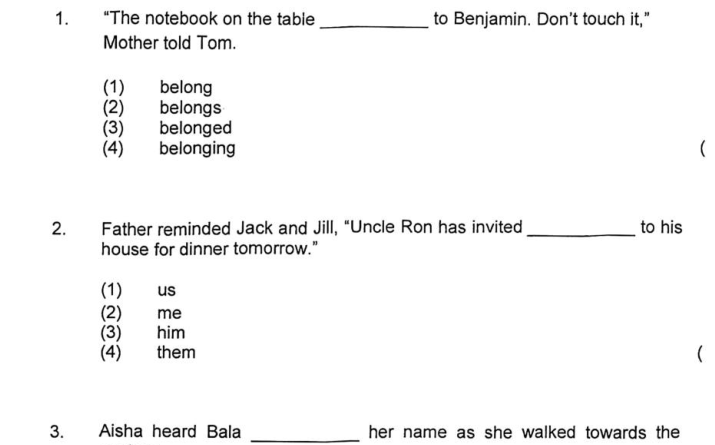

## Vocabulary MCQ

### Screenshots

#### Section header

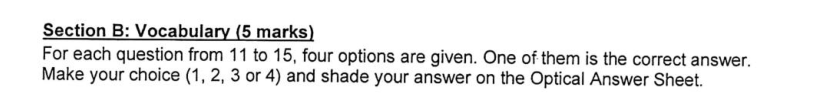

The printed section title is usually **Section B: Vocabulary**. In PSLE-style Paper 2, this is usually the second Booklet A section.

#### Sample questions

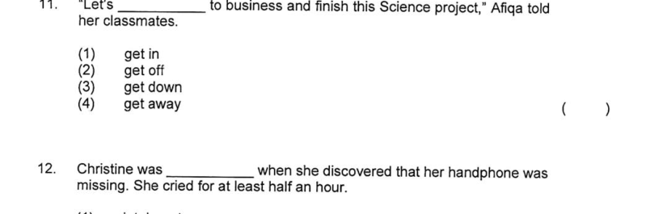

## Vocabulary Cloze

### Screenshots

#### Section header

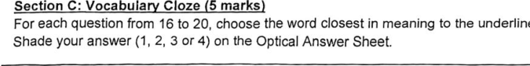

The printed section title is usually **Section C: Vocabulary Cloze**. It still uses MCQ answer selection, but the questions share one passage.

#### Sample questions

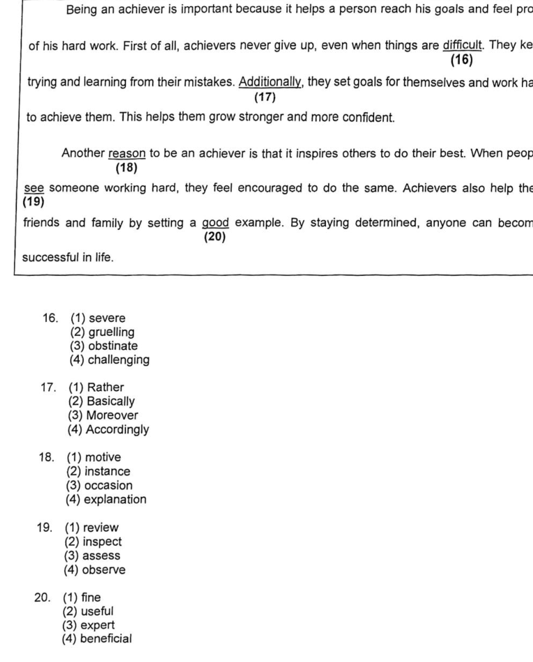

## Visual Text Comprehension

### Screenshots

#### Section header

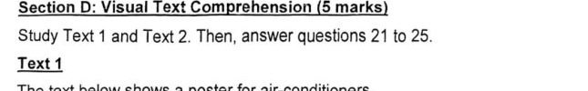

The printed section title is usually **Section D: Visual Text Comprehension**. The section normally contains one or more visual/informational texts followed by MCQs.

#### Sample stimuli

##### Text 1

##### Text 2

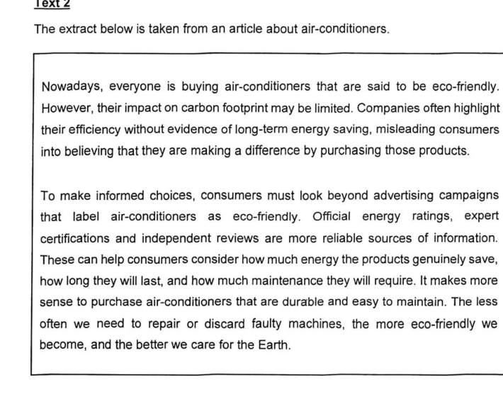

#### Sample questions

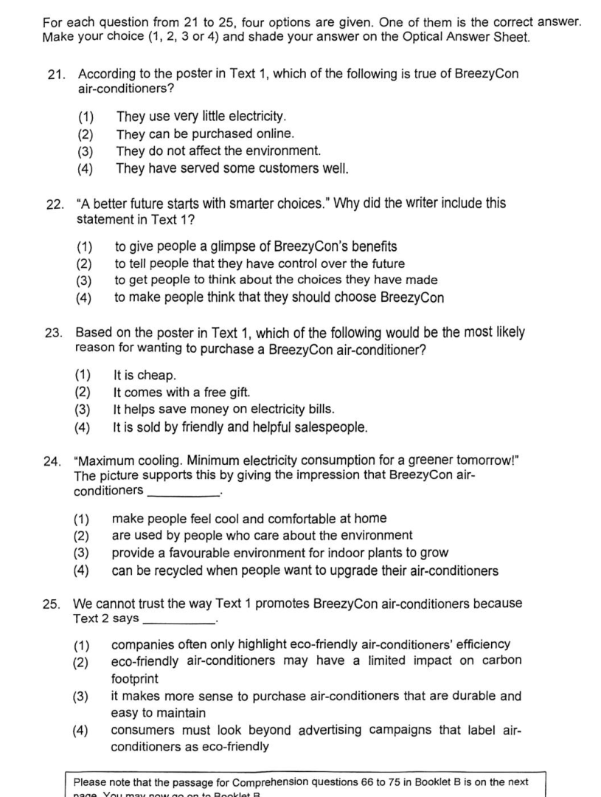

## Grammar Cloze

### Screenshots

#### Section header

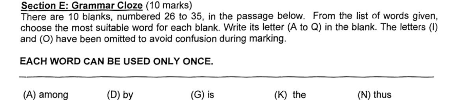

The printed section title is usually **Section E: Grammar Cloze**. This is the first Booklet B section in this sample.

#### Sample questions

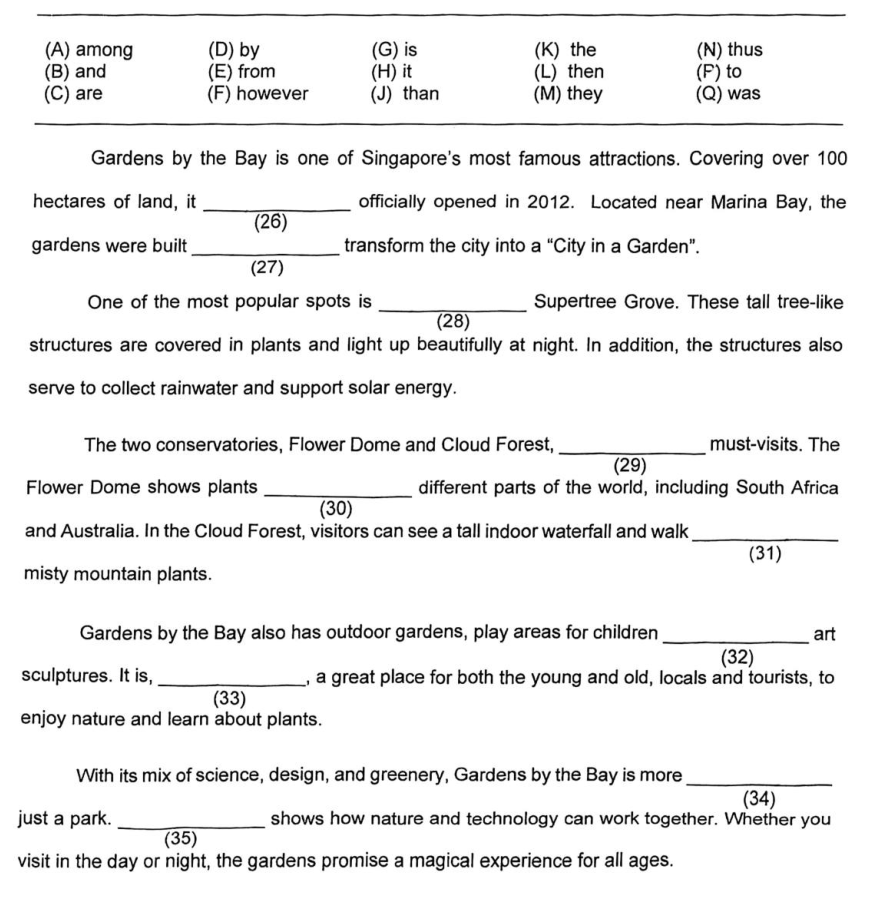

## Editing

### Screenshots

#### Section header

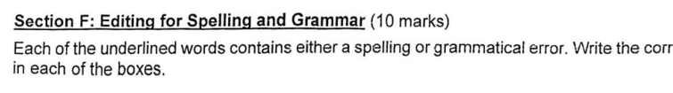

The printed section title is usually **Section F: Editing for Spelling and Grammar**.

#### Sample questions

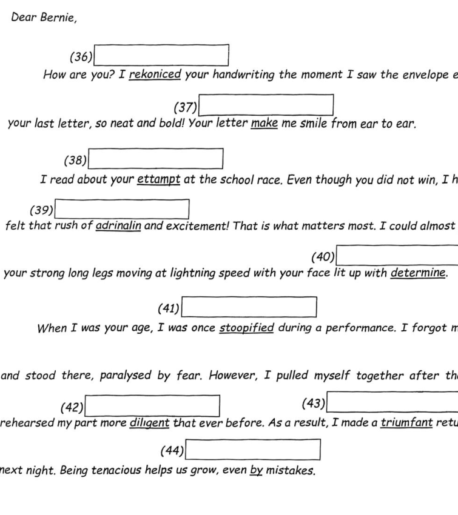

## Comprehension Cloze

### Screenshots

#### Section header

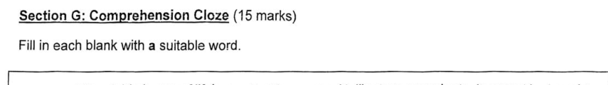

The printed section title is usually **Section G: Comprehension Cloze**. This is an open-ended fill-in-the-blank task with a shared passage.

#### Sample questions

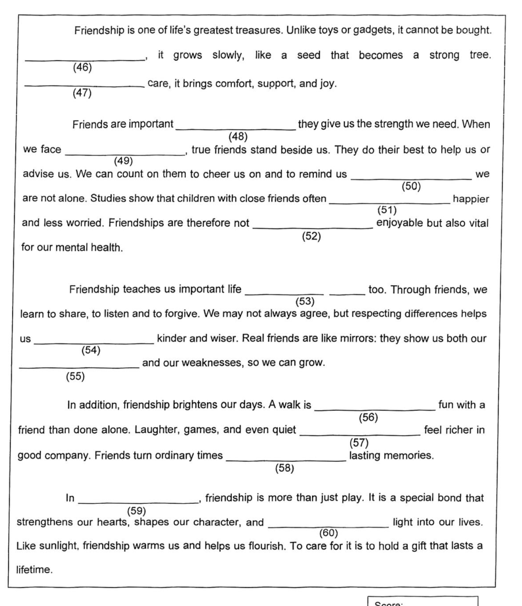

## Synthesis and Transformation

### Screenshots

#### Section header

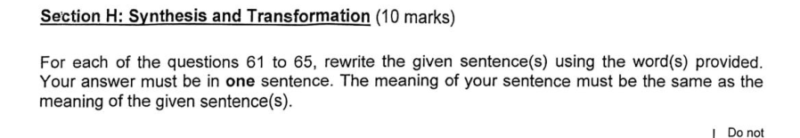

The printed section title is usually **Section H: Synthesis and Transformation**. Each item usually provides a sentence or sentence pair and a required rewrite cue.

#### Sample questions

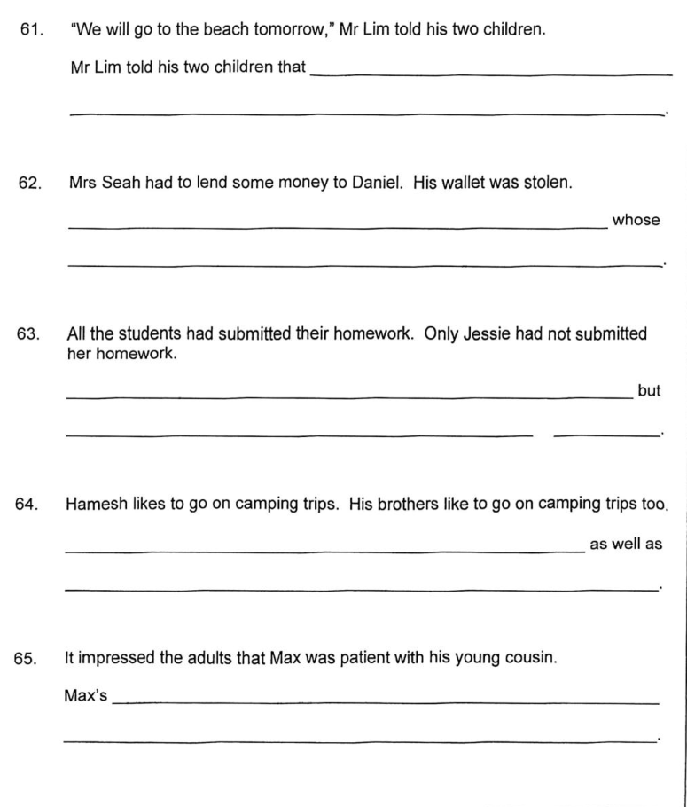

## Comprehension Open-ended

### Screenshots

#### Section header

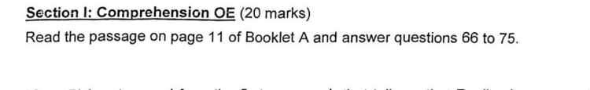

The printed section title is usually **Section I: Comprehension OE**. In this sample, the section tells students to read the passage on page 11 of Booklet A and answer questions 66 to 75.

#### Sample questions

##### Stem

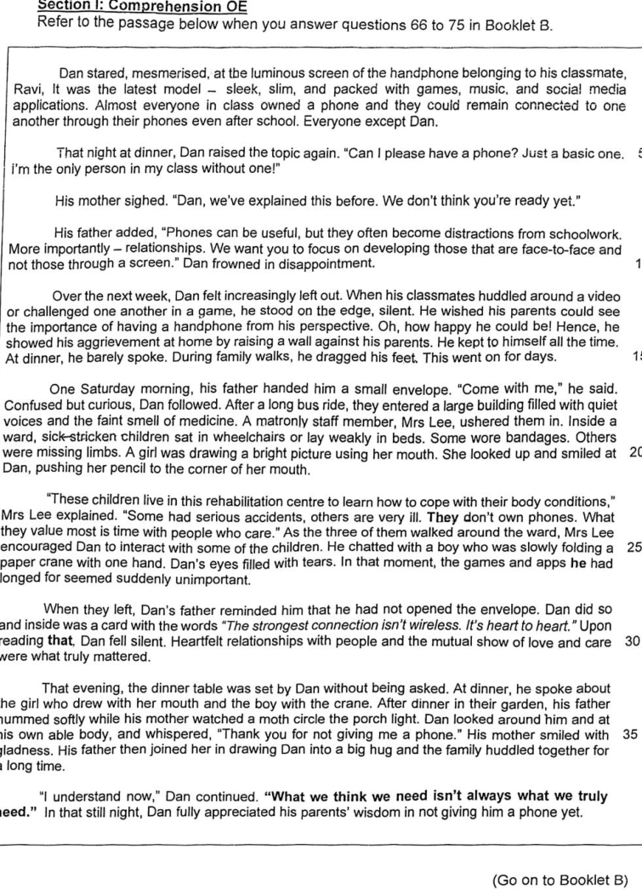

##### Questions

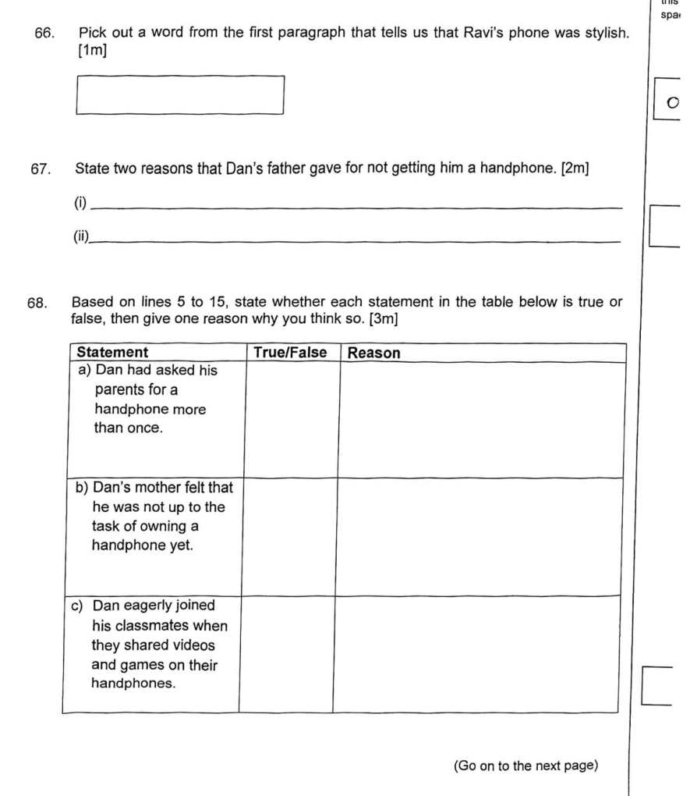
