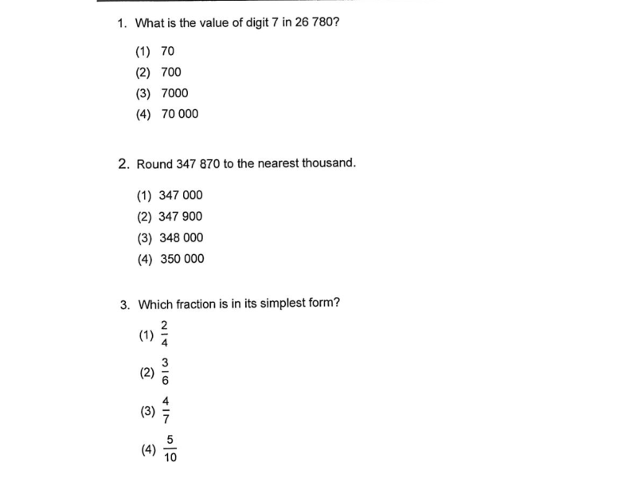
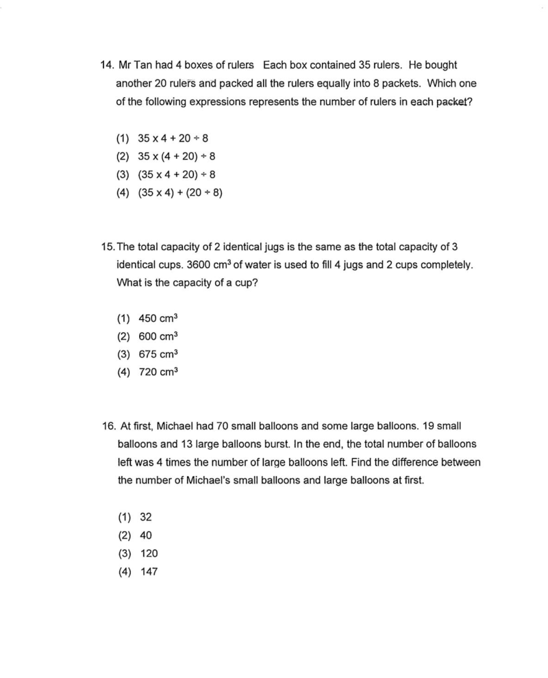
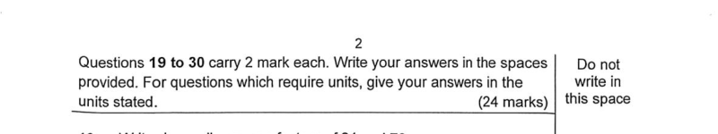
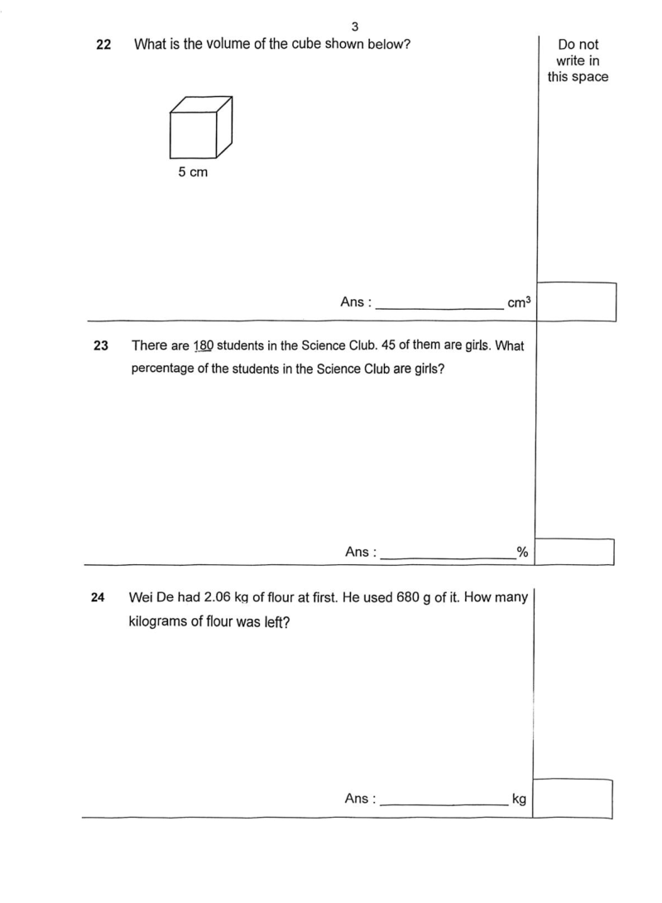
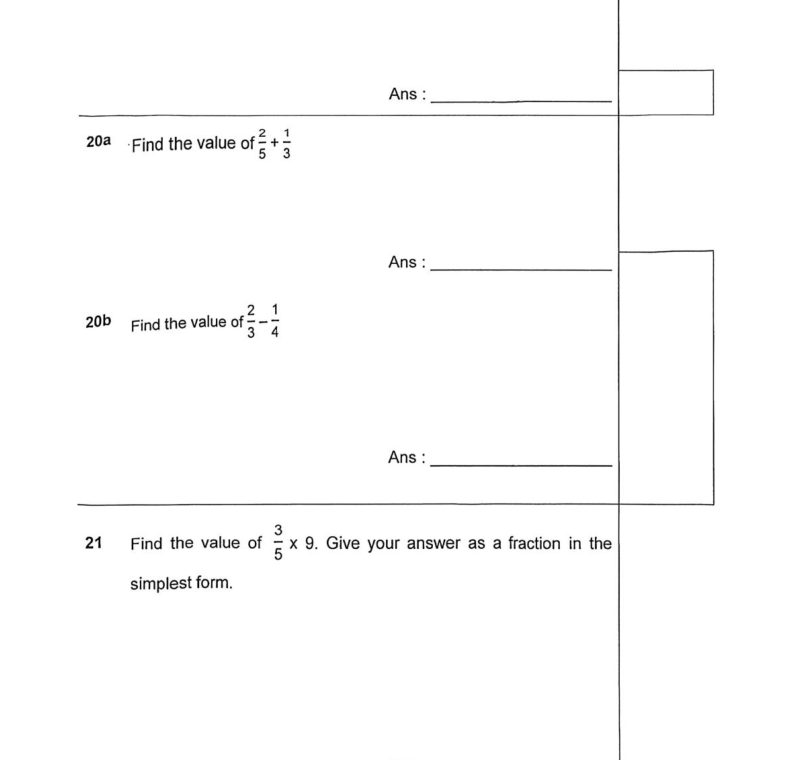
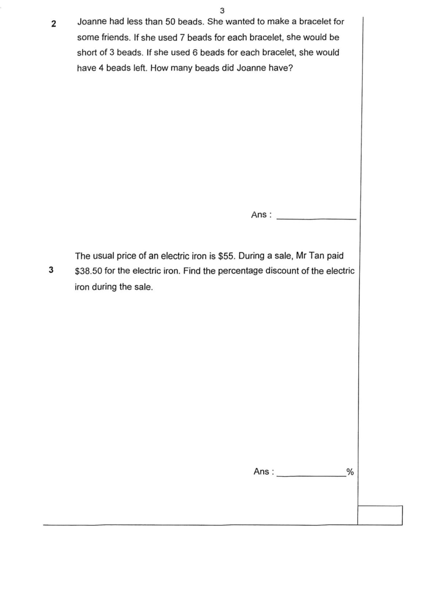
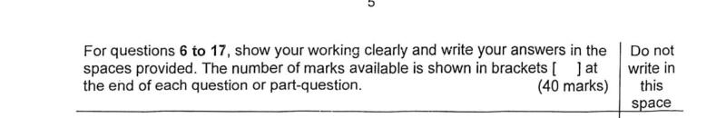
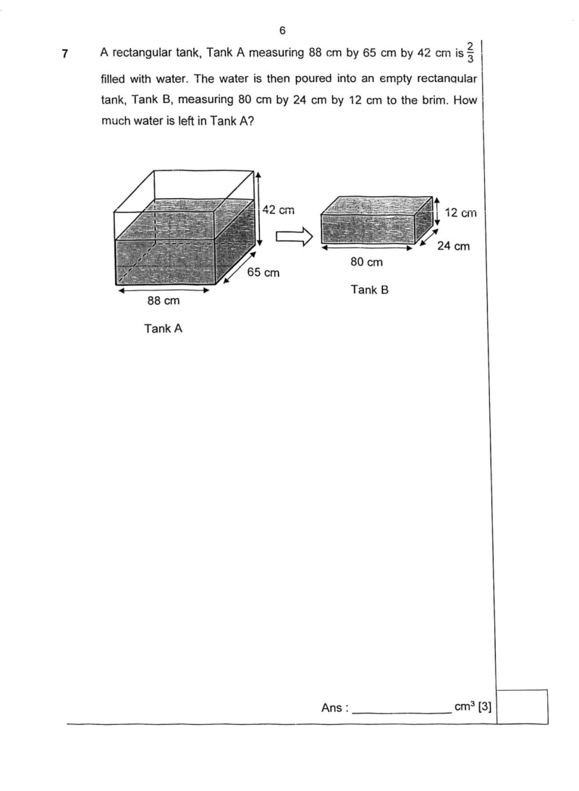
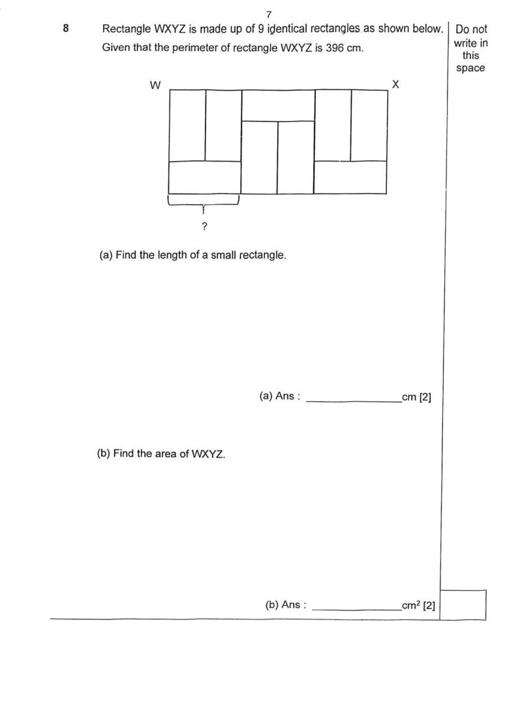
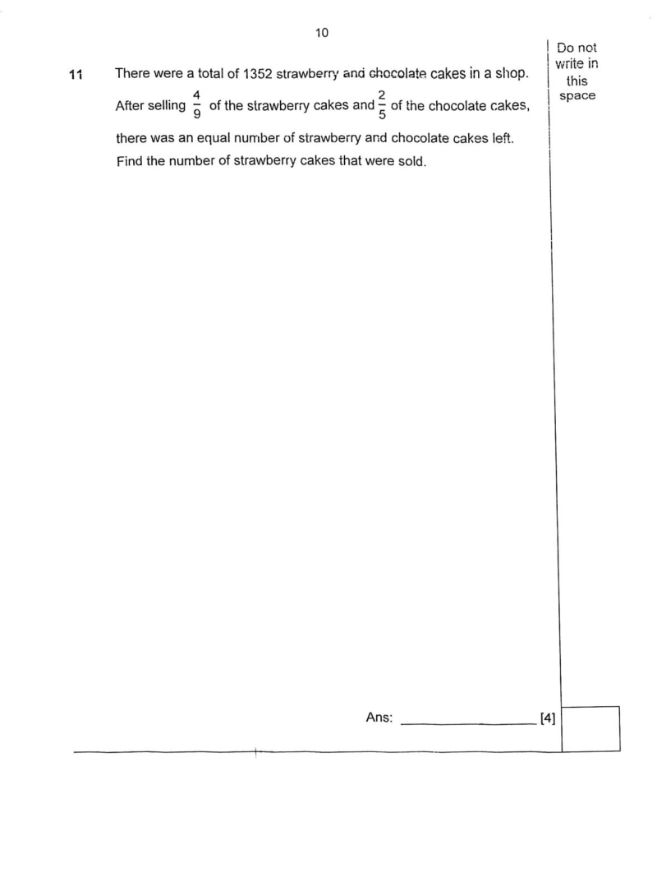

## Overview

This document defines 3 canonical question types in Singapore Primary Mathematics exams. They underpin marking splits and analytic roll-ups. Illustrations mirror standard PSLE-format papers split into Paper 1 / Paper 2 and Booklet A / B—for example Primary 5 end-of-year samples commonly used as teaching anchors.

See [math_exam_format.md](./math_exam_format.md) for the full exam structure.

### The 3 canonical question types

1. `"MCQ"`: Multiple-choice question. Four options (1)–(4) are given; the student selects one. Appears only in **Paper 1 Booklet A**. Answers are shaded on the **Optical Answer Sheet (OAS)** — no working is written in the question booklet. There are two mark sub-types: **1-mark MCQ** and **2-mark MCQ**. The 1-mark items always come first, followed by the 2-mark items; the exact question numbers at which the boundary falls can vary across papers. The section instruction at the top of Booklet A states both bands and their boundary together (e.g. "Questions 1 to 10 carry 1 mark each. Questions 11 to 18 carry 2 marks each.").

2. `"SAQ"` (Short-Answer Question): The student works out the answer and writes it on a printed `Ans:` line in the booklet. No mark brackets `[n]` appear per question — the section instruction states "carry 2 marks each" once for the whole block. Appears in two places:
   - **Paper 1 Booklet B** (no calculator): Q19–Q30, 2 marks each, 24 marks total.
   - **Paper 2 Q1–Q5** (calculator allowed): 2 marks each, 10 marks total.
   
   Some numbered SAQ questions have two sub-parts (e.g. **(a)** and **(b)**), each worth 1 mark, sharing the same question stem. The total per numbered question is still 2 marks. The printed `Ans:` lines carry sub-part labels like `Ans: a)` / `Ans: b)` in that case. The calculator availability differs between the two appearances of SAQ, but the format and mark value are identical.

3. `"LAQ"` (Long-Answer / Structured Question): The student works out the answer(s) and writes them in the booklet. **Mark brackets `[n]` are printed at the end of each question or sub-part** — this is the key visual distinguisher from SAQ. Appears only in **Paper 2 Q6–Q15** (calculator allowed), 40 marks total. Each numbered LAQ carries **3, 4, or 5 marks**. Many LAQs have sub-parts (e.g. **(a)** and **(b)**) each with their own `[n]` bracket; some are single-part with a single bracket at the end. Questions often include diagrams, tables, charts, or multi-sentence word-problem scenarios requiring multi-step working and bar models.

### Key distinguishing signals

| Signal | MCQ | SAQ | LAQ |
|--------|-----|-----|-----|
| Location | Paper 1 Booklet A only | P1 Booklet B + Paper 2 Q1–5 | Paper 2 Q6–15 only |
| Answer format | OAS shading | `Ans:` line in booklet | `Ans:` line(s) in booklet |
| Mark brackets `[n]` printed | No | **No** | **Yes** — always |
| Marks per numbered question | 1 or 2 | Always 2 | 3, 4, or 5 |
| Calculator | Not allowed | P1B: not allowed; P2: allowed | Allowed |
| Options given | Yes (4 options) | No | No |

**`[n]` bracket rule:** The presence or absence of a printed `[n]` bracket beside each answer line is the most reliable visual signal to distinguish SAQ from LAQ when the question number alone is not visible. SAQ blocks state marks once in the section instruction only; LAQ blocks print the mark value on every question and sub-part.

### Canonical type vs printed section label

School papers do not always use the labels MCQ / SAQ / LAQ. The printed section heading or instruction line is the authoritative source. Structured outputs should use the three canonical values above as `question_type`; auxiliary fields can carry the printed section number range and mark totals.

---

## MCQ

### Screenshots

#### Section instruction

The section instruction at the top of Booklet A states both mark bands together. This is the only section in the exam that uses the OAS — no written working appears in the question booklet for Booklet A.

#### 1-mark MCQ sample questions

The first block of MCQ questions carry 1 mark each. Each question has four numbered options (1)–(4). Questions at this level are typically straightforward single-step or conceptual items.

#### 2-mark MCQ sample questions

The second block of MCQ questions carry 2 marks each. Questions at this level are typically multi-step word problems or require geometric reasoning. The visual format (four options) is identical to 1-mark MCQ.

---

## SAQ

### Screenshots

#### Section instruction — Paper 1 Booklet B

The section instruction states the mark value once for all questions in the block. There are no `[n]` brackets on individual questions. Students write their answers in the spaces provided; a "Do not write in this space" column on the right holds the examiner's score box.

#### Single-part SAQ sample questions (Booklet B)

Each question occupies a horizontal band separated by a printed rule. The answer line carries a unit label when relevant (e.g. `Ans : _______ cm³`). Working space is provided above the answer line.

#### Two-part SAQ sample question (Booklet B)

Some questions split into two independently answered sub-parts labelled **(a)** and **(b)** or **20a** / **20b**, each with its own `Ans:` line. The total for the numbered question is still **2 marks** (1 mark per sub-part). Note that there are **no `[n]` brackets** — this is what distinguishes a two-part SAQ from an LAQ with sub-parts.

#### Section instruction — Paper 2 Q1–5

The Paper 2 SAQ block uses the same format (2 marks each, no brackets, `Ans:` line) but calculator use is permitted.

#### Paper 2 SAQ sample questions

Paper 2 SAQ questions tend to be more complex word problems than Booklet B ones (calculator is needed), but the printed format is identical: no `[n]` bracket, single `Ans:` line per question or sub-part, 2 marks per numbered question.

---

## LAQ

### Screenshots

#### Section instruction

The section instruction explicitly states that "the number of marks available is shown in brackets [ ] at the end of each question or part-question." This is the defining visual feature of LAQ — every answer line has a `[n]` bracket.

#### Single-part LAQ sample question (3 marks)

A single-part LAQ has one answer line with a `[3]` (or `[4]` or `[5]`) bracket. The question typically involves a multi-step word problem or geometric calculation. Substantial working space is provided; method marks may be awarded for correct intermediate steps.

#### Multi-part LAQ sample question (sub-parts with individual brackets)

A multi-part LAQ has sub-parts **(a)**, **(b)**, etc., each with its own `[n]` bracket. The total marks for the question is the sum of the sub-part brackets. Sub-parts often build on each other (the result of (a) feeds into (b)). A shared diagram or scenario is given at the top of the question.

#### 4-mark LAQ sample question

Higher-mark LAQ questions (4 or 5 marks) are usually single-part or two-part problems requiring multiple interdependent reasoning steps. The full page of working space is typical.
