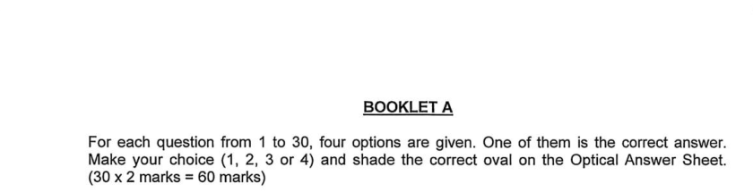
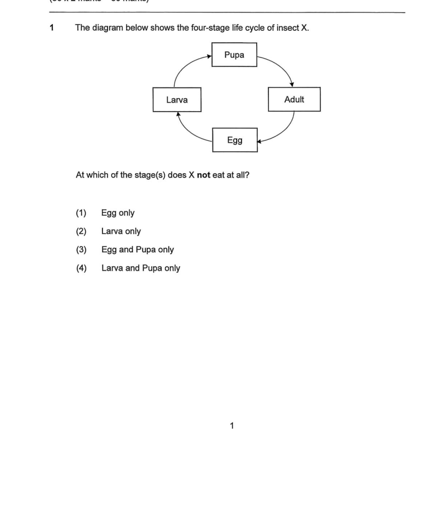
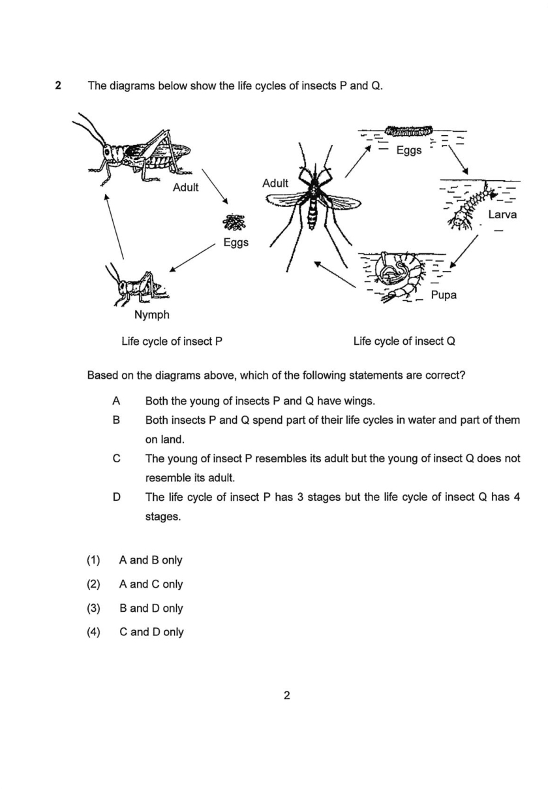
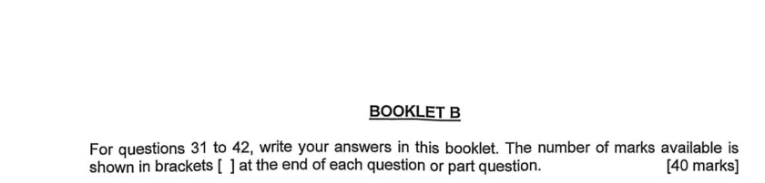
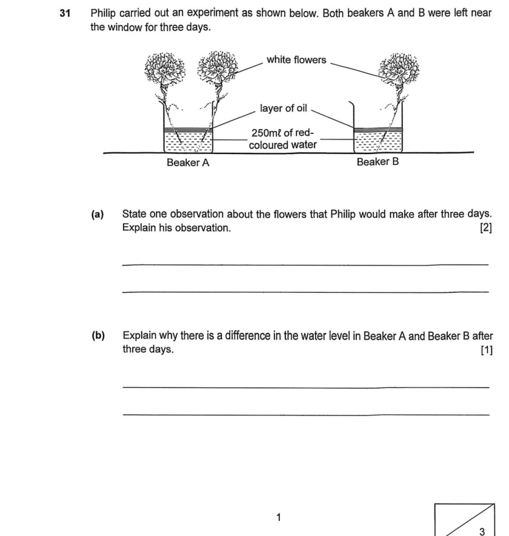
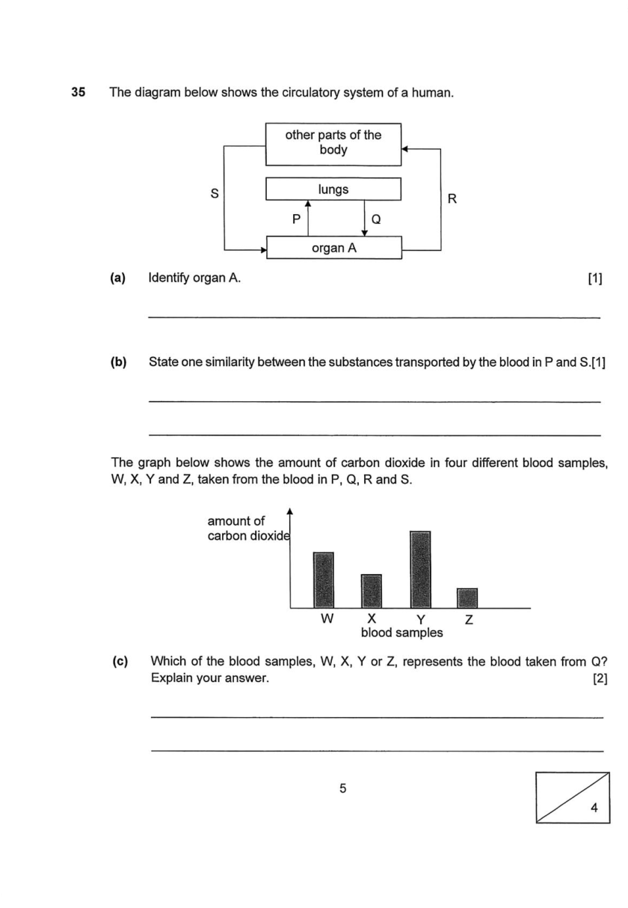
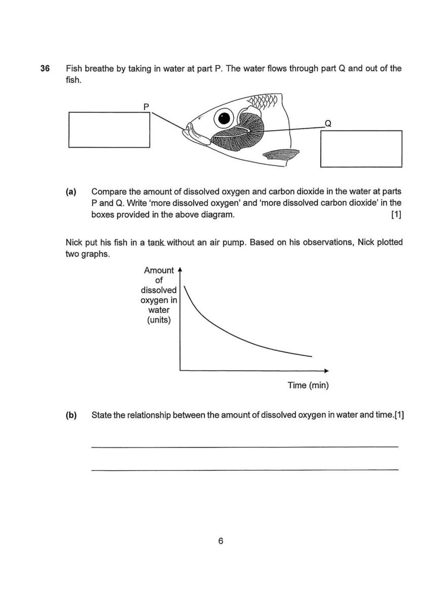
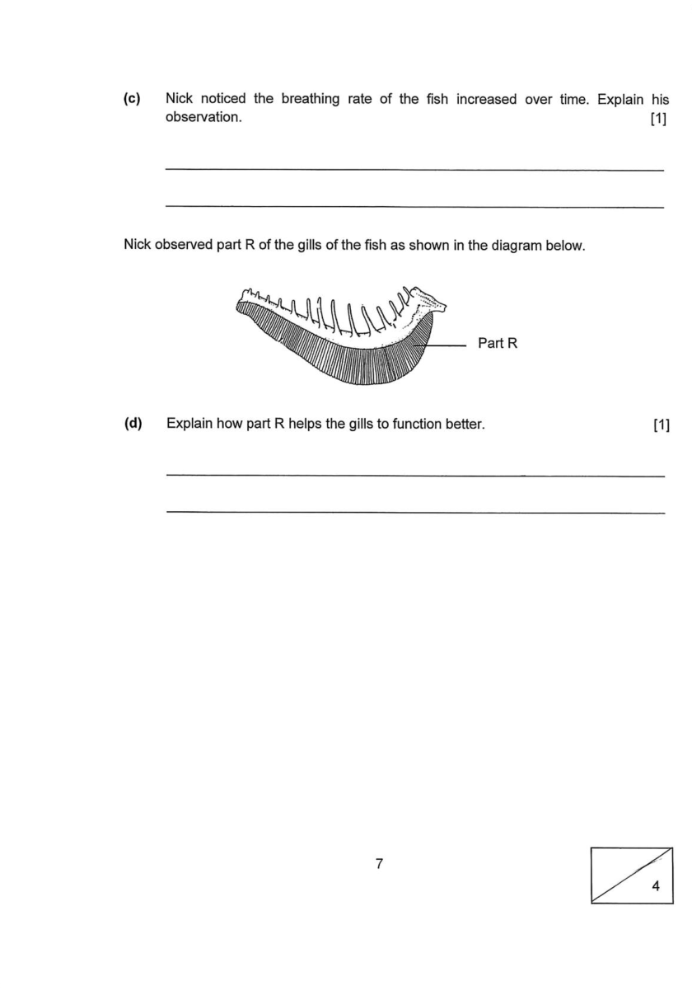
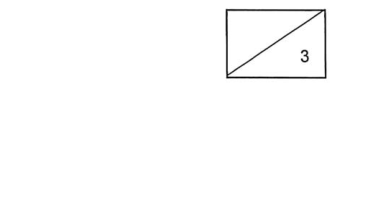

## Overview

This document defines 2 canonical question types in Singapore Primary Science exams. They underpin marking and Booklet A / Booklet B roll-ups described in companion format notes—illustrations follow typical Primary 5–6 school assessments with the MCQ booklet plus open-ended booklet structure.

See [science_exam_format.md](./science_exam_format.md) for the full exam structure.

### The 2 canonical question types

1. `"MCQ"`: Multiple-choice question. Four options (1)–(4) are given; the student selects one. Appears only in **Booklet A**. Answers are shaded on the **Optical Answer Sheet (OAS)** — no written answer is recorded in the question booklet. **All MCQ items carry 2 marks each** (uniform band; unlike Math MCQ there are no 1-mark items). The section instruction states `(30 x 2 marks = 60 marks)` or equivalent. Some MCQ questions embed a set of lettered statements (A, B, C, D) within the question stem that the student must evaluate; the answer choices (1)–(4) then refer to combinations of those statements (e.g. "A and C only"). This is still a single MCQ item.

2. `"OEQ"` (Open-Ended Question): The student writes answers in the booklet. **Mark brackets `[n]` are printed at the end of each question or sub-part** — this is the defining visual signal for Booklet B. Appears only in **Booklet B** (questions numbered continuously from Booklet A, e.g. Q31–Q42 in this paper), 40 marks total. Each numbered OEQ carries **2, 3, 4, or 5 marks** (the total for that question). Nearly all OEQ questions have multiple sub-parts — **(a)**, **(b)**, **(c)**, sometimes **(d)** — each with its own `[n]` bracket and its own answer line(s). Single-part OEQ items (a single question with one `[n]` bracket) are rare but possible. Questions almost always include a shared stimulus: an experiment diagram, a graph, a table, or a scenario paragraph that precedes the sub-parts.

### Key distinguishing signals

| Signal | MCQ | OEQ |
|--------|-----|-----|
| Location | Booklet A only | Booklet B only |
| Answer format | OAS shading (no writing in booklet) | Ruled answer lines in booklet |
| Mark brackets `[n]` printed | **No** | **Yes** — always, on every sub-part |
| Marks per numbered question | Always **2** | 2, 3, 4, or 5 |
| Options given | Yes — (1), (2), (3), (4) | No |
| Sub-parts | No | Almost always; **(a)**, **(b)**, **(c)**, … |
| Shared stimulus (diagram/scenario) | Common but optional | Nearly universal |
| Score box (bottom-right corner) | No | Yes — diagonal box with max marks printed |

**`[n]` bracket rule:** The presence of a printed `[n]` bracket at the end of each sub-part is the single most reliable visual signal for OEQ. MCQ items have no such brackets. The Booklet B section instruction explicitly states: *"The number of marks available is shown in brackets [ ] at the end of each question or part question."*

**Score box:** Each Booklet B page has a rectangular score box in the bottom-right corner, divided diagonally. The maximum marks for the question(s) on that page are printed in the lower-right triangle; the teacher writes the student's earned marks in the upper-left triangle.

### Canonical type vs printed section label

School papers do not always use the labels MCQ / OEQ. The printed booklet heading and section instruction are authoritative. Structured outputs should use the two canonical values above as `question_type`.

---

## MCQ

### Screenshots

#### Section instruction

The Booklet A section instruction states the uniform 2-mark value and total marks in one line: `(30 x 2 marks = 60 marks)`. All 30 questions carry 2 marks each — there is no mark-band split as in Math MCQ. Answers are shaded on the OAS; no written answer appears in the question booklet.

#### Simple MCQ sample question (diagram + 4 options)

The most common MCQ layout: a question stem with an optional diagram or graph, followed by four numbered answer options (1)–(4). One diagram illustrates the concept being tested.

#### MCQ with embedded statement list (A/B/C/D)

Some MCQ items embed a list of labelled statements (A, B, C, D) inside the question, and the answer choices (1)–(4) refer to combinations (e.g. "(1) A and B only"). This is still a single MCQ item worth 2 marks. The visual layout is a bulleted list of statements followed by combination options (1)–(4).

---

## OEQ

### Screenshots

#### Section instruction

The Booklet B section instruction states: *"The number of marks available is shown in brackets [ ] at the end of each question or part question."* This is the defining instruction that establishes `[n]` brackets as the mark indicator for all Booklet B items.

#### Multi-part OEQ sample — Q31 (two sub-parts, [2] and [1])

A typical Booklet B question: a shared experiment setup is shown at the top, followed by sub-parts **(a)** and **(b)** each with its own `[n]` bracket and ruled answer lines. Sub-part marks sum to the question total (here `[2] + [1] = 3`). The score box in the bottom-right corner shows `3` as the maximum for this question.

#### Multi-part OEQ sample — Q35 (three sub-parts, [1]+[1]+[2])

Three sub-parts building on a shared circulatory system diagram. Sub-parts **(a)**, **(b)**, and **(c)** carry [1], [1], and [2] marks respectively (total = 4). The additional scenario and graph within the question introduce new information for later sub-parts.

#### Multi-part OEQ spanning two pages — Q36 (four sub-parts, page 1 of 2)

When a question has many sub-parts or large diagrams, it spans two pages. The question stimulus and sub-parts **(a)** and **(b)** appear on the first page, continuing with **(c)** and **(d)** on the next page.

#### Multi-part OEQ spanning two pages — Q36 continuation (page 2 of 2)

The continuation of Q36. Sub-parts **(c)** and **(d)** each carry `[1]` mark. The score box on the second page of the question shows the total (here `4`) for the whole question.

#### Score box (examiner's marking box)

The score box appears in the bottom-right corner of every Booklet B page. It is divided diagonally: the **lower-right triangle** contains the maximum marks for the question(s) on that page (pre-printed); the **upper-left triangle** is blank for the teacher to write the earned marks. When a question spans two pages, the score box with the total appears on the **last page** of the question.
