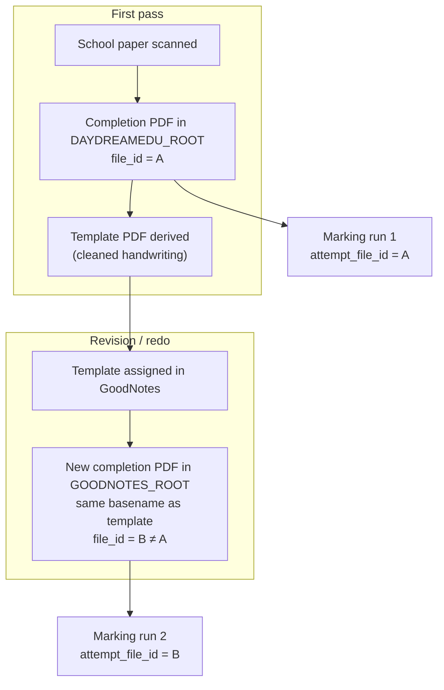

# AI Study Buddy — Completion & Marking Framework

> Status: **Normative reference** (May 2026). Describes how **completion PDFs** (registry + on-disk) relate to **marking runs** and **attempt ordering**. Complements the file/registry model in [L4_FILE_FRAMEWORK](./L4_FILE_FRAMEWORK.md) and the artifact contract in [L4_MARKING_RESULT_ARTIFACT](./L4_MARKING_RESULT_ARTIFACT.md).
>
> Related: [L4_STUDENT_FILE_MANAGEMENT](./L4_STUDENT_FILE_MANAGEMENT.md), [L4_LOCAL_LEARNING_DB](./L4_LOCAL_LEARNING_DB.md), [marking README](../marking/README.md), [multiple attempts proposal](../marking/docs/proposal/3-multiple_attempts_per_template_v1_1.md).

---

## Context

1. Students complete the same **exercise, exam, or book practice** more than once over time.
2. Each completion is a **distinct PDF** in `pdf_registry.db` with its own **`file_id`**, even when the **normal basename** matches another file.
3. Marking produces **canonical JSON** under `context/marking_results/` (and optional DB projection in `study_buddy.db`) keyed to exactly one completion PDF per run.
4. Operators need a stable vocabulary to tell **“same name, different file”** apart from **“same file, re-marked twice”** — and to align browser UI, Review Workspace, and marking writers.

This document is the **conceptual layer** between [L4_FILE_FRAMEWORK](./L4_FILE_FRAMEWORK.md) (what files exist on disk and in the registry) and [L4_MARKING_RESULT_ARTIFACT](./L4_MARKING_RESULT_ARTIFACT.md) (what one marking run stores).

---

## Assumptions

1. **Completion** means a registered **main** PDF with `is_template=false` and a `student_id` (see [L4_FILE_FRAMEWORK](./L4_FILE_FRAMEWORK.md)).
2. **Template** means a general-scoped main used as the empty unit; completions are often sourced from or linked to a template via `completed_from`.
3. **Marking run** means one canonical `marking_result` JSON (plus derived report, assets, optional amendments/review state) for one completion PDF.
4. **`attempt_file_id`** in marking context is the registry **`file_id`** of the completion PDF that was marked (not the template id).
5. **`root_id`** (`daydreamedu` | `goodnotes`) describes which sync tree a path lives under; it is **not** a substitute for `file_id` (see [Student File Browser `root_id` proposal](../student_file_browser/docs/proposal/1-root-id-filter.md)).

---

## Typical lifecycle (same unit, multiple completion files)

**Example:** Emma’s school exercise is scanned into **DaydreamEdu** (`d_root`). A **template** is stored under `d_root`. For revision, the template is assigned in GoodNotes; the **new completion** lives under **GoodNotes** (`g_root`) and **inherits the template basename**. Both completions may appear as `c_EPO_Comprehension_Open-ended_02.pdf` but are **separate registry rows**.

---

## Identity layers

| Layer | Source of truth | What it answers |
|-------|-----------------|-----------------|
| **Completion PDF** | Registry **`file_id`** | Which physical PDF was worked on? |
| **Normal / display name** | `normal_name` / basename (often from template) | What does the operator see in folder listings? |
| **Sync root** | Path under `DAYDREAMEDU_ROOT` vs `GOODNOTES_ROOT` → `root_id` in inventory | Which tree is this card from? |
| **Template unit** | `template_file_id` + `template_attempt_group_id` | Which worksheet/book unit is this attempt for? |
| **Marking run** | `context/marking_results/.../<stem>__<timestamp>.json` | What grades/diagnosis were produced for **one** completion? |
| **Attempt order (product)** | `context.attempt_sequence` (1-based, per group) | Which completion file is 1st, 2nd, … on that template for this student? |

**Rule of thumb:** same **name** does not imply same **file**; same **file** must not have multiple active marking runs.

---

## Marking invariants

### One marking run per completion `file_id`

- Each unique completion PDF (`file_id`) should have **at most one active** marking result.
- **`attempt_file_id`** in `marking_result` context must equal that completion’s `file_id`.
- A **re-mark** of the same PDF (new `__YYYYMMDD_HHMMSS` stem, same `attempt_file_id`) is a mistake in production data: **prune** the older run (filesystem + `marking_artifacts.is_deleted` in `study_buddy.db`). See [prune-marking-run-artifacts](../../.cursor/skills/prune-marking-run-artifacts/SKILL.md) and [\_prune_db_only_marking_artifacts.py](../learning_db/cli/_prune_db_only_marking_artifacts.py).

### Multiple marking runs per template are normal

- Different **`file_id`s** (e.g. first scan in `d_root`, redo in `g_root`) → **multiple** marking results are expected.
- They may share `template_file_id`, `template_attempt_group_id`, and basename; they must differ in **`attempt_file_id`**.

### `attempt_sequence` semantics (intended)

Within one **`template_attempt_group_id`** (typically `"<student_slug>::<template_file_id>"`):

| `attempt_sequence` | Meaning |
|------------------|---------|
| `1` | First **completion file** marked for this student on this template |
| `2` | Second **completion file** (e.g. GoodNotes redo after DD scan) |
| `null` | No template link; grouping not established |

**Not intended:** incrementing sequence when the **same** `file_id` is marked again (re-mark). That conflates “grading pass” with “new completion PDF.”

**Implementation note (May 2026):** `write_marking_artifact` → `_next_attempt_sequence` in [`artifact_writer.py`](../marking/core/artifact_writer.py) currently counts **prior marking JSONs** for the template group, so a re-mark on one PDF can bump sequence incorrectly. **Follow-up:** assign sequence from **distinct `attempt_file_id`s** in the group (chronological), not from artifact file count.

---

## How layers connect in products

### Registry (`pdf_file_manager`)

- Completions are **student-scoped** rows; templates are **general-scoped**.
- `completed_from` links a completion main to its template.
- Lookup for marking and Review Workspace uses **`file_id`** (or resolved path → file).

### Marking artifacts (`ai_study_buddy/marking`)

- Writer: [`write_marking_artifact`](../marking/core/artifact_writer.py) — sets `template_attempt_group_id`, `attempt_sequence`, `marking_asset` path.
- Lookup: [`find_marking_artifacts_for_attempt`](../marking/core/artifact_lookup.py) — matches rows where `attempt_file_id` (or legacy path) equals the completion’s `file_id`; returns refs sorted by `created_at` desc.
- Canonical schema: `marking_result.v1.6` — see [L4_MARKING_RESULT_ARTIFACT](./L4_MARKING_RESULT_ARTIFACT.md).

### Learning DB (`study_buddy.db`)

- `marking_artifacts.attempt_file_id` mirrors JSON context; one active row per on-disk JSON after hygiene passes.
- Orphan DB rows without JSON should be soft-deleted (`delete_reason` e.g. `json_missing_orphan`).

### Student File Browser

- Cards expose **`file_id`**, **`root_id`**, workflow flags (`has_marking`, `review_status`, …).
- Same basename under DD and GN may be **two cards** (different `file_id`s or cross-root mirrors); see [L4_FILE_FRAMEWORK](./L4_FILE_FRAMEWORK.md) and [root_id filter proposal](../student_file_browser/docs/proposal/1-root-id-filter.md).
- **`root_id` filter** helps triage by tree; it does not replace completion identity.

### Review Workspace

- Deep links use **`attempt_id=`** (= completion `file_id`) + `student_id=`.
- Amendments and `student_review_state` are keyed by marking run stem (`<attempt_basename>__<timestamp>`), not by `file_id` alone.

---

## Operator scenarios

| Scenario | Expected data shape |
|----------|---------------------|
| First scan marked | One `file_id`, one marking JSON, `attempt_sequence = 1` (if template known) |
| Redo in GoodNotes, marked separately | Second `file_id`, second marking JSON, `attempt_sequence = 2` |
| Re-run marking on same PDF by mistake | Two JSONs, **same** `attempt_file_id` → prune older run |
| Same basename in DD and GN grid | Two cards possible; check `file_id` / `root_id`; may or may not be the same logical paper |

---

## Hygiene utilities (reference)

| Task | Tool |
|------|------|
| Prune one superseded run (JSON + report + assets + amendments + review) | [prune-marking-run-artifacts](../../.cursor/skills/prune-marking-run-artifacts/SKILL.md) |
| Soft-delete DB rows with no on-disk JSON | `python3 -m ai_study_buddy.learning_db.cli._prune_db_only_marking_artifacts` |
| Audit active marking vs JSON count | Compare `marking_results/**/*.json` with `SELECT COUNT(*) FROM marking_artifacts WHERE is_deleted=0` |

---

## Open follow-ups

1. **Writer:** `attempt_sequence` from distinct `attempt_file_id`s in `template_attempt_group_id`, not marking-artifact count.
2. **Writer guard:** reject or replace second active marking run for the same `attempt_file_id` at write time.
3. **Browser:** surface `attempt_sequence` / attempt count on cards where multiple completions share a template (optional UX).
4. **Cross-root policy:** canonical “one card per completion” vs twin mirrors — registry policy, not marking (see [root_id filter proposal](../student_file_browser/docs/proposal/1-root-id-filter.md) out of scope).

---

## References

- [L4_FILE_FRAMEWORK](./L4_FILE_FRAMEWORK.md) — on-disk layout, registered file attributes, `root_id`, Student File Browser
- [L4_MARKING_RESULT_ARTIFACT](./L4_MARKING_RESULT_ARTIFACT.md) — `marking_result` JSON shape, paths, `attempt_basename`
- [L4_STUDENT_FILE_MANAGEMENT](./L4_STUDENT_FILE_MANAGEMENT.md) — operator browser filters and workflow flags
- [marking proposal: multiple attempts per template](../marking/docs/proposal/3-multiple_attempts_per_template_v1_1.md) — schema fields `template_attempt_group_id`, `attempt_sequence`, `attempt_label`
- [Student File Browser: `root_id` filter proposal](../student_file_browser/docs/proposal/1-root-id-filter.md) — UI filter for sync root (secondary to this framework)
