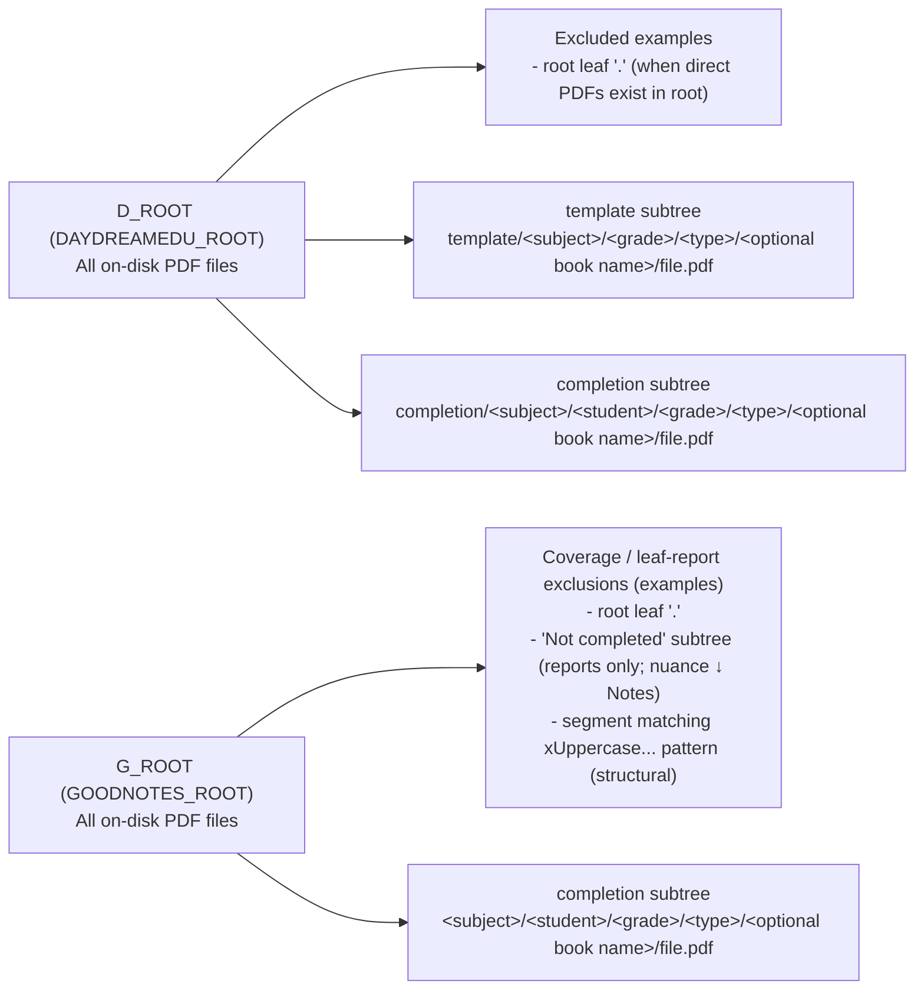

## Context
1) We have pdf_file_manager module for managing on-disk pdf files used in the broader ai_study_buddy project.

There are some conceptual foundations of what those files are. Having a clear framwork can help better design the tools and workflows, and better utilize those files.

## Assumptions
1. In this document, "file" always refers to a PDF file.
2. "On-disk file" means a PDF that exists physically under a root folder (e.g. DAYDREAMEDU_ROOT or GOODNOTES_ROOT), regardless of whether it is registered.
3. "Registered file" means a PDF that has a corresponding record in the pdf_file_manager registry.
4. All files in scope are main files (e.g. files with "_c_" prefix in their base names), not raw files (e.g. files with "_raw_" prefix in their base names).

## On-disk file organization

The chart below describes the on-disk PDF universe under the 2 roots and how excluded folders relate to reporting workflows.

Notes:
- This section is about on-disk organization only (physical files and path layout).
- Under `DAYDREAMEDU_ROOT`, the first segment is always `template` or `completion`; subject folders sit under that branch.
- Exclusions in **GEX** attach to **traversal/reporting semantics**, not ownership: those PDFs remain on-disk under `GOODNOTES_ROOT`.
- **`Not completed` segments (GoodNotes):** These folders hold **Work-in-progress** completion PDFs. **Leaf-registry reports** (`.cursor/commands/goodnotes-leaf-registry-report.md`) **exclude** those leaf folders by default so summaries target **registration-ready gaps** (`list_goodnotes_leaf_folders_under_root(..., exclude_not_completed=True)` in `ai_study_buddy.files`). **Browsing / viewers** should typically **include** them so work in progress stays visible (**`exclude_not_completed=False`**, as in **`root_pdf_browser`** / `is_goodnotes_excluded_relative_path(..., exclude_not_completed=False)`).
- **Structural x-prefix** segments (`^x[A-Z].*$`) are treated as **out of coverage** for both reports and local browse unless a tool explicitly changes that behavior.
- `<optional book name>` appears only when `type` is `book`.

## Registered file structure

In general, I divide registered files into the following hierarchical structure according to attributes. All of those attributes are stored in the pdf_file_manager registry.
1. The top-level attribute of a registered file is template vs. completion. A template registered file is basically "empty" (i.e. they haven't been worked on). Examples are cleaned school exams or exercises (we usually use the "reprocess-wa-exam-template" skill to general them from a scanned completion file). A completion registered file has been worked on (usually this means the questions in the file are answered).
   - A completion registered file is student-scoped (i.e. it must have student_id attribute set because it must belong to a particular student). A template registered file is general-scoped (i.e. it's not attached to a particular student although it might be sourced/cleaned from a student's completion file, usually by using the "reprocess-wa-exam-template" skill).
2. The following second-level attributes apply to both template and completion registered files.
   - "subject" refers to the 4 primary school subjects: chinese, english, math, and science. This attribute appears in a registered file's path as a folder name.
   - "grade" refers to the primary school grade. It can be single-grade (i.e. P1 to P6) or across-grade (i.e. PSLE). This attribute also appears in a registered file's path as a folder name.
   - "type" refers to the content type of the registered file. Template registered files should only have 3 distinct main types: "exam", "exercise", and "book". Completion registered files also have the 3 types with 2 additional types: "activity" and "note". If we tighten the definition of "completion registered file" to include only the main types, then template and completion registered files have the same "type" enums, but some of the on-disk student-scoped files are no longer categorized as "completion registered files". This attribute appears in a registered file's path as a folder name too.
3. There's 3 third-level attributes.
   - "root" refers to the root folder of the registered file path. There are 2 roots: DAYDREAMEDU_ROOT and GOODNOTES_ROOT. Template registered files are only stored in DAYDREAMEDU_ROOT while completion registered files can be stored in both DAYDREAMEDU_ROOT and GOODNOTES_ROOT. This attribute technically also appears in a registered file's path because it's the root part of the path. But this attribute is not as innate to the registered file as the second-level attributes. It's somewhat arbitrary in nature.
   - "book group" refers to the actual book a "book"-type registered file is part of. This is a third-level attribute because it only applies to a registered file whose second-level "type" attribute is "book". This attribute also appears in a registered file's path as a folder name.
   - "book unit" refers to a registered file's unit in the book. Similar to the "book group" attribute above, it only applies to a registered file whose second-level attribute "type" is "book".
4. "normal_name" is the fourth-level attribute of a registered file. This refers to the registered file's base name with prefix (e.g. "_raw_", "_c_", and "c_") and file extension stripped.

## File utilities

### `files` module (`ai_study_buddy.files`)

Use `ai_study_buddy.files` as the centralized file-utility surface for deterministic filesystem + registry-correlation logic.

- **Roots + leaf folders (registry-agnostic):**
  - `resolve_daydreamedu_root()`, `resolve_goodnotes_root()`
  - `list_leaf_folders_under_root()`, `list_daydreamedu_leaf_folders_under_root()`, `list_goodnotes_leaf_folders_under_root()`
  - `is_goodnotes_excluded_relative_path(...)` for structural GoodNotes exclusions (including optional `exclude_not_completed`)
- **Registry correlation (read-only, via `PdfFileManager` rows):**
  - `RegistryPathIndex.from_pdf_file_manager(pfm)` builds canonical resolved-path sets and row counts.
  - Leaf partition/profile helpers: `partition_daydreamedu_leaf_folders(...)`, `partition_goodnotes_leaf_folders(...)`.
  - Per-leaf helpers: `leaf_folder_registry_status(...)`, `leaf_registry_statuses_for_included_leaves(...)`, `registration_buckets(...)`.
  - Atomic per-PDF helpers: `is_pdf_registered(...)`, `pdf_file_registry_status(...)`, `leaf_pdf_file_registry_statuses(...)`.
- **Determinism rule:** callers should not hand-roll path normalization, set-difference leaf partitioning, or ad hoc `find_files()`/`list_scan_roots()` membership checks outside this module.

This module is now the default place to implement reusable “on-disk leaf ↔ registry” behavior so tools (for example command docs and later `root_pdf_browser` enhancements) can share the same semantics.

API contract and versioned details: [`ai_study_buddy/files/SPEC.md`](../files/SPEC.md).

### Unregistered on-disk files

Use these command docs to audit on-disk PDFs that are not represented in the registry:

- `.cursor/commands/daydreamedu-leaf-registry-report.md`
  - Compares DaydreamEdu leaf folders (folders with direct `*.pdf` files) against `pdf_file_manager` registered paths. Under `DAYDREAMEDU_ROOT`, registered PDFs live under `template/...` or `completion/...`; leaf and scan-root paths follow that layout.
  - Excludes the root leaf `.` from totals/tables when applicable.
  - Reports counts for scan roots vs non-scan-roots and a 4-bucket registration breakdown (`all registered` vs `some unregistered` crossed with scan-root status).
  - Surfaces unregistered basenames per leaf folder and can provide a full folder table on request.

- `.cursor/commands/goodnotes-leaf-registry-report.md`
  - Runs the same leaf-folder vs registry comparison for GoodNotes.
  - Enumerates leaf folders via **`list_goodnotes_leaf_folders_under_root(root)`** (default **`exclude_not_completed=True`**): omits **`Not completed`** subtrees plus root leaf `.` and **`^x[A-Z].*$`** segments. Other callers may set **`exclude_not_completed=False`** to list WIP completions (same module); this command keeps the default.
  - Produces the same summary/breakdown structure as the DaydreamEdu report, including unregistered basenames.

Both commands perform exact resolved-path matching (`Path.resolve()` string equality), so moved files may appear unregistered at the new location if registry paths were not updated.

Interpretation of the key output fields: `scan-root` tells you whether a leaf folder is configured as an intentional scan boundary in `PdfFileManager().list_scan_roots()`; `registered` vs `unregistered` is determined by exact resolved-path matching between each direct PDF in that leaf and `PdfFileManager().find_files()`. In practice, the 4 summary categories are:

1. scan-root + all direct PDFs registered
2. scan-root + some direct PDFs unregistered
3. non-scan-root + all direct PDFs registered
4. non-scan-root + some direct PDFs unregistered

These 4 categories are MECE (mutually exclusive and collectively exhaustive): each included leaf folder maps to exactly one category, and all included leaf folders are covered.

### Local PDF browser (`root_pdf_browser`)

[`ai_study_buddy/root_pdf_browser/README.md`](../root_pdf_browser/README.md) — small **localhost** HTTP + static UI to **view** PDFs under configured **`DAYDREAMEDU_ROOT`** and **`GOODNOTES_ROOT`** (resolved via `ai_study_buddy.files` roots helpers). Registry-agnostic browsing only; no registry reads.

- **Navigation:** a **leaf-prefix tree** computed at startup from the same PDF-leaf-folder definitions as **`ai_study_buddy.files`**: prefixes of **`list_daydreamedu_leaf_folders_under_root(daydreamedu_root)`** on DaydreamEdu and **`list_goodnotes_leaf_folders_under_root(goodnotes_root, exclude_not_completed=False)`** on GoodNotes. Directories that never ancestor a leaf folder (no direct **`*.pdf`** in that subtree per the **`files`** rules) are hidden—avoids stray top-level clutter (for example accidental **`db/`** dirs) whilst still traversing **`Not completed`** WIP subtrees where they contain PDF leaf folders.
- **`/api/pdf`** is served only when the resolved file sits in a leaf folder keyed in that snapshot; restart the server to refresh after large on-disk moves.
- **Run:** `.cursor/commands/start-root-pdf-browser.md` or `python3 -m ai_study_buddy.root_pdf_browser.spawn_background` / `serve` — see README.

### Completion template link gap report (registry)

Use this when you want a **quantitative gap list** for **completion mains** that still have **no** linked template in `pdf_file_manager` (no `file_relations` row with `relation_type='completed_from'` from the completion’s `id`).

- **Definitions:** A **completion main** is a registered `pdf_files` row with `file_type='main'` and `is_template=false`. **Template linked** means a `completed_from` edge exists (see `PdfFileManager.link_to_template` / `get_template`). Linking is **not** automatic on registration unless you implement a workflow for it (see backlog **P1-5** in `ai_study_buddy/TODO.md`).
- **Default filter:** `doc_type` **not** in `activity`, `note`, so the table focuses on **exam**, **exercise**, and **book** completions (aligned with template `doc_type` expectations in this doc). Pass `--include-activity-note` to include all completion types.
- **Root column:** Each row’s `root` is derived from the stored path: `d_root` when the path contains `/DaydreamEdu/`, `g_root` when it contains `/GoodNotes/`, otherwise `(unknown)`.
- **Agent / operator command:** `.cursor/commands/completion-template-link-gap-report.md` — instructs the agent to run the script and summarize output.

How to run:

- `python3 -m ai_study_buddy.pdf_file_manager.scripts.completion_template_link_gap_report`
- `python3 -m ai_study_buddy.pdf_file_manager.scripts.completion_template_link_gap_report --include-activity-note`
- `python3 -m ai_study_buddy.pdf_file_manager.scripts.completion_template_link_gap_report --db /path/to/pdf_registry.db`
- `python3 -m ai_study_buddy.pdf_file_manager.scripts.completion_template_link_gap_report --json`

Exit code is **`0`** when there are **no** gap rows under the chosen filters, and **`1`** when at least one completion is still missing a template link (**`2`** if the DB file is missing). Human-readable mode prints a short summary plus a grouped table; JSON mode emits `summary`, `filters`, and a `gaps` array.

### Back-generate templates from D_ROOT completions (`reprocess-wa-exam-template`)

Use this when a **student-scoped completion** under **`DAYDREAMEDU_ROOT`** (school-returned weighted assessment or exam, usually scanned with handwriting) should yield a **general-scoped template** plus a **`completed_from`** registry link. This is the standard remediation for gap-report rows where the completion exists on disk and in the registry but no template has been created yet.

- **Skill (operator workflow):** [`.cursor/skills/reprocess-wa-exam-template/SKILL.md`](../../.cursor/skills/reprocess-wa-exam-template/SKILL.md) — follow it end-to-end; registry moves/scans/links go through [`pdf-file-manager`](../../.cursor/skills/pdf-file-manager/SKILL.md) / `PdfFileManager`, not ad hoc SQL.
- **When it applies:** Scanned completions are registered (or about to be) as `is_template=false` mains, often as `_raw_` + `_c_` pairs; the cleaned “empty” paper should live under `DAYDREAMEDU_ROOT/template/<subject>/<grade>/<doc_type>/` and be registered with `is_template=true`.
- **Canonical source path (per list row):** `DAYDREAMEDU_ROOT/completion/<subject>/<student_email>/<grade>/<doc_type>/<file>.pdf` with `<grade>` in `P1`–`P6` or `PSLE`. Paths outside this layout are rejected (fail-fast).
- **Canonical template destination (per row):** `DAYDREAMEDU_ROOT/template/<subject>/<grade>/<doc_type>/<canonical_basename>.pdf` where `canonical_basename` strips at most one leading `_raw_` from the working name.

**Inputs the operator must supply**

1. A **list txt** of absolute PDF paths (one per line; `#` comments allowed), in merge/split order.
2. Confirmation of the **external-cleaning handoff** (default merged/cleaned artifacts at repo root unless overridden).
3. If the batch spans **more than one** `(subject, grade, doc_type)` template branch, an explicit **`<doc label>`** (or full path override) for Phase A merged / Phase B cleaned files—there is no safe default across mixed branches.

List lines may name `_c_` completion mains; Phase A merges the sibling `_raw_` PDFs in list order instead. Multi-leaf batches still produce **one** merged PDF for external cleanup, then Phase B splits once and routes each segment to **that row’s** template folder and links against **that row’s** `student_dir`.

**Phases (summary)**

| Phase | Purpose |
|-------|---------|
| **A** | Fail-fast validation → move completions into canonical `completion/...` paths if needed (registry-aware `move_file` when registered) → merge `_raw_` sources → stop with `<doc label> - merged.pdf` for **external** cleanup → expect `<doc label> - cleaned.pdf` back at `DAYDREAMEDU_ROOT`. |
| **B** | Split cleaned PDF using per-row page counts from each `student_dir` (prefer `_c_<name>.pdf` over plain `<name>.pdf`) → place segments under per-row `template/...` → `scan_for_new_files` on all affected template and student dirs → set template/completion flags → `link_to_template(..., inherit_metadata=True)` per row → verify links and paths → trash merged/cleaned temporaries. |

**Relation to other utilities**

- Run **`completion_template_link_gap_report`** (above) to enumerate completions still missing a template link; use this skill for **exam / weighted assessment** (and similar) batches that need a cleaned template derived from scans, not for book units misfiled under `template/.../Book/` (see **Re-scope misfiled book completions** below).
- After Phase B, each completion main should resolve a template via `PdfFileManager.get_template` / `completed_from`; re-run the gap report or **`validate_pdf_registry_integrity`** to confirm.

### Re-scope misfiled book completions (`reprocess-student-completion-from-general`)

Use this when **book unit PDFs were scanned and registered under the general template branch** but are actually a **student’s completions**. The workflow **moves** the existing registered raw/main pair into `completion/...`, **detaches** template-only book ownership (group membership, `book_answer_mapping`), **back-generates** cleaned template units under the original `template/.../Book/<book name>/` folder, then **restores** mappings and **`completed_from`** links.

- **Skill (operator workflow):** [`.cursor/skills/reprocess-student-completion-from-general/SKILL.md`](../../.cursor/skills/reprocess-student-completion-from-general/SKILL.md) — two-phase with a **hard checkpoint** between phases; registry path changes use `PdfFileManager.move_file(...)` for listed rows (not shell `mv` alone).
- **When it applies:** List entries are `_c_` mains (with linked/sibling `_raw_`) or legacy `_raw_` rows under one book folder; all lines must be the **same** `.../Book/<book name>/` tree. Mixed books or paths that already include a student-email segment are rejected.
- **Contrast with `reprocess-wa-exam-template`:** That skill starts from **correct** `completion/...` exam/WA paths and creates templates. This skill starts from **incorrect** `template/.../Book/...` paths, reclassifies them as completions, then recreates templates in place.

**Canonical paths**

| Role | Path |
|------|------|
| **Source (list rows)** | `DAYDREAMEDU_ROOT/template/<subject>/<grade>/Book/<book name>/<file>.pdf` |
| **Student destination (Phase A)** | `DAYDREAMEDU_ROOT/completion/<subject>/<student_email>/<grade>/Book/<book name>/<same basename>.pdf` |
| **Template restore (Phase B)** | Split segments return to the **original** `template/.../Book/<book name>/` folder |

`<grade>` is `P1`–`P6` or `PSLE`. Folder segment is **`student.email`** from `PdfFileManager.get_student(student_id)`, not the bare `student_id`. Technical prefixes (`_c_`, `_raw_`) are preserved on move. Unit matching across phases uses `normalize_pdf_display_name(...)` as the canonical **unit key**.

**Inputs the operator must supply**

1. **List txt** — absolute paths, one per line, `#` comments allowed; single book folder only.
2. **`student_id`** — must resolve via `get_student`; destination uses `student.email`.
3. **External-cleaning confirmation** for Phase A handoff and, before Phase B, the **cleaned PDF path** (default `<book name> - cleaned.pdf` at `DAYDREAMEDU_ROOT`).
4. Phase B uses the **same txt list** as Phase A; load the Phase A snapshot (`<book name> - reprocess-snapshot.json` by default) for mapping payloads and row order.

**Phases (summary)**

| Phase | Purpose |
|-------|---------|
| **A** | Preflight (registered raw/main pairs, unique unit keys, collision checks, snapshot book groups / `book_answer_mapping` / links) → `move_file` main + raw into student mirror → verify `is_template=false` and `student_id` → remove book group + delete saved unit mappings (payload kept in snapshot) → merge **raw** sources to `<book name> - merged.pdf` → **stop** for external cleanup. |
| **Checkpoint** | Do not start Phase B until the cleaned PDF exists and is confirmed. |
| **B** | Split cleaned PDF by moved completion main page counts → place units in original template book folder → `scan_for_new_files` (dry run, then apply) on template + student book dirs → `ensure_book_group_from_path` → `set_book_answer_mapping` from snapshot onto **new** template mains → `link_to_template` per unit → four-checkpoint validation + **`validate_pdf_registry_integrity`** → trash merged/cleaned/snapshot artifacts. |

**Registry specifics worth remembering**

- Phase A **preserves** raw/main relation ids while changing paths and scope; relations are id-based, not path-based.
- Template-only state removed from moved mains must be **re-applied** in Phase B: book **group** membership and per-unit **answer-page mappings** come from the snapshot, not from the moved completion rows.
- Existing `get_template` / `get_completions` on listed mains requires explicit user approval before relink or dependent-link migration.
- One txt file = one book; page-count mismatch after cleaning is a hard stop (no guessed split boundaries).

**Relation to other utilities**

- Not for exam/WA scans already under `completion/...` — use **`reprocess-wa-exam-template`** (above).
- After Phase B, run **`completion_template_link_gap_report`** and **`validate_pdf_registry_integrity`** to confirm links, groups, and mappings.

### Registry integrity audit script

The `ai_study_buddy/pdf_file_manager/scripts/validate_pdf_registry_integrity.py` script is a reproducible integrity audit for the registry and on-disk state. It checks common drift and consistency issues such as missing on-disk files for registered paths, student/general scope template flag mismatches, missing `student_id` in student scope, raw/main metadata drift, raw/main relation consistency, invalid enum-like metadata values (`subject`, `metadata.grade_or_scope`, legacy `metadata.chinese_variant=foundation`), and invalid template `doc_type` values.

How to run:

- `python3 -m ai_study_buddy.pdf_file_manager.scripts.validate_pdf_registry_integrity`
- `python3 -m ai_study_buddy.pdf_file_manager.scripts.validate_pdf_registry_integrity --json`
- `python3 -m ai_study_buddy.pdf_file_manager.scripts.validate_pdf_registry_integrity --db /path/to/pdf_registry.db`

Output behavior:

- Human-readable mode prints a summary count per check and example rows (bounded by `--limit`, default `20`).
- JSON mode emits a machine-readable object with `summary` counts and full `checks` arrays.
- Exit code is `0` when all checks pass, and `1` when any check reports issues.