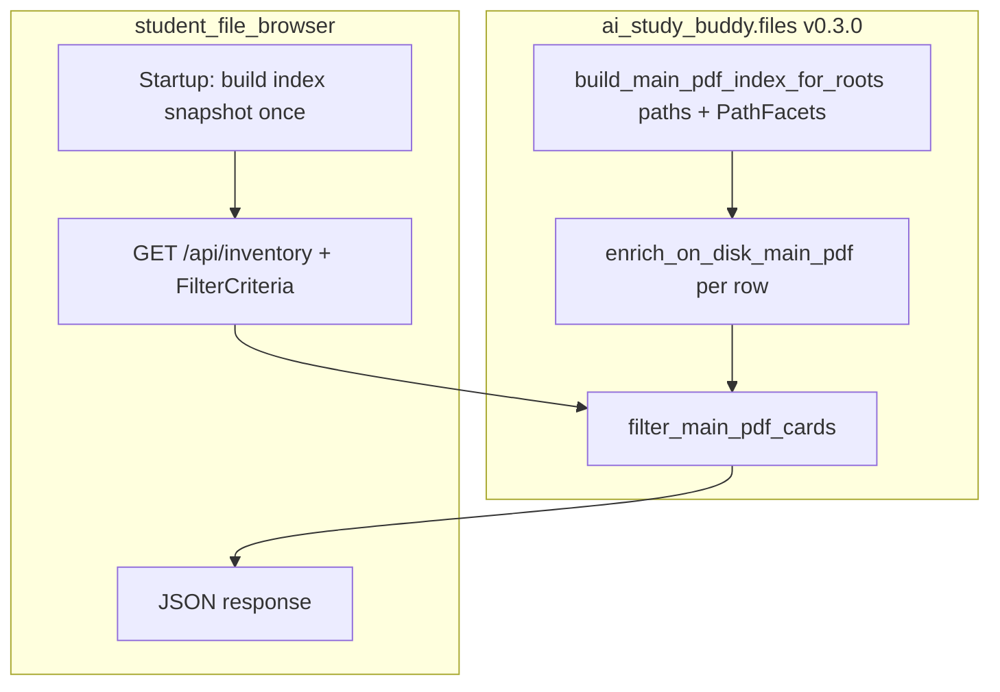

# AI Study Buddy — Student File Browser (Operator Console)

> Status: **Implemented** (May 2026) — [`ai_study_buddy.files`](../files/) **v0.3.0+** (v0.3.1: lazy `marking` import in `completion_enrichment`), [`marking`](../marking/) **v0.3.8** (`review.workflow_flags`), [`student_file_browser`](../student_file_browser/) **v0.1.1** (port **8771**), [`root_pdf_browser`](../root_pdf_browser/) **v0.1.6** (`?id=` + `rel=`), [`review_workspace`](../review_workspace/) **v0.1.4** (`?attempt_id=` + `student_id=` from card links).
>
> Canonical package docs: [student_file_browser/README.md](../student_file_browser/README.md), [SPEC.md](../student_file_browser/SPEC.md), [CHANGELOG.md](../student_file_browser/CHANGELOG.md).
>
> Related L4: [FILE_FRAMEWORK](./L4_FILE_FRAMEWORK.md), [COMPLETION_MARKING_FRAMEWORK](./L4_COMPLETION_MARKING_FRAMEWORK.md), [FILE_SYSTEM_MANAGEMENT](./L4_FILE_SYSTEM_MANAGEMENT.md), [STUDENT_MVP_EXPERIENCE](./L4_STUDENT_MVP_EXPERIENCE.md), [MARKING_RESULT_ARTIFACT](./L4_MARKING_RESULT_ARTIFACT.md).
>
> Sibling front-ends: [`root_pdf_browser`](../root_pdf_browser/README.md) (**8770**), [`review_workspace`](../review_workspace/README.md) (**5178**). Cursor: [start-student-file-browser.md](../../.cursor/commands/start-student-file-browser.md), [start-root-pdf-browser.md](../../.cursor/commands/start-root-pdf-browser.md). Post-MVP backlog: [TODO.md](../TODO.md) **P0-1**, **P1-6**, **P2-5**.

---

## Background

DaydreamEdu and GoodNotes sync folders hold hundreds of completion and template PDFs. **Primary user:** the operator (parent/admin) triaging files on a local machine — not students. Operators need a **filter-first inventory** to answer questions such as:

- Which completion PDFs on disk are still **unregistered**?
- Which registered completions are missing a **template link**, **marking**, or **review**?
- For one student and subject, what work exists across **DaydreamEdu** and **GoodNotes**?

Today:

1. **`root_pdf_browser`** walks a leaf-prefix **tree** and can show per-file registration booleans in a folder listing. It does not support cross-root filtering by student, subject, grade, type, or workflow health flags.
2. **`review_workspace`** lists **registry-backed** attempts for **one student at a time** and is optimized for deep review, not filesystem-wide discovery or registration-gap triage.
3. **Leaf-registry Cursor commands** produce text reports but are not a visual, bookmarkable UI.

**Shipped deliverables:**

1. **`ai_study_buddy.files` v0.3.0+** — on-disk main-PDF inventory, path facets, registry correlation, contextual filter meta, and completion workflow enrichment (single source of truth for flags). **v0.3.1** adds a lazy import in `completion_enrichment` to avoid `files` ↔ `marking` circular imports at package load.
2. **`marking` v0.3.8** — `marking.review.workflow_flags` (`load_completion_marking_context`, `completion_workflow_flags`) shared by Review Workspace `attempt_service` and `files.completion_enrichment`.
3. **Student File Browser** (`ai_study_buddy/student_file_browser/`) — thin localhost app on port **8771**: filter-first **card grid** (metadata + placeholder icon; PDF thumbnails deferred).
4. **`root_pdf_browser` v0.1.6** — deep links consumed by card **View PDF** (`http://127.0.0.1:8770/?id=<root_id>&rel=<posix/path>`).

**Ship order (completed):** `files` v0.3.0 → `marking` v0.3.8 + `files` v0.3.1 → `root_pdf_browser` v0.1.6 → `student_file_browser` v0.1.0.

---

## Scope

### In scope (MVP)

#### `ai_study_buddy.files` v0.3.0 (prerequisite)

1. **`path_facets.py`** (registry-agnostic): public `infer_path_facets(path, *, root_id) -> PathFacets`; Phase A delegates to `PdfFileManager._infer_from_path`; Phase B moves implementation into `files` and makes `pdf_file_manager` call `files` during scan/register (reuse / migrate `pdf_file_manager/tests/test_inference.py`).
2. **`main_pdfs.py`:** `is_inventory_main_pdf(path, registry_index=...)` — registered paths: `file_type='main'` only; unregistered: non-`_raw_` basename (`is_main_pdf_basename`). `list_main_pdfs_in_leaf_folder`, `build_main_pdf_index_for_roots(..., registry_index=...)`; each row includes `infer_path_facets` output.
3. **`pdf_registry_paths.py`** (extend): registry row lookup by resolved path; `has_template_link(completion_file_id, pfm)`; re-export or colocate `is_main_pdf_basename` if shared with `main_pdfs`.
4. **`completion_enrichment.py`** (composition; depends on `PdfFileManager` + `marking.review`): `enrich_registered_completion` → `RegisteredCompletionEnrichment`; calls `marking.review.workflow_flags.completion_workflow_flags` only (no public `CompletionWorkflowFlags` in `files`).
5. **`on_disk_inventory.py`** (orchestrator): `enrich_on_disk_main_pdf(path, *, pfm, review_repo, context_root, index) -> OnDiskMainPdfCard` — path facets + `is_registered` + registry block + workflow block; unregistered completions get fixed falsy/null workflow flags (no path-heuristic marking scan).
6. Package docs: bump [files/README.md](../files/README.md), [files/SPEC.md](../files/SPEC.md), [files/CHANGELOG.md](../files/CHANGELOG.md) to **v0.3.0**; update [L4_FILE_SYSTEM_MANAGEMENT](./L4_FILE_SYSTEM_MANAGEMENT.md) version table when shipped.
7. Tests under `ai_study_buddy/files/tests/` for path facets, main index, registry lookup, enrichment (mocked `PdfFileManager` / review repo).

#### `student_file_browser` v0.1.0 (depends on `files` v0.3.0)

1. **New package** `ai_study_buddy/student_file_browser/` (separate from `root_pdf_browser`), default loopback port **8771**.
2. **Index source:** every direct `*.pdf` under each PDF **leaf folder** for:
   - `list_daydreamedu_leaf_folders_under_root(daydreamedu_root)`
   - `list_goodnotes_leaf_folders_under_root(goodnotes_root)` — default GoodNotes profile (same as [`goodnotes-leaf-registry-report`](../../.cursor/commands/goodnotes-leaf-registry-report.md): exclude `Not completed`, `^x[A-Z].*$` segments, and root-as-leaf `.`).
3. **Main-file filter:** for **registered** paths, include only when registry `file_type='main'` (same as `completion_template_link_gap_report`). For **unregistered** paths, include non-`_raw_` basenames so operators can still triage gaps. `_raw_` archive names and registered `file_type='raw'` paths are excluded.
4. **Completion universe:** same as [`completion_template_link_gap_report`](../pdf_file_manager/scripts/completion_template_link_gap_report.py) — completion rows with inferred `doc_type` **`activity`** or **`note`** are omitted from the index (`build_main_pdf_index_for_roots(..., exclude_activity_note_completions=True)`). **Templates** are always indexed regardless of `doc_type`.
5. **Path-derived facets** (for every indexed main, registered or not): `scope` (template | completion), `root_id` (`daydreamedu` | `goodnotes`), `subject`, `grade_or_scope`, `doc_type` (`exam` | `exercise` | `book`, …), optional `book_group_name`, optional `student_email` (completions only).
6. **Top filter bar** with **Filter** (apply on click; stale in-flight inventory requests dropped) and **Reset** (default filters + clear `localStorage` student), URL query sync on apply, `localStorage` for last **student** (`students.id`):
   - `scope` — default `completion`; when `template`, **student** disabled.
   - `student` — registry `students.id` (e.g. `winston`); URL/localStorage may still hold legacy email — client migrates to `student_id` when config lists a matching email.
   - `subject`, `grade`, `doc_type` — **contextual** dropdowns (options + `Label (n)` counts from current slice via `filter_meta_for_response`); `activity` / `note` omitted from index, not shown in UI.
   - `book` — book group name dropdown when `doc_type=book` (contextual `book_names`).
   - `is_registered`, `has_template`, `has_marking`, `review_status` — shown only when the contextual slice has more than one distinct value (`workflow_filter_options`); not fixed “Has/No” lists.
7. **`is_registered`** and completion workflow flags via **`ai_study_buddy.files.on_disk_inventory`** (not ad hoc logic in the browser).
8. **Registered completion enrichment** (when `is_registered=true` and registry row is a completion main), from `files.completion_enrichment` + registry helpers:
   - `has_template` — `get_template` / `has_template_link` is not `None`
   - `has_marking` — latest marking artifact exists for attempt `file_id`
   - `has_marking_amendment` — companion `marking_amendment.v1` for latest artifact (same rules as `attempt_service._attempt_summary`)
   - `review_status` — `student_review_state.v1` attempt-level enum: `not_started` | `in_progress` | `completed` (missing file ⇒ `not_started`)
9. **Registered template enrichment (minimal):** registry `file_id`, `normal_name`, path, `is_registered=true`; no marking/review flags.
10. **Card grid UI:** placeholder icon + metadata badges; no PDF page thumbnails in v0.1.
11. **Card actions (v0.1):**
    - **View PDF** — new tab to **Root PDF Browser** with `?id=` + `rel=` deep link (`root_pdf_browser` v0.1.6+). POSIX `rel` derived from absolute path (backslashes normalized on Windows).
    - **Copy path** — absolute filesystem path to clipboard.
    - **Review Workspace** — when `has_marking=true`; opens Review Workspace on the same hostname as the operator session (port **5178**) with `?attempt_id=<registry_file_id>&student_id=<student_id>` (v0.1.1+ browser + v0.1.4+ review workspace).
    - **`GET /api/pdf`** — implemented with same leaf-folder + path guard as `root_pdf_browser` (parity / direct fetch); **not** used by the card **View PDF** button in v0.1.
12. **Operator-only:** loopback bind, no auth (same trust model as other local dev tools).
13. **Tests:** `files` tests (facets, index, enrichment) plus `student_file_browser` tests (filter/query mapping, API path guard) — browser does not own business-rule tests.
14. **Documentation suite (Phase 6):** `README.md`, `ARCHITECTURE.md`, `SPEC.md`, `CHANGELOG.md` under `student_file_browser/` (plus `TESTING.md` from Phase 5, linked from README).

### Out of scope (MVP)

1. Registry **mutations** (scan, register, move, link, compress) — remain in `pdf_file_manager` / Cursor skills.
2. PDF **thumbnail** rendering (deferred).
3. **Student-facing** UX (Review Workspace owns that).
4. GoodNotes **template** files (templates live under DaydreamEdu `template/...` only; GoodNotes index is completion-oriented).
5. **Raw** PDF browsing as first-class cards (excluded by main-file rule).
6. Production deployment, HTTPS, multi-user auth.
7. In-app marking, amendment editing, or review-note editing (Review Workspace only).
8. Replacing or merging **`root_pdf_browser`** (both apps coexist).

### Non-goals

- Do not duplicate Review Workspace’s four-panel review UI.
- Do not query `pdf_registry.db` with ad hoc SQL; use `PdfFileManager` and `ai_study_buddy.files` composition modules only.
- Do not implement path facets or completion enrichment inside `student_file_browser`; call `ai_study_buddy.files` v0.3.0 APIs.

---

## Design

### `ai_study_buddy.files` v0.3.0 (shared library)

Extend the existing layered model ([L4_FILE_SYSTEM_MANAGEMENT](./L4_FILE_SYSTEM_MANAGEMENT.md)):

| Layer | Module | Depends on | Responsibility |
|-------|--------|------------|----------------|
| Core | `roots.py`, `leaf_folders.py` | — | Unchanged (v0.2.0) |
| Core | **`path_facets.py`** | — | Path layout → filter dimensions (`scope`, `subject`, `grade_or_scope`, `doc_type`, `book_group_name`, `student_email`, `root_id`, `parse_status`) |
| Core | **`main_pdfs.py`** | `leaf_folders`, `path_facets`, `pdf_registry_paths` | Enumerate **main** PDFs: registry `file_type='main'` when registered; else non-`_raw_` basename |
| Registry composition | **`pdf_registry_paths.py`** (extend) | `PdfFileManager` | Existing registration helpers + **registry row by resolved path**, **`has_template_link`** |
| Marking composition | **`marking.review.workflow_flags`** + **`completion_enrichment.py`** | `PdfFileManager`, `marking.review` | `load_completion_marking_context` / `completion_workflow_flags` (private `_CompletionWorkflowFlags`); `attempt_service` and `files` share one implementation |
| Orchestrator | **`on_disk_inventory.py`** | modules above | **`enrich_on_disk_main_pdf`**, **`build_enriched_inventory`**, **`filter_main_pdf_cards`**, **`FilterCriteria`**, **`filter_meta_for_response`** / **`workflow_filter_options`** (contextual dropdowns + counts) |

**Public imports (target):**

```python
from ai_study_buddy.files import (
    infer_path_facets,
    PathFacets,
    build_main_pdf_index_for_roots,
    enrich_on_disk_main_pdf,
    OnDiskMainPdfCard,
    # … existing v0.2.0 exports unchanged
)
```

**Inference migration (two phases):**

- **v0.3.0 Phase A:** `infer_path_facets` wraps `PdfFileManager._infer_from_path` + explicit book/student segment extraction.
- **Follow-up (same or next minor):** move inference implementation into `files.path_facets`; `PdfFileManager._infer_from_path` becomes a thin delegate (parity tests must pass).

```text
ai_study_buddy/files/
  path_facets.py           # NEW — registry-agnostic
  main_pdfs.py             # NEW — registry-agnostic
  completion_enrichment.py # NEW — imports marking.review
  on_disk_inventory.py     # NEW — orchestrator
  pdf_registry_paths.py    # EXTEND v0.2.0 helpers
  tests/
    test_path_facets.py
    test_main_pdfs.py
    test_completion_enrichment.py
    test_on_disk_inventory.py
```

### Student File Browser package layout (thin UI)

```text
ai_study_buddy/student_file_browser/
  __init__.py
  serve.py                 # ThreadingHTTPServer + routes; calls files.on_disk_inventory
  spawn_background.py      # optional background launcher (parity with root_pdf_browser)
  filters.py               # URL query params ↔ files filter API
  path_guard.py            # safe_resolve_under_root for /api/pdf (shared pattern)
  static/
    index.html
    app.css
    app.js
  tests/
    test_filters.py
    test_path_guard.py
    test_serve.py        # P2-5 — HTTP integration (after serve test hook)
  README.md              # Phase 6 — documentation suite
  ARCHITECTURE.md        # Phase 6
  SPEC.md                # Phase 6
  CHANGELOG.md           # Phase 6
  TESTING.md             # Phase 5 (smoke + pytest); linked from README
```

`.cursor/commands/start-student-file-browser.md` — operational entry (shipped). `.cursor/commands/start-root-pdf-browser.md` documents deep-link handoff (v0.1.6).

### Student File Browser documentation suite (Phase 6)

Ship a self-contained doc set under `ai_study_buddy/student_file_browser/` (same pattern as [`review_workspace`](../review_workspace/README.md)), finalized at **v0.1.0** release:

| Doc | Purpose |
|-----|---------|
| **README.md** | What the tool is, default port **8771**, quick start (`serve` / `spawn_background`), links to ARCHITECTURE / SPEC / CHANGELOG / TESTING, relationship to `files` v0.3.0 and sibling apps (:8770, :5178). |
| **ARCHITECTURE.md** | Boundaries: thin HTTP + static UI; all inventory/enrichment via `ai_study_buddy.files`; no registry mutations; startup index snapshot; security model (loopback + path guard). |
| **SPEC.md** | Contract: HTTP routes, query parameters, JSON response shapes, filter semantics, card action rules, error codes. |
| **CHANGELOG.md** | Version history; **v0.1.0** initial release entry when shipped. |

`TESTING.md` is written during Phase 5 (pytest + manual smoke); README links to it in Phase 6.

### Index pipeline



**Startup snapshot:** at server start, call `build_main_pdf_index_for_roots` once and keep the list in memory (same refresh model as `root_pdf_browser` leaf-prefix snapshot). `/api/inventory` enriches lazily per request or caches enriched cards — implementation choice; document in `ARCHITECTURE.md`. **Restart required** after large filesystem or registry path changes.

**Scale guardrail:** if index size exceeds a configurable threshold (default **2000** mains), log a warning; API still returns data but UI should show a “narrow filters” hint (implementation detail in frontend).

### Path facets (`ai_study_buddy.files.path_facets`)

Path segments are the **source of truth** for filters on both registered and unregistered files. Public API: **`infer_path_facets(path, *, root_id) -> PathFacets`**. v0.3.0 Phase A wraps `PdfFileManager._infer_from_path(path)` (existing tests in `pdf_file_manager/tests/test_inference.py`); add `files/tests/test_path_facets.py` and migrate assertions over time.

| Field | Rule |
|-------|------|
| `root_id` | `daydreamedu` if resolved path is under DaydreamEdu root; else `goodnotes` if under GoodNotes root. |
| `scope` | `template` when inferred `is_template=True`; else `completion`. DaydreamEdu: first segment `template` vs `completion`. GoodNotes: always `completion` for in-scope student-mirror paths. |
| `subject` | Inferred `subject` (`chinese` \| `english` \| `math` \| `science`) or `unknown`. |
| `grade_or_scope` | Inferred `metadata.grade_or_scope` (`P1`–`P6`, `PSLE`) or `unknown`. |
| `doc_type` | Inferred `doc_type` or `unknown`. |
| `book_group_name` | When `doc_type=book`, the path segment immediately under the `Book` folder (book group folder name). |
| `student_email` | For completions: email segment immediately before grade segment (`_path_has_student_mirror_layout`); else `null`. |

**Parse failures:** `infer_path_facets` must **not** propagate `InvalidDocTypeError` to callers; catch inference failures and return `parse_status: "invalid"` with facet fields `unknown` so operators can find misfiled PDFs. Filter UI may offer “show unparseable only” as a follow-up (post-MVP).

**Filter application order:** server-side filter on the index snapshot using query parameters; client mirrors URL ↔ controls.

### URL query parameters (canonical)

| Param | Values | Default |
|-------|--------|---------|
| `scope` | `completion` \| `template` | `completion` |
| `student` | registry `students.id` (e.g. `winston`) | last from `localStorage`, else empty (= all students) |
| `subject` | `chinese` \| `english` \| `math` \| `science` \| `all` | `all` |
| `grade` | `P1`…`P6`, `PSLE`, `all` | `all` |
| `doc_type` | `exam` \| `book` \| `exercise` \| `all` | `all` |
| `book` | string (book group folder name) | empty |
| `is_registered` | `true` \| `false` \| omitted | omitted (= both) |
| `has_template` | `true` \| `false` \| omitted | omitted |
| `has_marking` | `true` \| `false` \| omitted | omitted |
| `review_status` | `not_started` \| `in_progress` \| `completed` \| omitted | omitted |

**MVP UI note:** `activity` / `note` completions are **excluded from the index** (`exclude_activity_note_completions=True`), not merely hidden in the filter UI.

Omit workflow params from the URL when the corresponding control is hidden (`meta.show_*_filter === false` from contextual slice, not the full index only).

### Registration and enrichment (`ai_study_buddy.files`)

All logic lives in **`on_disk_inventory.enrich_on_disk_main_pdf`** (and helpers). The browser passes a shared `RegistryPathIndex` / `PdfFileManager` snapshot built once per inventory request (or cached ~30s — implementation choice).

**Registration** — `pdf_registry_paths.is_pdf_registered` + new **registry row lookup** by resolved path string (`find_files()` equality rule).

**Unregistered completions** — orchestrator sets:

- `has_template = false`
- `has_marking = false`
- `has_marking_amendment = false`
- `review_status = null` (UI displays “—”)

No `context/marking_results/**` path-heuristic scan for unregistered files.

**Registered completion flags** — `completion_enrichment.enrich_registered_completion(...)` calls `marking.review.workflow_flags.completion_workflow_flags` (lazy-imported in v0.3.1). `attempt_service._attempt_summary` uses `load_completion_marking_context` from the same module.

**Registered templates** — workflow flags not applicable; UI shows template scope chips only.

### Runtime configuration (`student_file_browser`)

| Input | Default | Used for |
|-------|---------|----------|
| `DAYDREAMEDU_ROOT` / `GOODNOTES_ROOT` or `local_*_root.txt` | via `ai_study_buddy.files` | Index roots |
| `PDF_REGISTRY_PATH` | `ai_study_buddy/db/pdf_registry.db` | `PdfFileManager` (same as Review Workspace) |
| Context root for marking/review | `ai_study_buddy/context` | `find_marking_artifacts_for_attempt`, `StudentReviewRepository` |
| `--port` | `8771` | HTTP listen port |
| Index size warning threshold | `2000` mains | Log + UI hint |

### API (MVP)

| Path | Method | Role |
|------|--------|------|
| `/`, `/app.css`, `/app.js` | GET | Static UI |
| `/api/health` | GET | `{ "status": "ok", "index_count": N, "files_version": "0.3.1" }` (minimum `files` v0.3.0) |
| `/api/config` | GET | Roots, students, contextual filter meta (same query params as inventory); accepts `FilterCriteria` for slice-aware options |
| `/api/inventory` | GET | Filtered inventory rows (query params → `FilterCriteria` → `filter_main_pdf_cards`) |
| `/api/pdf` | GET, HEAD | Safe PDF bytes under configured roots; parent directory must be a PDF **leaf folder** in the startup snapshot (parity with `root_pdf_browser`) |

**`GET /api/inventory` response shape (per row):**

```json
{
  "items": [
    {
      "absolute_path": "/…/completion/…/_c_foo.pdf",
      "basename": "_c_foo.pdf",
      "root_id": "daydreamedu",
      "scope": "completion",
      "subject": "math",
      "grade_or_scope": "P4",
      "doc_type": "exam",
      "book_group_name": null,
      "student_email": "emma@example.com",
      "parse_status": "ok",
      "is_registered": true,
      "registry_file_id": "abc123",
      "normal_name": "foo",
      "has_template": true,
      "has_marking": true,
      "has_marking_amendment": false,
      "review_status": "in_progress"
    }
  ],
  "meta": {
    "total_in_index": 412,
    "total_after_filter": 18,
    "unregistered_in_index": 3,
    "show_is_registered_filter": true,
    "subjects": ["math", "english"],
    "subject_counts": { "all": 412, "math": 200 },
    "show_has_marking_filter": true,
    "has_marking_options": ["true", "false"],
    "has_marking_counts": { "": 18, "true": 12, "false": 6 }
  }
}
```

(`meta` also includes `scopes`, `grades`, `doc_types`, `student_ids`, `book_names`, and parallel `*_counts` / `show_*_filter` fields — see `filter_meta_for_response` in `files.on_disk_inventory`.)

### UI behavior (shipped v0.1.0)

1. **Filter bar** at top; **Filter** applies criteria, updates URL (`history.replaceState`), and refreshes inventory + contextual dropdown options. **Reset** clears student `localStorage` and reloads defaults.
2. **Student memory:** `student_file_browser.lastStudent` in `localStorage` (`students.id`).
3. **Scope = template:** student dropdown disabled (“Student (n/a for templates)”).
4. **Book filter:** dropdown when `doc_type` is `book` (contextual `book_names`).
5. **Workflow filters:** registered / template / marking / review controls appear only when `meta.show_*_filter` is true for the current slice.
6. **Card grid:** placeholder PDF icon, facet chips, **colored workflow badges** (registered, template, marking, amendment, review).
7. **Empty state:** “No files match these filters.” Server exits with message if no roots configured.

### Relationship to other tools

| Need | Tool |
|------|------|
| Tree navigation, PDF view, deep links | `root_pdf_browser` :8770 (`?id=` + `rel=`) |
| Filtered inventory, registration health | **Student File Browser** :8771 |
| Marking review, notes, amendments | `review_workspace` :5178 |
| Batch register / link / move | `pdf_file_manager` skills & scripts |

---

## Migration Plan

No migration of existing data or registry schema.

1. **Additive — `files` v0.3.0:** new modules and exports; existing v0.2.0 imports unchanged. Optional follow-up: `PdfFileManager._infer_from_path` delegates to `files.infer_path_facets` (no registry DB change).
2. **Additive — `student_file_browser`:** new package and Cursor command; depends on `files` v0.3.0.
3. **`root_pdf_browser` v0.1.6** — deep-link support for Student File Browser **View PDF** (no shared inventory API).
4. **`review_workspace`** unchanged in MVP (generic :5178 link when marked).
5. **Docs:** [L4_FILE_SYSTEM_MANAGEMENT](./L4_FILE_SYSTEM_MANAGEMENT.md) v0.3.0 row; this doc status **Implemented**; [docs/README.md](./README.md) L4 table entry.
6. **Rollback:** remove `student_file_browser` and stop port 8771; `files` v0.3.x may remain for other consumers.

---

## Risks and Mitigations

| Risk | Mitigation |
|------|------------|
| Large index slow at startup | Snapshot once; warn above threshold; server-side filtering; optional future incremental refresh. |
| Path inference wrong for misfiled PDFs | Surface `parse_status`; keep misfiled rows visible with `unknown` facets; integrity script already exists. |
| Drift vs `attempt_service` enrichment | `files.completion_enrichment` calls same marking/review helpers; regression tests in `files/tests/` against known fixture completion id. |
| Operator confuses three localhost apps | Distinct ports, titles, and README; card actions label target app explicitly. |
| `find_files()` path match misses moved files | Document restart + registry path repair; same limitation as leaf-registry reports. |
| GoodNotes structural `x*` segments excluded from leaf list | By design per `ai_study_buddy.files`; not visible in index. |
| Circular import `files` ↔ `marking` | **Mitigated (v0.3.1):** lazy-import `completion_workflow_flags` inside `enrich_registered_completion`; `marking` does not import `on_disk_inventory`. |
| Enrichment slow on large `/api/inventory` | Path+facet index at startup; cache `RegistryPathIndex` per process; document enrich strategy in ARCHITECTURE. |

---

## Detailed TODO Checklist (Implementation Monitoring)

### Phase 1 — `ai_study_buddy.files` v0.3.0 (prerequisite)

- [x] Add `path_facets.py`: `PathFacets` dataclass, `infer_path_facets(path, *, root_id)` (Phase A: delegate to `PdfFileManager._infer_from_path` + book/student extraction)
- [x] Add `main_pdfs.py`: `is_main_pdf_basename`, `list_main_pdfs_in_leaf_folder`, `build_main_pdf_index_for_roots`
- [x] Extend `pdf_registry_paths.py`: registry row lookup by resolved path; `has_template_link` / template resolution helper
- [x] Add `completion_enrichment.py`: `enrich_registered_completion` reusing `marking.review` (marking, amendment, `review_status`)
- [x] Add `on_disk_inventory.py`: `FilterCriteria`, `enrich_on_disk_main_pdf`, `filter_main_pdf_cards`, `OnDiskMainPdfCard`, `inventory_meta(index, filtered)` → `show_is_registered_filter`
- [x] Export new symbols from `files/__init__.py`
- [x] Update `files/SPEC.md` §§ for new modules; bump `files/README.md` and `files/CHANGELOG.md` to **v0.3.0**
- [x] Tests: `test_path_facets.py`, `test_main_pdfs.py`, `test_on_disk_inventory.py` (enrichment covered in `test_on_disk_inventory`; no separate `test_completion_enrichment.py`)
- [x] Run `pytest ai_study_buddy/files/tests -q` (52 passed after v0.3.1; see `files/TESTING.md`)
- [x] **v0.3.1** — lazy `completion_workflow_flags` import in `completion_enrichment` (import-cycle fix)
- [x] Update [L4_FILE_SYSTEM_MANAGEMENT](./L4_FILE_SYSTEM_MANAGEMENT.md) version table (v0.3.0 row)
- [x] Rollback note: revert `files` v0.3.0 commit; v0.2.0 consumers (`pdf_registry_paths` only) remain valid (see `files/CHANGELOG.md`)

**Phase 1 — marking / `files` boundary cleanup**

- [x] `marking.review.workflow_flags`: `load_completion_marking_context` + `completion_workflow_flags`; `_CompletionWorkflowFlags` not part of public API
- [x] `attempt_service._attempt_summary` delegates to `load_completion_marking_context` (single artifact/review/amendment load)
- [x] `files.completion_enrichment` imports only `completion_workflow_flags`; exposes `RegisteredCompletionEnrichment` only
- [x] Tests: `marking/tests/test_workflow_flags.py`

### Phase 2 — `student_file_browser` scaffolding

- [x] Create `ai_study_buddy/student_file_browser/` package (`__init__.py` and code layout only; **documentation suite deferred to Phase 6**)
- [x] Add `serve.py` with loopback `ThreadingHTTPServer`, default port **8771**, `--port` / `--no-browser` flags; startup builds in-memory main-PDF index snapshot
- [x] Add `spawn_background.py` (mirror `root_pdf_browser.spawn_background`)
- [x] Add `.cursor/commands/start-student-file-browser.md`
- [x] Add static shell (`index.html`, `app.css`, `app.js`) with filter bar placeholders
- [x] Add `filters.py` mapping URL query params → `files.filter_main_pdf_cards` arguments

### Phase 3 — Browser API (calls `files` only)

- [x] Implement `path_guard.safe_resolve_under_root` for `/api/pdf`
- [x] Implement `GET /api/config` (roots, students, enum options, `show_is_registered_filter` from full index)
- [x] Implement `GET /api/inventory` on startup snapshot + `enrich_on_disk_main_pdf` + `filter_main_pdf_cards` (no full re-walk per request)
- [x] Implement `GET /api/pdf` with leaf-folder + root guard
- [x] Unit tests: `test_filters.py`, `test_path_guard.py` (`test_serve.py` → [TODO.md](../TODO.md) **P2-5**)

### Phase 4 — Frontend

- [x] Wire filter controls ↔ URL query params ↔ `/api/inventory`
- [x] Implement `localStorage` last-student persistence
- [x] Implement conditional student / book / is_registered controls per spec
- [x] Render card grid with placeholder icons and badges
- [x] Implement card actions: View PDF (deep link :8770), copy path, Review Workspace (:5178)

### Phase 5 — Testing and verification

- [x] Add `student_file_browser/TESTING.md` (pytest commands, manual smoke checklist, env vars)
- [x] `pytest ai_study_buddy/files/tests ai_study_buddy/student_file_browser/tests -q` (56 passed, May 2026)
- [x] Manual smoke: both roots configured, filter unregistered only, open registered marked completion in Review Workspace
- [x] Manual smoke: template scope shows DaydreamEdu templates, student filter disabled
- [x] Record smoke notes in `student_file_browser/TESTING.md` (see **Smoke verification** there)

### Phase 6 — Documentation and rollout

**`student_file_browser` documentation suite (required at v0.1.0):**

- [x] **README.md** — overview, port, quick start, doc index, sibling-tool pointers
- [x] **ARCHITECTURE.md** — layers, `files` dependency, non-goals, index snapshot, path-guard security
- [x] **SPEC.md** — API/query/response contract aligned with implemented behavior
- [x] **CHANGELOG.md** — **v0.1.0** release notes (initial ship)
- [x] README links to **TESTING.md** (completed in Phase 5)

**Repo / cross-package docs:**

- [x] Update `ai_study_buddy/docs/README.md` L4 table (implemented entry)
- [x] Add cross-link under [L4_FILE_FRAMEWORK](./L4_FILE_FRAMEWORK.md) file utilities (`path_facets`, `on_disk_inventory`, Student File Browser)
- [x] Confirm `files/CHANGELOG.md` documents **v0.3.0** / **v0.3.1**; `marking/CHANGELOG.md` **v0.3.8**; `root_pdf_browser` **v0.1.6**
- [x] Rollback note in `student_file_browser/README.md`: delete package + command; no DB changes (`files` v0.3.0 can remain if other tools adopt it)
- [x] Update this proposal’s status callout to **Implemented** when both deliverables ship (or split status per package if `files` ships first)

---

## Decision (implemented)

1. **`ai_study_buddy.files` v0.3.0+** is the canonical place for on-disk main-PDF inventory and enrichment (`path_facets`, `main_pdfs`, `pdf_registry_paths`, `completion_enrichment`, `on_disk_inventory`). Inference remains Phase A delegate to `PdfFileManager._infer_from_path`.
2. **`marking.review.workflow_flags` (v0.3.8)** is the single completion workflow loader for `attempt_service` and `files.completion_enrichment`.
3. **`student_file_browser` v0.1.0** on port **8771** is a thin UI over `files` only — contextual filters, **Filter** / **Reset**, card grid with workflow badges.
4. **View PDF** deep-links to **`root_pdf_browser` v0.1.6** (`?id=` + `rel=`); **Review Workspace** deep-links via `?attempt_id=` + `student_id=` (v0.1.1 / v0.1.4).
5. Documentation suite shipped under `student_file_browser/` (README, ARCHITECTURE, SPEC, CHANGELOG, TESTING) plus Cursor `start-student-file-browser.md`.

**Git commits (main, May 2026):** `feat(files): v0.3.0 …`, `refactor(marking): v0.3.8 …`, `feat(root_pdf_browser): v0.1.6 …`, `feat(student_file_browser): v0.1.0 …`.

---

## Open Questions (post-MVP)

| # | Topic | Decision |
|---|--------|----------|
| 1 | **Review Workspace attempt deep link** from a card | **Done** (May 2026): `review_workspace` v0.1.4 + `student_file_browser` v0.1.1 — [proposal](../review_workspace/docs/proposal/2-attempt-deep-links.md). |
| 2 | **`root_id` filter** (DaydreamEdu vs GoodNotes) in filter bar + URL | **Tracked:** [TODO.md](../TODO.md) **P0-1** — proposal [1-root-id-filter.md](../student_file_browser/docs/proposal/1-root-id-filter.md). |
| 3 | **`include_activity_note`** in index / UI | **No action** for now — index continues to exclude `activity` / `note` completions (`exclude_activity_note_completions=True`). |
| 4 | **Move `_infer_from_path` into `files.path_facets`** | **Tracked:** [TODO.md](../TODO.md) **P1-6**. |
| 5 | **`test_serve.py`** (HTTP tests for `/api/inventory`, etc.) | **Tracked:** [TODO.md](../TODO.md) **P2-5** (P2 — after P0 serve changes; needs test hook first). |

### Note on `test_serve.py` (item 5)

**Priority:** **P2** — improves regression safety; does not block operator workflows (unit tests + manual smoke already passed at v0.1.0). Prefer landing the **serve test hook** alongside **P0-1** (`root_id` filter) if `serve.py` is already being refactored.

**Scope:** integration-style tests that spin up `StudentFileBrowserHandler` on an ephemeral port (or call `do_GET` via a request stub) and assert HTTP status + JSON for `/api/health`, `/api/config`, and `/api/inventory` (query → `FilterCriteria` → filtered `items` / `meta`), plus `/api/pdf` path-guard rejections (traversal, non-leaf parent).

**Prerequisites (why v0.1.0 deferred the file):**

1. **No repo precedent** — `root_pdf_browser` and `review_workspace` use unit tests + manual smoke only.
2. **Class-level handler state** — `StudentFileBrowserHandler.roots`, `index_rows`, `enriched_cache` set on the class in `main()`; needs a factory / instance attrs or `create_app(...)`.
3. **`/api/inventory` enrichment** — `_get_enriched_cards()` hits real `PdfFileManager` + `build_enriched_inventory` unless injected/mocked.
4. **Startup index** — `build_main_pdf_index_for_roots` in `main()` ties to real roots unless tests inject `index_rows`.

**Deliverable (P2-5):** thin test hook on `serve.py`, then `ai_study_buddy/student_file_browser/tests/test_serve.py`; document in `TESTING.md`.
