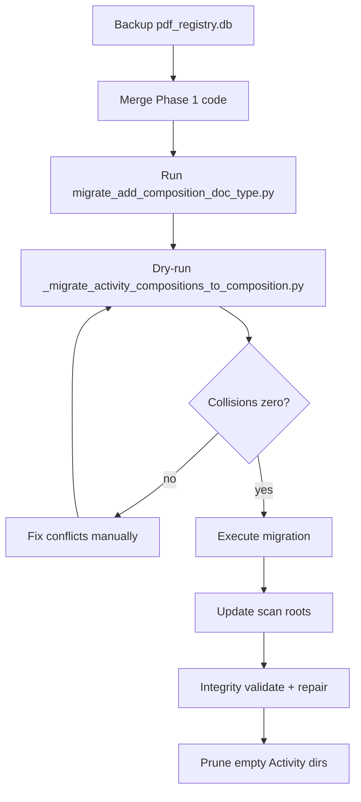

# Proposal 18: Add `composition` doc_type and `Composition/` content folder

**Happy path item:** [Type consistency] — Composition and situational/continuous writing work lived under `Activity/` with `doc_type=activity`. Split into a dedicated L3 folder and canonical enum so inference, filtering, and marking workflows can treat writing samples distinctly from generic activities.

**Proposal status:** **Complete** — enum, schema, d_root migration, docs, and Phase 5 final sweep are done. **Follow-up only:** remaining undated composition completion dates, composition marking workflow, and [TODO P1-4](../../../TODO.md) path-facets parity (see [Future work](#future-work)).

---

## Implementation status

**Overall status: Complete** (shipped **`pdf_file_manager` v0.3.35**, executed **2026-05-30 SGT**)

| Area | Status |
| --- | --- |
| **Overall** | **Complete** (see proposal status above) |
| Add `composition` to canonical `doc_type` set | **Done** |
| Add `Composition` L3 folder inference | **Done** |
| Schema CHECK + auto-rebuild on open | **Done** |
| d_root Activity → Composition file migration (38 items / 76 rows) | **Done** — see [Completed work](#completed-work) |
| g_root PP situational-writing book units (stay `book`) | **Confirmed out of scope** |
| Operator universe includes composition completions | **Confirmed** |
| Documentation (Phase 4) | **Done** |
| Phase 5 final sweep | **Done** (2026-05-30) |
| Completion dates (`filename_term` for term-keyword titles) | **Partial** — 11 inferred + 3 manual; 24 undated → [Future work](#future-work) |

### Completed work

Migration and validation were executed via `PdfFileManager` (`move_file`, scan-root ensure/remove) using:

- [`scripts/migrate_add_composition_doc_type.py`](../../scripts/migrate_add_composition_doc_type.py) — schema CHECK rebuild
- [`scripts/_migrate_activity_compositions_to_composition.py`](../../scripts/_migrate_activity_compositions_to_composition.py) — one-shot Activity → Composition moves
- Audit JSON: [`scripts/composition_migration_execute_20260530.json`](../../scripts/composition_migration_execute_20260530.json)

| Item | Result |
| --- | --- |
| Registry backup | `DaydreamEdu/db/pdf_registry_2026-05-30_12-57-50+0800.db` |
| Files moved | **76** (`_c_` + `_raw_` pairs for **38** logical items) |
| Post-migration `doc_type=composition` mains | **38** under `.../Composition/` |
| Migration dry-run (post-execute) | **0** candidates |
| `validate_pdf_registry_integrity` | Exit **0** — all summary counts zero |
| `pdf_file_manager` test suite (Phase 5) | **260 passed**, 1 skipped |
| Composition completion dates | **14/38** dated (11 `filename_term`, 3 `manual`); **24** still undated |

**Related fix (same release):** `infer_completion_dates --doc-type` batch filter — no longer passes a list to `find_files` (regression fix in v0.3.35).

---

## Motivation

Composition (作文), English Paper 1 (continuous + situational writing), and related writing practice are stored under d_root `.../Activity/` folders and classified as `doc_type=activity`. That conflates two different content kinds:

- **Activity** — topic-related study activities that accompany a textbook or topic; not necessarily writing samples.
- **Composition** — student writing work: essays, situational writing, continuous writing, and exam Paper 1 writing sections.

A dedicated folder and enum makes path inference deterministic and supports future marking, completion-date, and analytics workflows tuned for writing samples.

**Verified inventory (2026-05-30, pre-migration):** 76 registry rows (38 `_c_`/`_raw_` pairs) under d_root `Activity/` matched composition filename heuristics. **Post-migration (2026-05-30):** all 38 mains live under `Composition/` with `doc_type=composition`; g_root has 2 PP situational-writing files under `Book/` that remain `doc_type=book`.

---

## Goals

1. Add `composition` as the sixth canonical `doc_type`.
2. Map L3 folder `Composition` → `doc_type=composition`, `metadata.content_folder=Composition`.
3. Migrate existing d_root composition files from `Activity/` to sibling `Composition/` folders.
4. Keep g_root Power Pack situational-writing book units under `Book/` unchanged.
5. Include composition completions in the default operator universe (unlike `activity` / `note`).

**Non-goals:**

- Moving g_root book-based situational writing (`c_PP English Situational Writing Practice *.pdf`).
- Filename-based runtime inference (folder segment only, same strict model as other L3 types).
- Redesigning `file_type` or relation schemas.

---

## Design decisions

| Decision | Choice |
|----------|--------|
| L3 folder → doc_type | `Composition` → `composition`, `metadata.content_folder = "Composition"` |
| Inference | Folder-segment only; no filename fallback in `_infer_from_path` |
| Operator universe | **Include** composition completions — do **not** add to `COMPLETION_UNIVERSE_EXCLUDED_DOC_TYPES` |
| Template integrity | Compositions are **completions without templates** — no `template_for` link required; `collect_template_invalid_doc_type` unchanged (`exam`/`exercise`/`book` only for templates) |
| g_root book SW | No disk moves; registry rows stay `doc_type=book` |
| Migration selection | Basename heuristics (migration script only); exclude `Not completed/` paths |

### Proposed enum contract

Canonical `doc_type` values after this change:

| `doc_type` | L3 folder (`metadata.content_folder`) |
|------------|----------------------------------------|
| `exam` | `Exam` |
| `exercise` | `Exercise` |
| `book` | `Book` |
| `activity` | `Activity` |
| `composition` | `Composition` |
| `note` | `Note` |

### Migration filename heuristics (selection only)

Used by the one-shot migration script to pick Activity-folder candidates — **not** by runtime `_infer_from_path`:

- `composition` (case-insensitive)
- `作文`
- `paper 1` / `Paper 1`
- `试卷一`
- `situational writing` (case-insensitive)
- `continuous writing` (case-insensitive)

---

## Scope and inventory

### In scope (migrate)

76 registry rows (38 `_c_`/`_raw_` pairs) under d_root `.../Activity/` whose basenames match the heuristics above, excluding `Not completed/` paths.

### Out of scope (stay put)

- g_root `.../Book/Power Pack English PSLE/c_PP English Situational Writing Practice *.pdf` — remain `doc_type=book`
- Remaining ~286 d_root Activity PDFs that do not match heuristics — stay in `Activity/` as `doc_type=activity`
- Any path under `Not completed/` (e.g. g_root `Im the Best in English Composition Writing Primary 6/Not completed/...`)

### Affected Activity scan roots (8)

All are direct scan roots; after migration most retain non-composition files.

**Exception:** `winston.ry.meng@gmail.com/P3/Activity` (Chinese) is 2/2 composition — entire leaf empties; remove Activity scan root and add Composition scan root.

---

## Files to migrate (38 unique items, 76 registry rows)

Each item exists on disk as an `_c_` + `_raw_` pair. Paths are relative to d_root (`DaydreamEdu/`). The leaf folder `Activity` becomes sibling `Composition`; filenames are unchanged.

### Chinese — emma.rs.meng (2)

| # | Source leaf | Basename |
|---|-------------|----------|
| 1 | `completion/Singapore Primary Chinese/emma.rs.meng@gmail.com/P4/Activity` | 四年级 作文 1.pdf |
| 2 | `completion/Singapore Primary Chinese/emma.rs.meng@gmail.com/P4/Activity` | 四年级 作文 2.pdf |

### Chinese — winston.ry.meng (11)

| # | Source leaf | Basename |
|---|-------------|----------|
| 3 | `completion/Singapore Primary Chinese/winston.ry.meng@gmail.com/P3/Activity` | 三年级华文 期末考试 试卷一.pdf |
| 4 | `completion/Singapore Primary Chinese/winston.ry.meng@gmail.com/P4/Activity` | 四年级华文 期末考试 (试卷一).pdf |
| 5 | `completion/Singapore Primary Chinese/winston.ry.meng@gmail.com/P5/Activity` | 五年级华文 期末考试 (试卷一).pdf |
| 6 | `completion/Singapore Primary Chinese/winston.ry.meng@gmail.com/P5/Activity` | 五年级华文 期末考试 练习 (试卷一).pdf |
| 7 | `completion/Singapore Primary Chinese/winston.ry.meng@gmail.com/P5/Activity` | 五年级高华 期末考试 (试卷一).pdf |
| 8 | `completion/Singapore Primary Chinese/winston.ry.meng@gmail.com/P5/Activity` | 五年级高华 测验3 (试卷一).pdf |
| 9 | `completion/Singapore Primary Chinese/winston.ry.meng@gmail.com/P5/Activity` | 高华 作文练习一.pdf |
| 10 | `completion/Singapore Primary Chinese/winston.ry.meng@gmail.com/P5/Activity` | 高华 作文练习二.pdf |
| 11 | `completion/Singapore Primary Chinese/winston.ry.meng@gmail.com/P5/Activity` | 高华 作文练习四.pdf |
| 12 | `completion/Singapore Primary Chinese/winston.ry.meng@gmail.com/P5/Activity` | 高华 作文练习五.pdf |
| 13 | `completion/Singapore Primary Chinese/winston.ry.meng@gmail.com/P5/Activity` | 高华 作文练习六.pdf |

### English — winston.ry.meng (25)

| # | Source leaf | Basename |
|---|-------------|----------|
| 14 | `completion/Singapore Primary English/winston.ry.meng@gmail.com/P4/Activity` | P4 English EoY (Paper 1).pdf |
| 15 | `completion/Singapore Primary English/winston.ry.meng@gmail.com/P5/Activity` | A Pleasant Surprise Composition.pdf |
| 16 | `completion/Singapore Primary English/winston.ry.meng@gmail.com/P5/Activity` | Composition 1 A Change For The Better.pdf |
| 17 | `completion/Singapore Primary English/winston.ry.meng@gmail.com/P5/Activity` | Composition 1b.pdf |
| 18 | `completion/Singapore Primary English/winston.ry.meng@gmail.com/P5/Activity` | Composition 2b.pdf |
| 19 | `completion/Singapore Primary English/winston.ry.meng@gmail.com/P5/Activity` | Composition 3 A challenge.pdf |
| 20 | `completion/Singapore Primary English/winston.ry.meng@gmail.com/P5/Activity` | Composition Stellar Unit 4 The Promise.pdf |
| 21 | `completion/Singapore Primary English/winston.ry.meng@gmail.com/P5/Activity` | P5 English EoY (Paper 1).pdf |
| 22 | `completion/Singapore Primary English/winston.ry.meng@gmail.com/P5/Activity` | P5 English EoY Practice (Paper 1).pdf |
| 23 | `completion/Singapore Primary English/winston.ry.meng@gmail.com/P5/Activity` | Practice 7 Composition.pdf |
| 24 | `completion/Singapore Primary English/winston.ry.meng@gmail.com/P5/Activity` | Situational Writing Exercise 2.pdf |
| 25 | `completion/Singapore Primary English/winston.ry.meng@gmail.com/P5/Activity` | Situational Writing Exercise.pdf |
| 26 | `completion/Singapore Primary English/winston.ry.meng@gmail.com/P5/Activity` | Situational Writing Exercised Term 3 2025.pdf |
| 27 | `completion/Singapore Primary English/winston.ry.meng@gmail.com/P5/Activity` | Situational Writing Exercises Term 2 2025.pdf |
| 28 | `completion/Singapore Primary English/winston.ry.meng@gmail.com/P5/Activity` | Situational Writing Practice 12.pdf |
| 29 | `completion/Singapore Primary English/winston.ry.meng@gmail.com/P5/Activity` | p5.english.039.Composition 1 Stellar Unit 1 Coolie Boy.pdf |
| 30 | `completion/Singapore Primary English/winston.ry.meng@gmail.com/P6/Activity` | P6 Composition 1 2026.pdf |
| 31 | `completion/Singapore Primary English/winston.ry.meng@gmail.com/P6/Activity` | P6 Composition 2.pdf |
| 32 | `completion/Singapore Primary English/winston.ry.meng@gmail.com/P6/Activity` | P6 Composition 6.pdf |
| 33 | `completion/Singapore Primary English/winston.ry.meng@gmail.com/P6/Activity` | P6 English Composition Examples.pdf |
| 34 | `completion/Singapore Primary English/winston.ry.meng@gmail.com/P6/Activity` | P6 English Situational Writing 1.pdf |
| 35 | `completion/Singapore Primary English/winston.ry.meng@gmail.com/P6/Activity` | P6 English Situational Writing 2.pdf |
| 36 | `completion/Singapore Primary English/winston.ry.meng@gmail.com/P6/Activity` | P6 English Situational Writing 3.pdf |
| 37 | `completion/Singapore Primary English/winston.ry.meng@gmail.com/P6/Activity` | Situational Writing Practice 8 - Eyewitness Report.pdf |
| 38 | `completion/Singapore Primary English/winston.ry.meng@gmail.com/PSLE/Activity` | PSLE English Timed Practice 1 (Paper 1) (2024 Prelim).pdf |

**Example move (item 15):**

```text
completion/.../P5/Activity/_c_A Pleasant Surprise Composition.pdf
  → completion/.../P5/Composition/_c_A Pleasant Surprise Composition.pdf
completion/.../P5/Activity/_raw_A Pleasant Surprise Composition.pdf
  → completion/.../P5/Composition/_raw_A Pleasant Surprise Composition.pdf
```

---

## Open Questions and decisions

1. **Operator universe:** resolved — composition completions **stay included** in the default operator inventory (not added to `COMPLETION_UNIVERSE_EXCLUDED_DOC_TYPES`).
2. **g_root PP situational writing:** resolved — files under `Book/Power Pack English PSLE/` remain `doc_type=book`; no disk moves.
3. **Runtime inference vs migration heuristics:** resolved — `_infer_from_path` uses L3 folder segment only; basename patterns are **migration-selection only** (`composition_filenames.py`).
4. **Completion dates:** resolved for registry migration scope — **`filename_term`** inference applies to d_root compositions with term keywords (期末考试, 测验N, EoY, Term N, etc.) via unified `infer_completion_date_for_file` / `infer_completion_dates --doc-type composition`. Remaining undated compositions (generic titles) still need page-1 inspection or **Buddy Console** manual entry. See **Future work**.
5. **Composition templates:** resolved — compositions **do not require templates**. Completions under `Composition/` are standalone writing samples with no `template_for` link; no change to `collect_template_invalid_doc_type` (templates remain `exam`/`exercise`/`book` only).
6. **Marking artifact paths:** resolved — **none** of the 38 migration items have marking results yet (composition marking workflow undefined). No path remap or `rename_file_with_context_guardrail.py` work needed for this migration.
7. **Path inference relocation (TODO P1-4):** resolved — **out of scope** for this proposal. Implement `Composition` inference in `PdfFileManager._infer_from_path` only; P1-4 reconciliation is a separate future change.

---

## Implementation plan

Phases use **numbered indices** (Phase 1, Phase 2, …) per [TODO.md P1-1](../../../TODO.md). Each phase has a **todo checklist**, **test checklist**, and **success / handoff criteria**.

**Operator execution order (Phases 1–3):**



### Phase 1 — Core enum, inference, and schema

**Goal:** Accept `doc_type=composition` in code and registry schema; infer from `Composition/` paths. No disk moves.

**Todo checklist**

- [x] Extend `_ALLOWED_DOC_TYPES` with `"composition"` in `pdf_file_manager.py`.
- [x] Add L3 branch in `_infer_from_path()`:

```python
if p == "Composition":
    out["doc_type"] = "composition"
    out.setdefault("metadata", {})["content_folder"] = "Composition"
    break
```

- [x] Update strict error message to list `Exam/Exercise/Book/Activity/Composition/Note`.
- [x] Extend CHECK in `_rebuild_pdf_files_table()` and `schema.sql`.
- [x] Extend `_migrate_schema_if_needed()`: rebuild when `'composition'` missing from `pdf_files` table SQL.
- [x] Add `scripts/migrate_add_composition_doc_type.py` (`--dry-run` default; execute rebuilds CHECK).
- [x] Update `scripts/migrate_doc_type_enums.py` rebuilt CHECK to include `composition`.
- [x] **Do not** change `COMPLETION_UNIVERSE_EXCLUDED_DOC_TYPES` or `exclude_activity_note_completions` APIs.

**Test checklist**

- [x] `tests/test_doc_type_enum.py` — accept `composition`; reject unknown values.
- [x] `tests/test_inference.py` — `.../Composition/foo.pdf` → `doc_type=composition`, `content_folder=Composition`.
- [x] `tests/test_inference.py` — strict failure message mentions `Composition` when L3 segment missing.
- [x] Schema migration dry-run on a copy of registry DB (or test fixture).

**Success / handoff criteria**

- [x] `PdfFileManager.register_file(..., doc_type='composition')` and `update_metadata(..., doc_type='composition')` succeed.
- [x] Opening `PdfFileManager` on a live DB auto-migrates schema when CHECK lacks `composition`.
- [x] Existing rows unchanged until Phase 3 file migration.

### Phase 2 — Migration selection helpers and driver script

**Goal:** Ship auditable tooling to list and move Activity-folder composition candidates. Script defaults to dry-run.

**Todo checklist**

- [x] Add `composition_filenames.py` with `COMPOSITION_BASENAME_PATTERNS` and `is_composition_basename(name)`.
- [x] Add `scripts/_migrate_activity_compositions_to_composition.py` modeled on `_migrate_d_root_top_level_branches.py`.
- [x] Selection: d_root path, `Activity` segment, not `Not completed`, basename matches heuristics, registered row.
- [x] Target: `new_dir = path.parent.with_name("Composition")`; skip g_root, `Book/`, rows already under `Composition/`.
- [x] Execute: `PdfFileManager.move_file(file_id, new_dir)` per candidate; JSON audit output (`mode`, stats, previews, collisions).
- [x] Collision guard: refuse `--execute` when destination exists or duplicate targets.
- [x] Scan-root pass: `ensure_scan_root` for new Composition leaves; `remove_scan_root` for emptied Activity leaves (P3 Chinese).
- [x] Pre-flight: document `backup_pdf_registry.py` before first execute.

**Test checklist**

- [x] Unit tests for `is_composition_basename` (positive/negative cases from [Files to migrate](#files-to-migrate-38-unique-items-76-registry-rows)).
- [x] Integration test: temp dir with Activity + registered rows → dry-run lists candidates; execute moves disk + updates `doc_type`.
- [x] Test scan-root update logic for partial leaf (Activity retains files) vs empty leaf.

**Success / handoff criteria**

- [x] Dry-run against live registry lists **76** candidates matching proposal inventory (38 logical items).
- [x] Dry-run reports **0** g_root / `Book/` candidates.
- [x] Execute path uses `move_file` only (no ad hoc `mv` + manual SQL).

### Phase 3 — Operator migration and validation

**Goal:** Run one-time d_root Activity → Composition migration on production data; validate registry and disk alignment.

**Todo checklist**

- [x] Backup registry DB (`scripts/backup_pdf_registry.py`).
- [x] Run `migrate_add_composition_doc_type.py` (execute).
- [x] Run `_migrate_activity_compositions_to_composition.py` dry-run; review JSON; confirm 76 moves, zero collisions.
- [x] Execute file migration + scan-root updates.
- [x] Re-run migration dry-run → **0** candidates.
- [x] Run `validate_pdf_registry_integrity.py`; `repair_main_raw_metadata_drift()` if needed.
- [x] Run `_prune_empty_dirs_d_root.py` for emptied Activity folders.
- [x] Commit JSON audit artifact under `pdf_file_manager/scripts/` (output-only).

**Test checklist**

- [x] Spot-check counts: **38** main rows with `doc_type=composition`, **76** total rows under `Composition/`.
- [x] Integrity: zero `path_inferred_metadata_drift` for moved rows.
- [x] Manual spot-check: one Chinese 作文 pair and one English Situational Writing pair on disk at new paths.

**Success / handoff criteria**

- [x] All 38 logical items live under `.../Composition/` with `doc_type=composition`.
- [x] g_root PP situational-writing files unchanged (`doc_type=book`).
- [x] Remaining Activity PDFs still `doc_type=activity`.
- [x] Eight Composition scan roots registered; P3 Chinese Activity scan root removed if empty.

### Phase 4 — Documentation updates

**Goal:** Make the new enum, folder, and migration discoverable and consistent with project docs (required doc phase per [TODO.md P1-1](../../../TODO.md)).

**Todo checklist**

- [x] Update `pdf_file_manager/DATA_MODEL.md`, `SPEC.md`, `README.md`, `ARCHITECTURE.md` (L3 table + doc_type table).
- [x] Add `DECISIONS.md` entry for `composition` doc_type.
- [x] Update `CHANGELOG.md` with version bump.
- [x] Update L4 docs: `L4_FILE_FRAMEWORK.md`, `L4_INGESTION_PIPELINE.md`, `L4_COMPLETION_MARKING_FRAMEWORK.md`.
- [x] Update `.cursor/skills/pdf-file-manager/SKILL.md` if agents need Composition folder guidance.
- [x] Mark this proposal **Implementation status** table rows as **Implemented** when done.

**Test checklist**

- [x] Doc examples list six canonical `doc_type` values including `composition`.
- [x] L3 folder table includes `Composition` → `composition`.
- [x] Migration scope and g_root exclusion match shipped behavior.

**Success / handoff criteria**

- [x] A future agent can infer `composition` from path and find migration scripts from README/SPEC.
- [x] Proposal inventory table matches post-migration registry counts.

### Phase 5 — Final sweep

**Goal:** Per [TODO.md P1-1](../../../TODO.md), a **final sweep** means checking **completeness, accuracy, and consistency** across the proposal, code, tests, docs, and live registry — and confirming readiness to mark the proposal **Implemented** (or listing remaining limitations as future work).

**Todo checklist**

- [x] Re-run `pytest` for `pdf_file_manager` and `files` inference-related tests.
- [x] Re-run `validate_pdf_registry_integrity.py` (JSON mode) after migration.
- [x] Confirm no direct registry-SQL migration paths bypass `PdfFileManager.move_file`.
- [x] Review [Open Questions](#open-questions-and-decisions) — all items resolved; follow-ups listed under **Future work**.
- [x] Check [TODO.md](../../../TODO.md) for bullets this proposal was meant to complete; update or close any that apply (this proposal does not directly close an open TODO bullet today).

**Test checklist**

- [x] Full `pdf_file_manager` test suite green.
- [x] Dry-run migration script returns zero candidates post-execute.

**Success / handoff criteria**

- [x] Proposal status can be set to **Implemented** with code, migration audit JSON, tests, and docs aligned.
- [x] Remaining follow-up items (completion-date automation for `composition`) documented under **Future work**, not hidden.

---

## Acceptance criteria

- Canonical `doc_type` set is `exam`, `exercise`, `book`, `activity`, `composition`, `note`.
- Paths under `.../Composition/` infer `doc_type=composition` and `metadata.content_folder=Composition`.
- All 38 d_root composition items (76 registry rows) migrated from `Activity/` to sibling `Composition/`.
- g_root `c_PP English Situational Writing Practice *.pdf` files remain under `Book/` as `doc_type=book`.
- Composition completions remain visible in default operator inventory (not excluded like `activity`/`note`).
- Composition completions do not require a template link; no marking artifacts exist for migration items at time of writing.

---

## Expected end state

| Location | Before | After |
|----------|--------|-------|
| d_root composition work | `.../Activity/` + `doc_type=activity` | `.../Composition/` + `doc_type=composition` |
| d_root other activities | `.../Activity/` + `activity` | unchanged |
| g_root PP situational writing | `.../Book/Power Pack.../` + `book` | unchanged |
| Operator browser / gap report | N/A | composition completions **visible** (not filtered like activity/note) |

---

## Risks

- **Heuristic false positives:** `Paper 1` / `试卷一` match exam Paper-1 writing sections intentionally; current Activity inventory has no counterexamples. Dry-run lists every candidate for review.
- **Partial leaf splits:** e.g. Emma P4 Activity (4 composition / 20 total) needs **both** Activity and Composition scan roots afterward.

---

## Future work

- Remaining composition completion dates: **24/38** mains still undated after `filename_term` pass (2026-05-30); page-1 agent or Buddy Console manual entry for generic titles (`作文练习`, `P6 Composition N`, etc.).
- Composition marking workflow definition and first marking runs (no artifacts exist for the 38 migration items today).
- Reconcile `Composition` inference with [TODO.md P1-4](../../../TODO.md) when path inference moves to `files.path_facets` (separate effort).
- `files/tests/test_path_facets.py`: add `Composition` → `composition` parity test when P1-4 lands (currently delegated to `pdf_file_manager/tests/test_inference.py`).

---

## Related

- Proposal 12 — doc_type enum hardening (pattern for schema migration)
- Proposal 14 — d_root template/completion branch migration (pattern for `move_file` batches)
- Proposal 17 §4.4 — completion dates for activity/note (composition follow-up)
