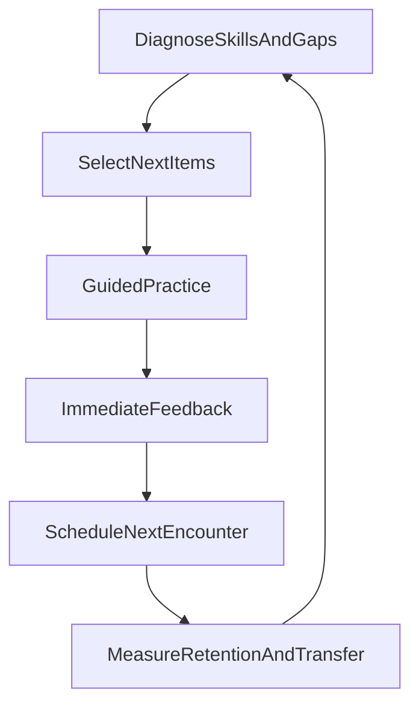

# Learning Functions Research & Brainstorming

Date: 2026-02-01  
Repo: `daydreamedu-scripts/chinese_chr_app/chinese_chr_app/`

## Why this doc exists

We’re shifting the app from **utility/dictionary-like functions** to **learning functions**: proactive, data-driven, personalized experiences that efficiently improve Chinese proficiency for primary-school-aged learners whose day-to-day language is often English.

This document is the “paper trail” for:

- Research notes (with citations) on *what works*, *why it works*, and *where it fails*.
- A distilled set of **learning design principles**.
- A **feature/experience catalog** mapped to those principles.
- A recommended **MVP learning slice** + **measurement/logging** plan.

## Executive synthesis (the short version)

If we optimize for general proficiency (not a specific exam), an effective learning system for English-dominant primary learners should:

- **Maximize comprehensible input** and time-on-task *without relying on motivation alone*.
- Convert exposure into learning via **guided retrieval practice**, **feedback**, and **spaced re-encounters**.
- Treat “Chinese proficiency” as a bundle of partially-independent skills: **listening, speaking, reading, writing**. Some transfer exists, but not enough to assume “learn to read = learn to speak”.
- Respect Chinese-specific constraints:
  - **Handwriting practice** helps *writing recall* more than pinyin typing does, even if recognition gains can look similar (Chen et al., 2016).
  - **Semantic radicals / sub-character structure** can be taught as transferable meaning cues, including transfer to untaught radicals/characters (Nguyen et al., 2017).
  - **Morphological awareness** (especially compounding) matters for literacy, and bilingual experience can change which morphological skills predict reading (Marks et al., 2023).
  - **Tones** are hard for English-dominant learners; “one-size-fits-all” training is suboptimal because acoustic manipulations help some tones while hurting others (Cao et al., 2024).
- Avoid common failure modes:
  - “Feels easy” study (re-reading, passively watching) can create **illusions of competence**; learners underuse the strategies that feel harder but work (Carpenter, Pan, & Butler, 2022).
  - “Just give graded readers” can fail without **accountability** and **appropriate difficulty matching**; meta-analysis suggests these moderate outcomes (Sangers et al., 2025).
  - Home environment can be English-dominant; if the app assumes rich Mandarin exposure at home, it will systematically underperform in the real world (Li, Tan, & Goh, 2016).

## Definitions (so we can measure the right thing)

- **Learning**: durable change in ability that shows up on later performance, not just immediate fluency.
- **Retention**: ability to recall/recognize after time has passed.
- **Transfer**: ability to apply what was learned to a new context (e.g., using a radical strategy on an unseen character).
- **Item**: a unit we can schedule for practice (character, word, sentence, tone minimal pair, etc.).
- **Mastery** (working definition): sustained performance above threshold across spaced checks.

## A model for the learning functions

This is the “engine” we want the product to embody.

**Key idea**: learning functions should run as a loop. “Content” is necessary, but the loop is the product.

## Research notes (with first-principles explanations)

### 1) Retrieval practice + spacing (memory science)

**Claim**: For durable learning, *trying to recall* is more effective than re-reading, and repeating retrieval across time improves retention.

- **Why it works (first principles)**:
  - Retrieval is not just an assessment; it **strengthens memory traces** and improves later access.
  - Spacing introduces “desirable difficulty”: it makes retrieval harder in a way that improves long-term retention.
  - Learners systematically misjudge this because *ease during study* is not the same as *durability later* (metacognitive illusion).

- **Evidence**:
  - Review of spacing + retrieval practice, plus metacognition and underuse (Carpenter, Pan, & Butler, 2022): `https://www.nature.com/articles/s44159-022-00089-1`
  - Meta-analysis: spaced retrieval vs massed retrieval shows strong benefit; expanding vs uniform schedules are not universally better (Latimier, Peyre, & Ramus, 2021): `https://link.springer.com/article/10.1007/s10648-020-09572-8`
  - Primary school classroom study (history texts): retrieval practice > re-reading; spacing manipulation (1 vs 4 days) did not show clear gains in that setup (Franzoi et al., 2025): `https://www.frontiersin.org/journals/psychology/articles/10.3389/fpsyg.2025.1632206/full`

- **Design implications**:
  - We should treat **quizzing as the default**, but keep it *guided* (especially for kids).
  - We should build **feedback loops** (corrective feedback) into practice.
  - We should be cautious about assuming any “magic spacing schedule”; implement something simple, measurable, and adaptable.

- **Common failure modes**:
  - Overly hard retrieval without scaffolding → discouragement and/or random guessing.
  - “Streaks” and “XP” that reward speed can accidentally optimize for shallow performance.

### 2) Interleaving (discrimination / contrast + distribution)

**Claim**: Mixing related categories/problem types can improve learning compared to blocked practice, partly by improving discrimination.

- **Why it works (first principles)**:
  - Interleaving creates **contrast**: it forces the learner to decide “what kind of thing is this?” and choose the right mapping/strategy.
  - It also introduces **distribution** of practice (a spacing-like effect), which may contribute independently.

- **Evidence**:
  - Foster et al. (2019) show benefits of interleaving for math and analyze discriminative-contrast vs distributed-practice contributions: `https://link.springer.com/article/10.3758/s13421-019-00918-4`

- **Design implications**:
  - Don’t “interleave everything.” Interleave where discrimination matters:
    - visually similar characters
    - tone pairs (2 vs 3, etc.)
    - near-synonyms / confusable words
  - Add lightweight prompts like “Which one is it and why?” (guided contrast), especially early.

### 3) Chinese characters: handwriting vs typing

**Claim**: Handwriting practice is especially important for developing *writing recall* (dictation / production), while pinyin typing can be comparable for *recognition* under some conditions.

- **Why it works (first principles)**:
  - Writing builds a stronger mapping between **orthography (visual form)** and **motor programs**, which supports recall/production.
  - Recognition can be learned via visual exposure and meaning mapping, but producing from memory is a different demand.

- **Evidence**:
  - Controlled comparison in 6th graders: handwriting and pinyin keyboarding produced similar recognition gains for “un-mastered” items, but handwriting improved writing/dictation more; long-term forgetting patterns were similar (Chen et al., 2016): `https://journal.psych.ac.cn/acps/EN/10.3724/SP.J.1041.2016.01258`

- **Design implications**:
  - If the goal includes writing proficiency, we need a **production channel** (stylus, finger tracing, or at least stroke-order recall tasks).
  - If the goal is early reading/meaning recognition, we can lean more heavily on recognition + retrieval, but should not claim it teaches handwriting.

### 4) Sub-character structure: semantic radicals as transferable meaning cues

**Claim**: Teaching semantic radicals can improve learners’ ability to infer meanings of unfamiliar characters, including transfer to untaught radicals/characters.

- **Why it works (first principles)**:
  - Radicals provide a *sub-lexical meaning prior* that reduces the hypothesis space when encountering unknown characters.
  - With context, the learner can triangulate meaning: **radical category + sentence context**.

- **Evidence**:
  - Semantic radical instruction improves sentence cloze performance; experimental groups transfer strategy to unfamiliar characters with untaught radicals (Nguyen et al., 2017): `https://www.frontiersin.org/articles/10.3389/fpsyg.2017.01846/pdf`

- **Design implications**:
  - Teach radicals as **categories**, not trivia: “氵 often relates to water/liquids/actions with water”.
  - Practice should include:
    - “guess the category” tasks
    - context-supported inference tasks
    - transfer challenges (“new radical day”)

### 5) Morphological awareness (compounding/derivation) and bilingual literacy

**Claim**: Morphological awareness contributes to early reading; bilingual experiences can shape which morphological skills matter most.

- **Why it works (first principles)**:
  - Chinese uses compounding heavily; English too, but differently.
  - Morphology compresses vocabulary learning: understanding how pieces combine reduces “items to memorize”.

- **Evidence**:
  - In children ages 5–9, both derivational and compound morphological awareness contribute to early word reading; bilingual experiences show principled interactions (Marks et al., 2023): `https://www.cambridge.org/core/services/aop-cambridge-core/content/view/85C57E363BD695918D911A26DA1E3932/S1366728922000517a.pdf/`

- **Design implications**:
  - For Chinese learning functions, we should elevate **word-level learning** (not just single characters):
    - compound families
    - morpheme reuse
    - “build-a-word” from known characters

### 6) Tone + pronunciation: why it’s hard and what training implies

**Claim**: Tone learning is hard for English-dominant learners, and training benefits are tone-specific (acoustic manipulations can help some tones while hurting others).

- **Why it works/doesn’t (first principles)**:
  - English listeners overweight pitch height; Mandarin requires sensitivity to pitch contour/direction.
  - For some tones, exaggeration helps make contours more discriminable; for others it can distort cues and reduce accuracy.

- **Evidence**:
  - Cao et al. (2024) show training improves tone identification and generalization; Tone 3 is hard; expanded F0 helps Tone 2/3 but hurts 1/4; duration effects differ by tone (Cao et al., 2024): `https://www.frontiersin.org/journals/psychology/articles/10.3389/fpsyg.2024.1403816/full`

- **Design implications**:
  - Tone training should be adaptive and tone-aware:
    - don’t apply the same acoustic “difficulty slider” to all tones
  - Begin with perception (identification/discrimination), then add production with feedback.

### 7) Home language environment (HLE): the exposure constraint

**Claim**: In English-dominant bilingual environments, home language shift and reduced Mandarin exposure are real; “more input” can’t be assumed.

- **Why it matters (first principles)**:
  - Language learning is input-dependent, but the environment may not provide enough Mandarin quantity/quality.
  - If the app is a learning facilitator, it must provide both **structured exposure** and **structure that converts exposure into retention**.

- **Evidence**:
  - Singapore study of 376 Chinese six-year-olds: trend toward English preference; HLE facets (language use, literacy activities, etc.) relate differently to oral vs character recognition; children’s CL activities were not frequent (Li, Tan, & Goh, 2016): `https://www.tandfonline.com/doi/full/10.1080/2331186X.2016.1161958`

- **Design implications**:
  - Build for “low Mandarin outside the app”:
    - short daily sessions
    - strong re-entry design (users forget, return)
    - accountability that doesn’t require parents to be fluent

### 8) Extensive reading (comprehensible input) and the need for accountability

**Claim**: Extensive reading helps, but outcomes are moderated by difficulty matching and accountability.

- **Why it works (first principles)**:
  - Reading provides massive input (frequency effects, implicit learning).
  - Self-selection supports motivation, but too much freedom can break level-appropriateness; too little structure can reduce follow-through.

- **Evidence**:
  - Meta-analysis: ER has small-to-medium positive effects across language domains; effects are larger when text choice is limited appropriately and when accountability exists (Sangers et al., 2025): `https://link.springer.com/article/10.1007/s10648-025-10068-6`

- **Design implications**:
  - “Reading mode” should be:
    - level-matched (or leveled within a narrow band)
    - supported with light accountability (micro-checks, reading log, “tell me what happened”)

## Design principles (derived from research)

1. **Make retrieval the default learning action** (not “read more”).
2. **Keep retrieval guided**: prompts, partial cues, and progressive difficulty.
3. **Separate channels**: recognition vs recall; perception vs production.
4. **Use substructure**: radicals, phonetic components, morphemes, confusion sets.
5. **Interleave for discrimination** (not for variety).
6. **Prioritize time-on-task** with low-friction sessions; motivation is designed, not assumed.
7. **Instrument everything** (events + outcomes) so we can iterate.

## Feature/experience catalog (candidate learning functions)

Each item includes: *what it trains*, *why it should work*, *risk*, *data prerequisites*.

### A) Daily Micro-Session (5–8 minutes)

- **Trains**: retention + recall; foundational character/word/sentence knowledge.
- **Why it should work**: guided retrieval + feedback + spacing (Carpenter et al., 2022; Latimier et al., 2021; Franzoi et al., 2025).
- **Risk**: if items are too hard, kids disengage; if too easy, illusions-of-competence.
- **Prereqs**:
  - items: characters, pinyin, English gloss, example words/sentences (already in dataset)
  - scheduling logic (even a simple one to start)

### B) Character Mastery Loop (recognize → understand → recall → write)

- **Trains**: writing recall + orthographic precision + meaning/use.
- **Why it should work**: handwriting supports writing performance (Chen et al., 2016); radicals support meaning inference (Nguyen et al., 2017).
- **Risk**: handwriting UX can be frustrating; needs gentle feedback and achievable goals.
- **Prereqs**:
  - stroke order animation (already available via HanziWriter proxy)
  - a writing surface (finger/stylus) and scoring heuristics

### C) “Radical Detective” (semantic category inference)

- **Trains**: semantic radical awareness; transfer to unseen characters.
- **Why it should work**: explicit instruction + transfer effect (Nguyen et al., 2017).
- **Risk**: “radical trivia” if not tied to reading tasks; must connect to context.
- **Prereqs**:
  - radical mapping in HWXNet; sentence contexts (can be curated/generated)

### D) Tone Ear Training (perception → production)

- **Trains**: tone identification, discrimination, and then production.
- **Why it should work**: perceptual training works; tone-specific difficulty adjustments matter (Cao et al., 2024).
- **Risk**: poor ASR feedback can demotivate; avoid pretending we can grade tones perfectly.
- **Prereqs**:
  - curated audio stimuli + minimal pairs
  - a careful feedback strategy (confidence + “try again” rather than harsh grading)

### E) Graded Micro-Stories (read + optional listen)

- **Trains**: comprehension, fluency, vocabulary in context; motivation through narrative.
- **Why it should work**: ER positive effects; better with accountability and appropriate text limitation (Sangers et al., 2025).
- **Risk**: building a good corpus is hard; too hard → churn; too easy → boredom.
- **Prereqs**:
  - leveled story corpus + vocabulary control
  - micro-check questions

### F) Compound Builder (word formation)

- **Trains**: morphological awareness; vocabulary efficiency via composition.
- **Why it should work**: morphological awareness supports reading (Marks et al., 2023).
- **Risk**: needs careful pedagogical constraints to avoid nonsense compounds.
- **Prereqs**:
  - word lists (词组) + character meanings

## Recommendation: MVP learning slice (1–2 experiences)

### MVP 1: Daily Micro-Session (core loop)

**Reason**: It directly instantiates the learning engine (diagnose → practice → feedback → schedule) and leverages your existing dataset immediately.

**Session structure (example)**:

- **Warm-up (30–45s)**: 2–3 quick recognition items to build confidence.
- **Core retrieval set (4–6 min)**: mix of:
  - character → meaning (choose or type)
  - meaning → character (choose among close distractors)
  - character → pinyin-with-tone (choose among 4, including tone confusions)
  - sentence cloze using known words (light context inference)
- **Micro-write (60–90s)**: 1 character stroke-order replay + guided tracing OR “stroke count + radical + structure” recall prompt.

**Personalization heuristic (start simple)**:

- Maintain per-item stats: last_seen, attempts, correct_rate_recent, modality_strength (recognition vs recall vs writing).
- Build a “today queue” of:
  - due reviews (spaced)
  - 1–2 new items
  - 1–2 “confusion pair” items (interleaving for discrimination)

#### MVP 1 “v0 spec” (implementation-ready)

**Scope boundary** (keep v0 small):

- Only items already supported by your datasets (Feng + HWXNet) and existing UI affordances (search, stroke animation).
- No social features, no parent dashboard, no “AI teacher”.

**Item model** (minimum viable):

- `item_id`: stable key (e.g., `char:<汉字>`; internally also store Unicode codepoint)
- `item_type`: `character` | `word` | `sentence`
- `content`:
  - character: hanzi, pinyin_with_tone, radical, stroke_count, english_gloss
  - word: word, pinyin, english_gloss, example_sentence (optional)
  - sentence: sentence_text, cloze_target (optional), translation (optional)
- `practice_modality`: `recognize` | `recall` | `write`

**Scheduling algorithm (v0; deterministic, interpretable)**:

Store per-user per-item:

- `stage` (0–5)
- `next_due_at`

On a correct answer (no hint):

- `stage = min(stage + 1, 5)`
- schedule by stage:
  - 0 → same session (immediate confirm)
  - 1 → +1 day
  - 2 → +3 days
  - 3 → +7 days
  - 4 → +14 days
  - 5 → +30 days

On an incorrect answer (or heavy hint use):

- `stage = max(stage - 1, 0)`
- `next_due_at = soon` (later in same session if time, otherwise next day)

This is intentionally not “optimal”; it’s measurable and gives clean data for iteration.

**Confusion sets (v0 heuristic)**:

For a target character, generate 3 distractors from:

- **pinyin similarity**: same syllable different tone, or nearby tone confusions
- **radical similarity**: shared radical
- **stroke-count proximity**: ±1–2 strokes (when abundant)

Log which distractor was chosen to build an error heatmap.

### MVP 2: Graded Micro-Stories (input + accountability)

**Reason**: It addresses the “exposure constraint” (Li et al., 2016) and builds motivation and comprehension via narrative, while staying research-aligned via accountability (Sangers et al., 2025).

**Structure**:

- Very short story (80–200 characters) with:
  - tap-to-gloss (English + pinyin)
  - optional audio
- 2–4 accountability items:
  - “Who/What/Where” (literal)
  - “Choose the best next sentence” (comprehension)
  - one retrieval prompt that links to the Daily Micro-Session item bank

#### MVP 2 “v0 spec”

**Scope boundary**:

- Start with a tiny corpus (e.g., 20–50 stories) and a narrow leveling scheme (e.g., 3 levels).
- Prefer curated content first; generate later if/when you can enforce vocabulary control.

**Leveling approach (v0)**:

- Level by a controlled character/word set (e.g., only characters in a defined “known set + 5 new”).
- Enforce “tap-to-gloss” so stories remain readable even when slightly above level.

**Accountability (v0)**:

- Always include at least one retrieval prompt that reuses items from the Daily Micro-Session schedule.

**How MVP 1 and MVP 2 connect**:

- Reading a story can “introduce” items (soft exposure), but the micro-session “locks it in”.

## Measurement + logging plan (for iteration)

## Product vision, tangible goals, and metrics

### Product vision (learning functions)

Build a **personalized Chinese practice loop** that reliably converts short daily practice into durable gains in:

- **Reading** (recognition + comprehension)
- **Vocabulary** (characters → words → sentences)
- **Writing** (optional but supported via a production pathway)
- **Pronunciation/tones** (optional module; staged perception → production)

The differentiator is not “more content”, but **better scheduling + feedback + transfer practice** using the content you already have.

### Tangible product goals (6–12 weeks horizon)

- **G1: Establish a daily practice habit** with 5–8 minute sessions that kids can finish independently.
- **G2: Demonstrate durable retention** (not just same-day performance) on a meaningful slice of items (characters/words).
- **G3: Demonstrate transfer** in at least one dimension:
  - radical-based meaning inference in novel contexts, or
  - new sentences using previously learned words/characters.

### North-star metric (pick one and hold it steady)

**NSM: Retained items per active learner per week (30-day retention).**

Operational definition:

- An item counts as “retained” if the learner answers it correctly on a check that occurs **≥30 days** after first introduction (or first “learned” milestone), without hints.

Why this NSM:

- It directly optimizes for what we care about (durability), not just activity.
- It’s interpretable and comparable across cohorts and changes in UX.

### Leading indicators (week-to-week)

- **L1: Session completion rate** = `learning_session_completed / learning_session_started`
- **L2: Retrieval depth** = % of sessions that reach the “core retrieval set” (vs quitting during warm-up)
- **L3: Review efficiency**:
  - average attempts-to-stabilize per item (e.g., #answer events until 7-day retention is achieved)
  - “review burden” (total reviews shown per retained item)
- **L4: Confusion reduction**:
  - tone confusion matrix entropy decreases over time (if tone module enabled)
  - character confusion set accuracy increases after targeted interleaving

### Guardrail metrics (avoid perverse incentives)

- **GR1: Time-to-first-success** for new items (if too high, difficulty is too steep)
- **GR2: Hint dependency rate** (hints can help learning, but high reliance suggests poor item design)
- **GR3: Frustration proxy**:
  - rapid-exit sessions (started but <30s active)
  - repeated wrong attempts without improvement

### Outcomes (what we actually care about)

- **Retention**:
  - recall accuracy at 1d / 3d / 7d / 14d / 30d after first “learned”
  - “review burden” per mastered item (how many attempts to stabilize)
- **Transfer**:
  - performance on novel contexts:
    - same character in new sentence
    - same radical in new character
- **Engagement that predicts learning** (not vanity):
  - completed micro-sessions per week
  - percent of sessions reaching “core retrieval set” (vs quitting early)

### Suggested event taxonomy

- `learning_session_started` / `learning_session_completed`
- `item_presented` (fields: item_id, item_type, modality, difficulty, is_new, is_due_review)
- `item_answered` (fields: correct, response_time_ms, hint_used, attempt_index)
- `item_scheduled` (fields: next_due_at, reason: correct|incorrect|new)
- `story_opened` / `story_completed`
- `story_check_answered` (fields: correct, question_type)

### “Minimum viable analytics”

- **Cohort retention curves**: day-1 / day-7 / day-30 retention for items first introduced in week X.
- **Error heatmaps**:
  - tone confusions (2 vs 3, etc.)
  - radical confusions (look-alike components)
  - character confusions (visual similarity)

## Open questions / assumptions

- How much do we want to prioritize writing proficiency (handwriting) vs recognition/reading? (This affects MVP scope.)
- Do we want the app to explicitly teach pinyin/tones as a “phonology first” pathway, or keep phonology as support for reading?
- What kinds of “accountability” will be acceptable for kids without feeling like homework?

## References (key)

- Carpenter, S. K., Pan, S. C., & Butler, A. C. (2022). The science of effective learning with spacing and retrieval practice. *Nature Reviews Psychology*. `https://www.nature.com/articles/s44159-022-00089-1`
- Latimier, A., Peyre, H., & Ramus, F. (2021). A Meta-Analytic Review of the Benefit of Spacing out Retrieval Practice Episodes on Retention. *Educational Psychology Review*. `https://link.springer.com/article/10.1007/s10648-020-09572-8`
- Franzoi, L., Cembrani, V., Mulatti, C., & Treccani, B. (2025). Retrieval practice enhances learning in real primary school settings, whether distributed or not. *Frontiers in Psychology*. `https://www.frontiersin.org/journals/psychology/articles/10.3389/fpsyg.2025.1632206/full`
- Foster, N. L., Mueller, M. L., Was, C., Rawson, K. A., & Dunlosky, J. (2019). Why does interleaving improve math learning? *Memory & Cognition*. `https://link.springer.com/article/10.3758/s13421-019-00918-4`
- Chen, J., Xu, L., Cheng, X., & Liu, H. (2016). Chinese character practice: Comparison between children using handwriting and Pinyin keyboarding. *Acta Psychologica Sinica*. `https://journal.psych.ac.cn/acps/EN/10.3724/SP.J.1041.2016.01258`
- Nguyen, T. P., Zhang, J., Li, H., Wu, X., & Cheng, Y. (2017). Teaching Semantic Radicals Facilitates Inferring New Character Meaning in Sentence Reading for Nonnative Chinese Speakers. *Frontiers in Psychology*. `https://www.frontiersin.org/articles/10.3389/fpsyg.2017.01846/pdf`
- Marks, R. A., et al. (2023). Morphological awareness and its role in early word reading in English monolinguals, Spanish–English, and Chinese–English simultaneous bilinguals. *Bilingualism: Language and Cognition*. `https://www.cambridge.org/core/services/aop-cambridge-core/content/view/85C57E363BD695918D911A26DA1E3932/S1366728922000517a.pdf/`
- Cao, M., Pavlik Jr., P. I., & Bidelman, G. M. (2024). Enhancing lexical tone learning for second language speakers: effects of acoustic properties in Mandarin tone perception. *Frontiers in Psychology*. `https://www.frontiersin.org/journals/psychology/articles/10.3389/fpsyg.2024.1403816/full`
- Li, L., Tan, C. L., & Goh, H. H. (2016). Home language shift and its implications for Chinese language teaching in Singapore. *Cogent Education*. `https://www.tandfonline.com/doi/full/10.1080/2331186X.2016.1161958`
- Sangers, N. L., et al. (2025). Learning a Language Through Reading: A Meta-analysis of Studies on the Effects of Extensive Reading on Second and Foreign Language Learning. *Educational Psychology Review*. `https://link.springer.com/article/10.1007/s10648-025-10068-6`

