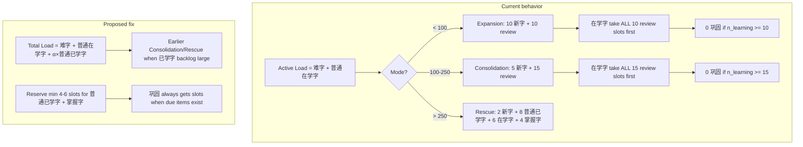

# Proposal: Queue 巩固 Slot Reserve and Total Load

**Status:** Implemented (2026-03)  
**Date:** 2026-03-03  
**Context:** User data (e.g. Emma) showed accumulated 普通已学字 with no 巩固 tests for consecutive days, and excessive 新字 (80 in one day) despite learning debt. Root cause: (1) in Expansion/Consolidation modes, 在学字 take all review slots first, crowding out 巩固; (2) Active Load excludes 普通已学字, so users with many 已学字 but fewer 在学字 stay in Expansion mode.

**References:**
- [PROPOSAL_Queue_By_Five_Score_Categories.md](PROPOSAL_Queue_By_Five_Score_Categories.md) — current five-band queue, Active Load, Expansion/Consolidation/Rescue modes
- [MVP1_Pinyin_Micro_Session_Plan.md](../plans/MVP1_Pinyin_Micro_Session_Plan.md) — original 巩固 slot reservation (`due_confirm_min`)
- `backend/pinyin_recall.py` — `build_session_queue()`

---

## 1. Root Cause Analysis

### 1.1 在学字 Crowds Out 巩固 in Expansion/Consolidation

In `pinyin_recall.py` lines 534–541 (Expansion) and 544–548 (Consolidation):

```python
# Expansion: 10 新字 + 10 review
n_learning_slots = min(review_slots, n_learning)           # 在学字 take FIRST
n_learned_normal_slots = min(review_slots - n_learning_slots, n_learned_normal)  # 普通已学字 get remainder
n_mastered_slots = min(review_slots - n_learning_slots - n_learned_normal_slots, n_mastered)
```

When 10+ due 在学字 exist, they take all 10 (Expansion) or 15 (Consolidation) review slots. 普通已学字 and 掌握字 get 0 slots → no 巩固. Rescue mode avoids this by reserving 8 slots for 普通已学字.

### 1.2 Active Load Excludes 普通已学字

Active Load (lines 482–488):

```
Active Load = count(难字) + count(普通在学字)   (score <= -20  or  -20 < score <= 0)
```

It does not include 普通已学字 (0 < score < 20). Result:

- User with 350 普通已学字 and 80 在学字 → Active Load = 80 → Expansion mode
- In Expansion: 10 新字 per batch, 在学字 take all 10 review slots → no 巩固
- User accumulates 新字 (e.g. 80/day across 8 batches) while never seeing 巩固

### 1.3 Mode Thresholds (Current)

| Mode          | Active Load | 新字/batch | Review split                    |
|---------------|-------------|------------|----------------------------------|
| Expansion     | < 100       | 10         | 在学字 first, then 已学字        |
| Consolidation | 100–250     | 5          | same                             |
| Rescue        | > 250       | 2          | 8 普通已学字 + 6 在学字 + 4 掌握字 |

---

## 2. Proposed Fix (Two Changes)

Implement **both** changes for a robust fix.

### 2.1 Change 1: Total Load (Include 普通已学字)

Replace Active Load with **Total Load** for mode selection:

```
Total Load = count(难字) + count(普通在学字) + α × count(普通已学字)
```

- Add `LEARNED_NORMAL_LOAD_WEIGHT` (e.g. `0.3`) in `pinyin_recall.py`
- Compute bank total for 普通已学字 (0 < score < 20) from `user_state`
- Use Total Load for mode selection; keep same thresholds (Expansion < 100, Consolidation 100–250, Rescue > 250)

**Rationale:** User with 350 普通已学字 and 80 在学字 → Total Load ≈ 80 + 0.3×350 = 185 → Consolidation mode → 5 新字/batch, more review capacity for 已学字.

### 2.2 Change 2: Reserve Slots for 巩固 Before 在学字

In Expansion and Consolidation, reserve slots for 普通已学字 + 掌握字 **before** allocating to 在学字.

**Constants:**
- `CONSOLIDATION_RESERVE_EXPANSION = 4`
- `CONSOLIDATION_RESERVE_CONSOLIDATION = 6`

**Allocation order (Expansion/Consolidation):**
1. `n_consolidation = min(CONSOLIDATION_RESERVE_*, n_learned_normal + n_mastered)` slots for 已学字
2. Split: `n_learned_normal_slots` + `n_mastered_slots` (learned_normal first, then mastered)
3. `n_learning_slots = min(review_slots - n_consolidation, n_learning)` for 在学字

**Code location:** `pinyin_recall.py` lines 534–548 (Expansion) and 544–548 (Consolidation).

**Note:** The `due_confirm_min` parameter (default 4) is passed to `build_session_queue` but unused in five-band logic; consider reusing as `CONSOLIDATION_RESERVE_EXPANSION`.

---

## 3. Implementation Order

1. **Total Load first** — Update load formula so mode selection uses Total Load.
2. **Slot reserve second** — Update slot allocation in Expansion/Consolidation to reserve 巩固 slots before 在学字.

---

## 4. Verification

One-off Supabase script to verify Emma's state:

- Resolve `emma.rs.meng@gmail.com` → `user_id`
- From `pinyin_recall_character_bank`:
  - Active Load and Total Load for mode prediction
  - Counts per band (难字, 普通在学字, 普通已学字, 掌握字)
  - Counts of due items per band (`next_due_utc <= now`)

---

## 5. Summary Diagram



---

## 6. Documentation Updates

After implementation, update:

- **`docs/DECISIONS.md`** — Add or extend the queue ADR: Total Load formula (replace Active Load for mode selection), consolidation reserve constants (`CONSOLIDATION_RESERVE_EXPANSION`, `CONSOLIDATION_RESERVE_CONSOLIDATION`).
- **`docs/ARCHITECTURE.md`** — Section 8.1 "Queue construction": change "Active Load" to "Total Load" with the new formula; update "Slot reservation" to describe the reserve-before-在学字 order for Expansion/Consolidation.
- **`backend/DATABASE.md`** — Queue construction section: Total Load formula, mode thresholds, consolidation slot reserve rules.
- **`docs/CHANGELOG.md`** — Add a version entry for the queue fix (Total Load + 巩固 slot reserve).
